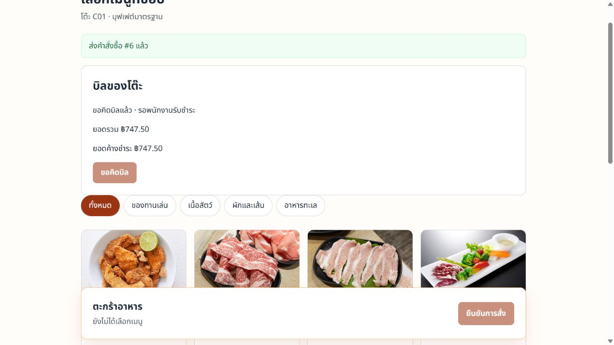
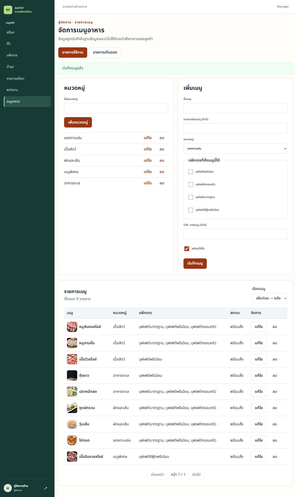
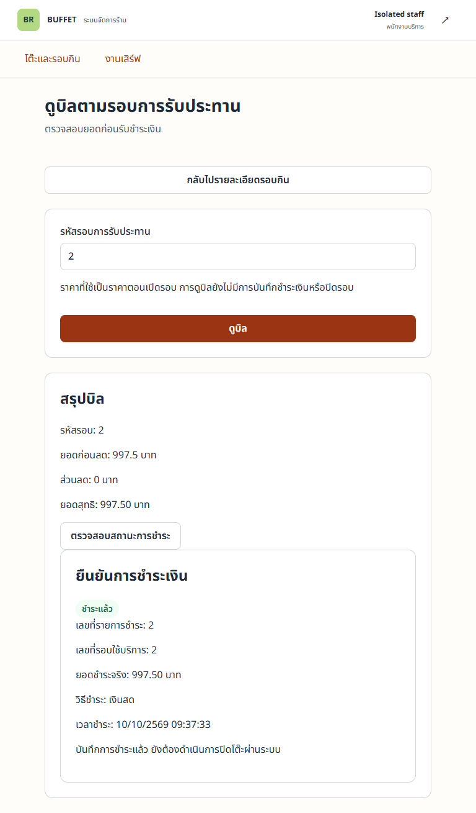
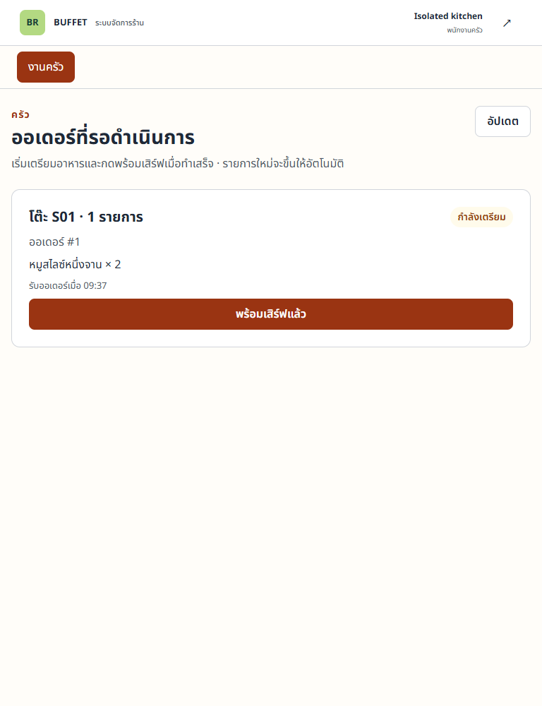

# Buffet Restaurant Management System

ระบบจัดการร้านอาหารบุฟเฟต์แบบ Walk-in สำหรับลูกค้า พนักงานบริการ ครัว ผู้จัดการ และผู้ตรวจดูสต๊อก
พนักงานเปิดโต๊ะ เลือกแพ็กเกจและน้ำซุป ลูกค้าสแกน QR เพื่อสั่งอาหารและขอคิดบิล
ครัวเตรียมอาหาร พนักงานยืนยันเสิร์ฟ รับชำระ แล้วปิดรอบกินเพื่อคืนโต๊ะ
ผู้จัดการดูแลข้อมูลร้าน ผู้ใช้และสต๊อก โดยระบบรักษาประวัติและราคาที่ใช้ตอนเปิดรอบ
พัฒนาสำหรับวิชา **CP353002 Principles of Software Design and Development (Spring Boot)**

[เปิดเว็บ](https://buffet-restaurant-management.onrender.com/) · [Swagger UI](https://buffet-restaurant-management.onrender.com/swagger-ui.html) · [ติดตั้ง](#installation--setup) · [เอกสารส่งงาน](#documentation-and-submission-index)

> **เอกสารส่ง Final — อัปเดต 10 ตุลาคม 2026** ตรวจโค้ดที่รวมใน `develop` รุ่น `097ad12` (PR #49/#52/#53 merge แล้ว) หลักฐาน public UAT ของสูตรสต๊อกตรวจบน Render รุ่น `af2b45b`; การรับรอง deployed commit รุ่นส่งและ release เข้า `main` ต้องอ้างหลักฐานรอบสุดท้าย



*ภาพระบบจริงใน public UAT วันที่ 10 ตุลาคม 2026 ยอดบิล 747.50 บาท เป็นข้อมูล UAT ไม่มีการรับเงินจริง ดู [รายงานและข้อจำกัด](doc/testing/pavarit-public-uat-2026-10-10.md)*

## Project Overview

ระบบช่วยส่งต่องานระหว่างหน้าร้าน ลูกค้าและครัว ลดการจดคำสั่งซื้อและการคำนวณยอดด้วยมือ โดยใช้ **รอบกิน (DiningSession)** เชื่อมโต๊ะ แพ็กเกจ คำสั่งซื้อและการชำระเงิน

ขอบเขตเป็นร้าน Walk-in และการบันทึกผลรับชำระ CASH/QR/CARD ไม่เชื่อม Payment Gateway ลูกค้าใช้สิทธิ์จาก QR ของรอบกิน ไม่ต้องสมัครบัญชี ส่วนพนักงานต้อง login และมี role ที่อนุญาต

## สมาชิกกลุ่ม

| ลำดับ | ชื่อ-นามสกุล | รหัสนักศึกษา | Section | Branch | หน้าที่รับผิดชอบ |
|---:|---|---|---|---|---|
| 1 | นายปวริศช์ ประมวล | 673380278-9 | 01 | `pavarit_673380278-9_01` | โต๊ะ แพ็กเกจ น้ำซุป รอบกินและ QR; เชื่อมโมดูลและตรวจสถาปัตยกรรมรวม |
| 2 | นายศิระพัทธ์ วงศ์วิวัฒน์เสรี | 673380293-3 | 01 | `sirapat_673380293-3_01` | หมวดหมู่ เมนู การสั่งอาหารและหน้า Customer; UI กลางและ regression |
| 3 | นายศรัณย์ พาพรชัย | 673380515-1 | 02 | `sarun_673380515-1_02` | ครัว การเสิร์ฟและ Order State; มาตรฐาน REST API/DTO และตรวจ contract |
| 4 | นายธีรเมธ สายคำ | 673380273-9 | 02 | `teeramet_673380273-9_02` | คำนวณบิลและรับชำระ; Docker และ public deployment |
| 5 | นายเมธัส มณีวิจิตร | 673380300-2 | 01 | `methus_673380300-2_01` | Login ผู้ใช้/Profile และสต๊อก; migration และสิทธิ์ฐานข้อมูล |

ชื่อ รหัส Section และ branch ตรวจเทียบ [Team](https://app.notion.com/p/3cfcb2e9d47a813795c9fc40d62b9868) กับ remote branches หน้าที่รวมงานเพิ่มเติมตรวจจาก PR/เอกสาร ไม่ใช้ตารางแบ่งงานเป็นหลักฐาน contribution รายบุคคลแทน Git

### ความรับผิดชอบต่อโค้ดและหลักฐานตามรายวิชา

ทุกคนรับผิดชอบ Controller → Service → Repository, Entity, Request/Response DTO, validation และ tests ในโมดูลของตน พร้อมอธิบายเหตุผล SOLID, ความสัมพันธ์ JPA, cascade/fetch และ diagram ที่เกี่ยวข้อง ตารางนี้ระบุเจ้าของโมดูลและผลงานหลักที่มีหลักฐานใน repository ส่วนประวัติผู้เขียนและผู้รีวิวตรวจจาก Git/PR ประกอบ

| สมาชิก | โค้ดและพฤติกรรมระบบที่รับผิดชอบ | หลักฐาน Software Design และการตรวจรับ |
|---|---|---|
| **ปวริศช์** | Table/Package/Soup CRUD และเก็บออก; เปิด/ปิด DiningSession, ราคา snapshot, QR exchange/customer grants; Staff Table/Session และ Manager master-data UI; เชื่อม session กับ Ordering/Billing, ขอคิดบิล และสูตรเมนู/หักสต๊อกเมื่อครัวเริ่มทำ | ตรวจ Layered Architecture และ shared provider interfaces; SOLID/constructor injection และ State registry ใน PR #25; [Table/Session SOLID–JPA](doc/architecture/pavarit-table-session-solid-jpa.md), [stock consumption design](doc/architecture/menu-stock-consumption.md); Component/Class/Sequence ของ Table/Session/QR; integration/concurrency และ [public UAT/Swagger](doc/testing/pavarit-public-uat-2026-10-10.md); รวม README และเอกสารส่งงาน |
| **ศิระพัทธ์** | MenuCategory/MenuItem, ความสัมพันธ์แพ็กเกจกับเมนู, Customer Ordering และประวัติออเดอร์; Customer QR/cookie flow, shared UI และการเก็บออก/คืนเมนู | [Menu/Ordering SOLID–JPA](doc/architecture/sirapat-menu-ordering-solid-jpa.md); DTO/Mapper และ Repository/Service Layer ของ Ordering; diagram ของ Menu/Ordering; test plan, requirement–test traceability, frontend tests และ [public regression](doc/testing/sirapat-public-regression-2026-10-09.md) |
| **ศรัณย์** | Fulfillment APIs และ Kitchen/Serving UI; transition RECEIVED → PREPARING → READY → SERVED และสิทธิ์ครัว/บริการ | **State Pattern** และ transition tests; [Pattern analysis](doc/design-patterns.md), [Order State diagram](doc/diagrams/order-fulfillment-state-diagram.md); API/DTO, enum/เวลา/ราคา, HTTP status, ErrorResponse และ shared contracts; Order/OrderItem JPA rationale, deletion contract และ Requirement Matrix/Git audit |
| **ธีรเมธ** | BillingEngine, discount strategies, BillingContext integration, Payment และ Staff Billing UI; production Docker build, Spring Boot เสิร์ฟ React/API ผ่าน Render URL เดียว | **Strategy Pattern**, ราคา snapshot/การปัดเศษ และป้องกันชำระซ้ำ; [Billing/Payment SOLID–JPA](doc/architecture/teeramet-billing-payment-solid-jpa.md); Billing/Payment Sequence และ Deployment diagram; [production runbook](doc/deployment/production-runbook.md), HTTPS/cookie/runtime checks และ public UAT/Swagger ของ PR #52 |
| **เมธัส** | Auth/User/Profile, BCrypt และ session login; Stock metadata, รับเข้า/ปรับยอด, history, target/active และเก็บออก/คืน; Flyway schema และ DB grants/RLS | **Template Method** ของ Stock transaction processors และ rollback tests; [Auth/Stock design](doc/architecture/template-method-auth-stock.md); User/Profile One-to-One, Stock/Transaction One-to-Many และ [JPA rationale](doc/architecture/jpa-entity-rationale.md); ERD/Data Dictionary, migration/JPA/security validation และ [DB validation report](doc/testing/methus-db-validation-auth-stock-profile-2026-10-09.md) |

งาน integration ที่ปวริศช์รับเพิ่มบันทึกแยกจากเจ้าของโมดูลเดิม เช่น Staff/Manager UI, bill request และ menu-stock consumption ตาม PR #21/#49 ส่วน State, Strategy และ Template Method ยังคงระบุผู้รับผิดชอบตาม implementation ของแต่ละโมดูล การรับรองรุ่นส่งต้องตรวจ [Requirement Matrix](doc/planning/step3-requirement-matrix.md), [SOLID](doc/solid-analysis.md), [Patterns](doc/design-patterns.md) และ [Git audit](doc/planning/step3-git-audit.md) ร่วมกัน

## Features and Core Flow

| ผู้ใช้ | งานที่ทำได้ใน baseline `develop` |
|---|---|
| Customer | แลก QR รับ cookie, ดูเมนูตามแพ็กเกจ, สั่งและดูสถานะ, ขอคิดบิลและดูยอด/ผลชำระ |
| SERVICE_STAFF | เปิดโต๊ะและแสดง QR, ยืนยันเสิร์ฟ, ดูบิล/บันทึกรับชำระ และกดปิดรอบ |
| KITCHEN_STAFF | อ่านออเดอร์และเปลี่ยน RECEIVED → PREPARING → READY |
| MANAGER | จัดการโต๊ะ แพ็กเกจ น้ำซุป เมนู/หมวดหมู่ ผู้ใช้/Profile และรายการสต๊อก รวมลบหรือเก็บออกตามเงื่อนไขประวัติ |
| SUPERVISOR | ดูสต๊อก/ประวัติ รับเข้าและปรับยอดตามสิทธิ์ ไม่ได้รับสิทธิ์ครัว เปิดโต๊ะหรือรับชำระ |

**Flow หลัก:** เปิดโต๊ะ → QR → สั่งอาหาร → ครัว → เสิร์ฟ → ขอคิดบิล → รับชำระ → กดปิดรอบ → โต๊ะว่าง

- QR หนึ่งชุดแลกได้ครั้งเดียว แล้วหมุนรหัสใหม่สำหรับเครื่องถัดไป ใช้ HttpOnly customer cookie ต่อจากนั้น
- ราคาแพ็กเกจเก็บเป็น snapshot ตอนเปิดรอบ ลูกค้าไม่ส่งยอดชำระมาให้ backend เชื่อถือ
- หลังขอคิดบิล ทุกเครื่องของรอบนั้นสั่งเพิ่มไม่ได้ เมื่อ PAID ยังต้องให้พนักงานกด close แยก
- ข้อมูลที่มีประวัติใช้การเก็บออกตาม contract ไม่ลบประวัติ Order/Payment/Stock

**สูตรเมนูและสต๊อก:** Manager กำหนดวัตถุดิบต่อเสิร์ฟได้ หรือเลือกไม่หักอัตโนมัติ สูตรถูกเก็บตอนสั่งและหักเมื่อครัวเริ่มทำ สต๊อกไม่พอได้ 409 และ rollback ทั้งชุด [Design](doc/architecture/menu-stock-consumption.md) · [Public UAT/Swagger หลัง deploy PR #49](test/evidence/uat-buffet-2026-10-10/report.md) · [Swagger contract fixes PR #52](test/evidence/pr52-swagger-fix-2026-10-10/report.md)

<details>
<summary>ดูหน้าจอ Manager, Staff และ Kitchen</summary>

**Manager — จัดเมนูและภาพอาหาร** จาก public UAT รุ่นก่อน



**Staff — บันทึกชำระแล้ว แต่ยังต้องปิดรอบแยก** จาก isolated local regression ของ PR #49 ไม่ใช่ภาพ Render



**Kitchen — ออเดอร์อยู่ระหว่างเตรียม** จาก isolated local regression ของ PR #49



แหล่งภาพ/revision และ hashes ดู [asset provenance](img/readme/README.md)

</details>

## Tech Stack

| ส่วน | เทคโนโลยีและหน้าที่ |
|---|---|
| Backend | Java **17**, Spring Boot **3.5.16**, Maven Wrapper; REST, validation, DI และ transaction |
| Persistence | Spring Data JPA/Hibernate, Flyway; PostgreSQL เป็นฐานหลัก, H2 สำหรับ demo/tests แยก |
| API docs | springdoc-openapi **2.9.1**, Swagger UI |
| Frontend | React **19.2.x**, TypeScript **6.0.x**, Vite **8.3.x**, React Router **7.18.4** |
| HTTP / QR / UI | Axios **1.20.0**, qrcode.react **4.2.0**, Tailwind CSS **4.3.3** และ shared components |
| Tests | JUnit 5, Mockito, Spring Boot Test, Testcontainers, Vitest **5.0.x**, Testing Library, Playwright browser runners, Oxlint |
| Runtime | Docker/Compose, Render Web Service และ Supabase PostgreSQL Session Pooler พร้อม SSL |
| CI | GitHub Actions สำหรับ backend/PostgreSQL และ frontend tests/lint/build; ยังไม่ใช้ผล Build/Test เป็นหลักฐาน Deploy อัตโนมัติ |

เวอร์ชันจาก [pom.xml](code/backend/pom.xml), [package.json](code/frontend/package.json) และ [lockfile](code/frontend/package-lock.json) Java ใน CI ใช้ 17, Node ใช้ 24; production Docker build ใช้ Node 22 ตามไฟล์ที่ตรวจ

พนักงาน authenticate ด้วย Spring HTTP session และ BCrypt ลูกค้าใช้ QR exchange/customer grant **Supabase ทำหน้าที่ฐานข้อมูล ไม่ใช่ Supabase Auth ของระบบนี้** UI ใช้ Noto Sans Thai, primary `#9A3412` และ background `#FFFDF9`

## System Architecture


*[เปิดภาพเต็ม](doc/diagrams/previews/component.svg) · [Diagram index และ source](doc/diagrams/README.md) · [System Design](doc/system-design/README.md)*

ภาพนี้คัดลอกจาก develop โดยยังมีชื่อ revision/schema เก่าในภาพ ส่วน [Component ที่ปรับสำหรับ PR #49](doc/diagrams/previews/component.svg) เพิ่มจุดเชื่อมสูตร/consumption ผ่านรีวิวและ merge เข้า develop แล้ว ก่อนรุ่นส่งต้องตรวจ diagram เทียบกับ release commit อีกครั้ง

| ชั้น | ตัวอย่าง | หน้าที่ |
|---|---|---|
| Presentation | `AuthController`, `DiningSessionController`, React pages | รับ HTTP/แสดง UI เรียก Service |
| Service | `DiningSessionServiceImpl`, `CustomerOrderingServiceImpl`, `PaymentService` | กฎธุรกิจ ประสาน providers และ transaction |
| Repository | `DiningSessionRepository`, `MenuItemRepository` | queries และ row locks ผ่าน Spring Data JPA |
| Domain | `DiningSession`, `CustomerOrder`, `StockItem` | Entity, Value Object และ enum |
| DTO / Mapper | `DiningSessionResponse`, `DiningSessionMapper`, `OrderingMapper` | แยก JSON contract ออกจาก Entity |

Spring Boot ประกอบ beans ด้วย constructor injection, ให้บริการ REST, ตรวจ `@Valid`, จัด `ErrorResponse` ผ่าน GlobalExceptionHandler และดูแล `@Transactional`/JPA ผ่าน framework configuration

การเชื่อมโมดูลใช้ contracts เช่น `SessionContextProvider`, `DiningSessionBillingReader` และ `PaymentStatusLookup` ไม่ให้ Controller เข้าถึง Repository ตรง ดู [shared contracts](doc/contracts/shared-contracts.md) และ [API conventions](doc/contracts/api-conventions.md)

### SOLID and Design Patterns

| หลักการ | ตัวอย่างและเหตุผล |
|---|---|
| S | `SessionUserContextProvider` ดู identity/role แยกจาก authentication และการคำนวณบิล |
| O | `RegistryOrderStateResolver` รับ State registrations; pricing/discount เปลี่ยนผ่าน strategy |
| L | `BillCalculator`/provider contracts ระบุผลสำเร็จและ failure; tests ตรวจ null, context ผิดรอบและ discount ที่ผิดกฎ |
| I | แยก `AuthenticationService` จาก `UserAdministrationService` ให้ผู้เรียกใช้เฉพาะสัญญาที่ต้องการ |
| D | Services รับ `UserContextProvider`, `BillCalculator`, `OrderStateResolver` ผ่าน constructor |

[อ่าน SOLID พร้อมไฟล์/บรรทัดและข้อจำกัด](doc/solid-analysis.md) การมี interface เพียงอย่างเดียวไม่ใช่ข้อรับรองว่า SOLID ทั้งระบบผ่าน

Enterprise Patterns ครบตามการออกแบบ: **Layered Architecture, MVC, Repository, Service Layer, DTO + Mapper และ Dependency Injection** ดูตารางปัญหา/คลาส/หลักฐานใน [design-patterns.md](doc/design-patterns.md)

| Behavioral Pattern | คลาสและปัญหาที่แก้ | Class Diagram |
|---|---|---|
| State | `OrderState`, `RegistryOrderStateResolver` และ State ทั้งสี่ คุมลำดับออเดอร์และ terminal state | [source](doc/diagrams/class-order-state.puml) / [ภาพ](doc/diagrams/previews/class-order-state.svg) |
| Strategy | `BillingEngine`, `BillCalculationStrategy`, `DiscountCalculationStrategy` แยกสูตรราคา/ส่วนลดจาก Payment | [source](doc/diagrams/class-billing-strategy.puml) / [ภาพ](doc/diagrams/previews/class-billing-strategy.svg) |
| Template Method | `StockTransactionTemplate`, `StockInProcessor`, `StockAdjustmentProcessor` ใช้ workflow ยอดและ audit ร่วมกัน | [source](doc/diagrams/class-stock-template.puml) / [ภาพ](doc/diagrams/previews/class-stock-template.svg) |

การเพิ่มสถานะธุรกิจยังต้องทบทวน enum, transitions, API/UI และสิทธิ์ร่วมกัน ส่วน StockConsumptionProcessor ขยาย Template Method เดิมสำหรับการหักวัตถุดิบตามสูตรใน PR #49 ที่ merge แล้ว

## Database Design (ER Diagram)


*[เปิด ERD เต็ม](doc/diagrams/previews/er-diagram.svg) · [Data Dictionary baseline](doc/database/step2-schema-approved.md) · [JPA/FK/cascade/fetch rationale](doc/architecture/jpa-entity-rationale.md) · [Migration files](code/backend/src/main/resources/db/migration)*

**สถานะภาพ:** ใช้ [ERD source](doc/diagrams/er-diagram.puml) และ preview จาก PR #49 ที่ merge แล้ว ครอบคลุม archive deltas V16–V18 และสูตรเมนู/สูตรออเดอร์ V19 ภาพ V15 ใน `img/readme/` เก็บเป็นประวัติที่ระบุ revision ใน manifest

- **One-to-One** — `UserAccount` กับ `UserProfile` ใช้ shared primary key; DiningSession กับ Payment เป็น domain 1:0..1 โดย FK/UNIQUE ที่ DB ไม่ใช่ JPA association ทั้งสองฝั่ง
- **One-to-Many** — `CustomerOrder` กับ `OrderItem`; order เป็น parent, item ถือ FK และเก็บชื่ออาหาร snapshot
- **Many-to-Many** — Menu กับ Package ผ่าน `package_menu_items` ฝั่ง JPA เก็บ package IDs เป็น ElementCollection ไม่ใช่ bidirectional `@ManyToMany`
- Session อ้าง Table/Package/Soup แบบ LAZY ไม่มี cascade ลบข้อมูลหลัก; `package_price_at_open` รักษาราคาของรอบเดิม

Repository มี migrations V1–V19 โดย V16–V18 เพิ่มการเก็บออกตาม [Stock/User delta](doc/database/r01c-stock-user-archive.md), [Table/Package/Soup delta](doc/database/pavarit-r01-b-schema-delta.md) และ V18 ของ Menu/Category

V19 เพิ่ม [สูตรปัจจุบัน/สูตร Order และ CONSUMPTION](doc/database/menu-stock-consumption-v19.md) หลักฐาน startup log และ public UAT ของ PR #52 ระบุ validate 19 migrations, schema version 19 และ JPA เริ่มสำเร็จ ดู [รายงานและขอบเขตหลักฐาน](test/evidence/uat-buffet-2026-10-10/report.md) Flyway ใช้ประวัติ/checksum ตรวจ migration ที่ apply แล้ว ห้ามแก้ไฟล์ย้อนหลังหรือ repair เพื่อให้ผ่านเฉย ๆ

## Installation & Setup

ต้องมี Git, Java 17+, Node.js 24 (ตาม CI), npm และ Docker สำหรับ Compose/PostgreSQL tests ใช้ Maven Wrapper ที่อยู่ใน repo

```bash
git clone https://github.com/PavaritPramual/buffet-restaurant-management-system.git
cd buffet-restaurant-management-system
git switch develop
```

`main` เป็น branch รุ่นส่ง การทดลอง baseline ปัจจุบันให้ใช้ `develop`; การพัฒนารายบุคคลใช้ชื่อ branch ในตารางสมาชิก ไม่เปลี่ยนรูปแบบ `ชื่อ_รหัสนักศึกษา_section`

### ตั้งค่าฐาน PostgreSQL ของตนเอง

จาก repository root บน PowerShell:

```powershell
Copy-Item code/backend/.env.example code/backend/.env
Copy-Item code/frontend/.env.example code/frontend/.env
```

แก้ `code/backend/.env` ให้เป็นฐานที่ได้รับอนุญาต โดยใช้ Supabase Session Pooler พอร์ต 5432 และ SSL ตาม [ตัวอย่าง](code/backend/.env.example) หรือ [runbook](doc/deployment/production-runbook.md) ตั้ง providers ตามไฟล์ตัวอย่างให้ครบ: MasterData/Menu/DiningSession/Fulfillment ใช้ `session`; Ordering/Billing/Payment ใช้ `database`

**ถ้า checkout branch ที่มี pending migration เช่น V19 อย่ารันชี้ฐานกลางก่อนอนุมัติ** Compose ไม่ได้สร้าง DB ใหม่ให้ ข้อมูลที่ Manager เพิ่มจะลงฐานตาม `.env` ไม่ได้อยู่ใน browser

ฐาน PostgreSQL ว่างสร้าง Manager แรกด้วย `BOOTSTRAP_ADMIN_ENABLED=true`, `BOOTSTRAP_ADMIN_USERNAME` และ `BOOTSTRAP_ADMIN_PASSWORD` ที่กำหนดใน environment ของตนเอง Runner ทำงานเฉพาะเมื่อ `app_users` ว่างและไม่ใช่ demo/test profile หลังสร้างแล้วปิด bootstrap จากนั้นสร้างบัญชีพนักงานผ่าน Manager UI ดู [setup/demo-data](doc/setup-demo-data.md) ไม่ใส่รหัสบัญชีจริงใน repo

## How to Run

### ทดลองในเครื่องด้วย H2 แยก

จาก `code/backend` บน PowerShell:

```powershell
.\mvnw.cmd spring-boot:run "-Dspring-boot.run.profiles=demo" "-Dspring-boot.run.arguments=--spring.config.import= --app.menu.admin-access-provider=session --app.ordering.session-provider=database --app.fulfillment.access-provider=session"
```

Demo ใช้ H2 memory และ seed ของ `DemoDataSeeder` ไม่ชี้ Supabase; restart แล้วข้อมูลหาย บัญชี demo ดู [คู่มือ](doc/setup-demo-data.md) สร้าง SERVICE_STAFF/KITCHEN_STAFF ผ่าน Manager ก่อนลองทุก role คำสั่งนี้เปลี่ยน fixture defaults ของสามโมดูลให้ใช้ session/database จริง ไม่ใช้การรัน demo profile เปล่าเป็นหลักฐาน integration

เปิดอีก terminal จาก `code/frontend`:

```bash
npm ci
npm run dev
```

เข้า [เว็บ local](http://localhost:5173/) / [Login](http://localhost:5173/admin) / [Health](http://localhost:8080/api/v1/system/health) / [Swagger](http://localhost:8080/swagger-ui.html) Frontend `.env.example` ใช้ `http://localhost:8080/api/v1`; backend ยอมรับ origin `http://localhost:5173` ตาม config

### Docker Compose กับฐานที่ตั้งค่าไว้

จาก repository root หลังเตรียม `.env` และตรวจ migration ที่จะใช้:

```bash
docker compose up --build
```

Compose ให้ backend 8080 และ frontend 5173 เป็น Vite dev server มีสองบริการ ไม่มี PostgreSQL container หยุดด้วย `docker compose down` ดู log ด้วย `docker compose logs backend frontend`

Production build ใช้ [Dockerfile.production](Dockerfile.production) รวม React static assets กับ Spring Boot ผ่าน origin เดียวตามหัวข้อ Deployment URL

## API Documentation

[Public Swagger](https://buffet-restaurant-management.onrender.com/swagger-ui.html) · [OpenAPI JSON](https://buffet-restaurant-management.onrender.com/v3/api-docs) · [Local Swagger](http://localhost:8080/swagger-ui.html)

| API ตัวอย่าง | ผู้เรียก / จุดประสงค์ |
|---|---|
| `POST /api/v1/auth/login`, `GET /api/v1/auth/me`, `POST /api/v1/auth/logout` | staff session lifecycle |
| `POST /api/v1/dining-sessions` | Service Staff เปิดรอบกับเปลี่ยนโต๊ะใน transaction |
| `POST /api/v1/dining-sessions/qr-exchange` | Customer ส่ง QR token ใน body แลก cookie |
| `GET /api/v1/dining-sessions/{sessionId}/menu`, `POST /api/v1/dining-sessions/{sessionId}/orders` | Customer cookie ต้องตรง active session |
| `PATCH /api/v1/orders/{id}/status` | Kitchen/Service Staff ตาม transition และ role |
| `POST /api/v1/dining-sessions/{sessionId}/bill-request` | Customer ขอคิดบิลครั้งแรก; กดซ้ำได้ผลเดิม |
| `POST /api/v1/payments`, `POST /api/v1/dining-sessions/{id}/close` | Service Staff รับชำระ แล้วปิดรอบแยก |

ตัวอย่าง `ErrorResponse` (ข้อมูลสาธิต ไม่ใช่ log จริง):

```json
{
  "timestamp": "2026-10-10T00:00:00Z",
  "status": 409,
  "error": "Conflict",
  "message": "ตัวอย่างข้อขัดแย้งตามกฎธุรกิจ",
  "path": "/api/v1/orders/1/status"
}
```

[API conventions](doc/contracts/api-conventions.md) · [Shared contracts](doc/contracts/shared-contracts.md) · [Ordering contract](doc/contracts/ordering-contract.md)

QR token อยู่ URL fragment แล้วถูกล้างและส่งใน POST body ไม่มี GET token ใน URL หลังแลกใช้ HttpOnly grant ไม่ใช้ `X-User-Role` เพิ่มสิทธิ์

## How to Run Tests

Backend จาก `code/backend` — ปิด `.env` import เพื่อไม่ใช้ฐานกลาง:

```powershell
.\mvnw.cmd test "-Dspring.config.import="
```

บน macOS/Linux ใช้ `./mvnw test -Dspring.config.import=` ชุด PostgreSQL ต้อง Docker หรือ **marked disposable PostgreSQL** ตาม [CI workflow](.github/workflows/ci.yml) และ [disposable SQL fixture](code/backend/src/test/resources/disposable-postgres-ci.sql) มี MENU/DINING/PAYMENT test URLs และ `ALLOW_DESTRUCTIVE_DB_TESTS` ตาม helper H2-only อาจ skip ชุด PG; อ่าน skipped จริงก่อนสรุป

Frontend จาก `code/frontend`:

```bash
npm ci
npm test
node --test ../../test/browser/step3-runtime-config.test.cjs
npm run lint
npm run build
```

| หลักฐาน | Revision / environment | ผลและขอบเขต |
|---|---|---|
| [Public UAT + Swagger](doc/testing/pavarit-public-uat-2026-10-10.md) | baseline develop `c778150`; Render 10 ต.ค. | Core Flow ถึง PAID/close; 78/78 operations ถูกเรียก รวม validation/permission checks ไม่ใช่ happy path ทุก CRUD; backend deployed SHA ยังรอหลักฐาน |
| [PR #49 regression](doc/testing/pavarit-menu-stock-report-2026-10-10.md) | head `c92a282`; H2/PG แยกและ local browser | backend429, frontend185, guards6 ผ่าน; browser feature5/CoreFlow16/StockProfile8 ผ่าน; lint5 warningsเดิม; buildผ่าน |
| [CI PR #49](https://github.com/PavaritPramual/buffet-restaurant-management-system/actions/runs/38018109842) | `c92a282`, CI Java17/Node24 | Backend/PostgreSQL และ Frontend tests/lint/build ผ่าน ไม่ใช่ผล deploy หรือ Final release |
| [Public stock UAT + Swagger PR #52](test/evidence/uat-buffet-2026-10-10/report.md) | Render `af2b45b`, 10 ต.ค. | สูตร snapshot, หักครั้งเดียว, shortage rollback และ role checks ผ่านตามขอบเขตรายงาน; V19/JPA จาก startup log เจ้าของระบบ |
| [Swagger correction PR #52](test/evidence/pr52-swagger-fix-2026-10-10/report.md) | local `1823c7f`, H2 ใหม่ | 58 tests ผ่าน; OpenAPI create 201/Location และ ErrorResponse ผ่าน local; public Swagger หลัง deploy ตรวจ 201/Location และ ErrorResponse ผ่านตามรายงานล่าสุด |
| [ตรวจ README/public ล่าสุด](doc/testing/readme-final-public-check-2026-10-10.md) | code baseline `855a954`, 10 ต.ค. | ตรวจหน้าที่ตามโจทย์ ลิงก์และ schema/diagram references; public Swagger/OpenAPI และ health ผ่านหลัง cold start; Execute Stock ไม่ login ตอบ 401 ถูกต้อง |

[Test Plan](doc/testing/test-plan.md) · [Requirement–Test Traceability](doc/testing/requirement-test-traceability.md) · [รายงานและภาพ](test/evidence/menu-stock-v19-2026-10-10/)

การปรับ README นี้ตรวจเอกสาร ลิงก์และภาพ ไม่ได้รัน runtime suite ใหม่ ตัวเลขมาจากรายงาน/CI ที่ระบุ แยก fixture/mock, H2, PostgreSQL และ public ตามแต่ละผล

## Deployment URL

**[https://buffet-restaurant-management.onrender.com/](https://buffet-restaurant-management.onrender.com/)**

[Staff login](https://buffet-restaurant-management.onrender.com/admin) · [Swagger UI](https://buffet-restaurant-management.onrender.com/swagger-ui.html) · [OpenAPI JSON](https://buffet-restaurant-management.onrender.com/v3/api-docs)

Render Web Service เสิร์ฟ React และ `/api/v1` จาก origin HTTPS เดียว Spring Boot เชื่อม Supabase Session Pooler พร้อม SSL ค่าตั้งต้น frontend คือ `/api/v1`; production profile ใช้ Secure cookies และ origin ที่กำหนด

[Deployment Diagram — design](doc/diagrams/previews/deployment-production-design.svg) / [source](doc/diagrams/deployment-production-design.puml) · [runtime evidence ตามวันที่ตรวจ](doc/diagrams/deployment-production-runtime.md) · [Deploy/redeploy/rollback runbook](doc/deployment/production-runbook.md)

Public UAT วันที่ 10 ต.ค. มีหลักฐาน Core Flow รุ่นก่อน และสูตรสต๊อกบน `af2b45b` พร้อม Render/startup evidence ใน PR #52 ผู้ใช้ยืนยัน deploy develop ล่าสุดแล้ว ส่วนผล public smoke รอบ README บันทึกใน [รายงานตรวจล่าสุด](doc/testing/readme-final-public-check-2026-10-10.md) Render Free อาจ cold start; staff HTTP sessions ต้อง login ใหม่หลัง restart ส่วน customer grant อยู่ DB และตรวจอายุ/สถานะทุกคำขอ

Merge ไม่ใช่ deploy ถ้าแอปเปิด Flyway ตอน startup การ deploy อาจ apply pending migrations จึงต้องอนุมัติ schema ก่อน deploy รุ่นที่เพิ่ม migration

## Project Structure

```text
code/
  backend/       Spring Boot source, config, JPA และ migrations
  frontend/      React pages และ shared UI
test/
  browser/       browser runners / URL guards
  fixtures/      controlled contract samples
  evidence/      ผลทดสอบและภาพที่ตรวจย้อนกลับได้
  reports/       temporary outputs ที่ไม่ส่ง Git
doc/
  architecture/ contracts/ database/ diagrams/ system-design/
  testing/ planning/ deployment/ slide/
  solid-analysis.md
  design-patterns.md
img/
  readme/        หน้าจอจริงและภาพ overview พร้อม provenance
.github/workflows/ci.yml
Dockerfile.production
docker-compose.yml
```

JUnit tests อยู่ `code/backend/src/test/` และ Vitest tests อยู่กับ frontend source เพื่อใช้ toolchain ปกติ ส่วน `test/` รวม fixtures/runners/evidence ตามโครงที่อาจารย์กำหนด ไม่อ้างว่าย้าย source tests ทั้งหมดมาที่ root แล้ว

## Documentation and Submission Index

| หลักฐานตามโจทย์ | เอกสาร |
|---|---|
| Requirement coverage | [Matrix](doc/planning/step3-requirement-matrix.md) — ดู revision ของแต่ละรายการ ไม่ถือว่าเป็นการรับรอง release ล่าสุดทั้งหมด |
| Use Case + Description | [Use Case](doc/diagrams/use-case.puml) / [ภาพ](doc/diagrams/previews/use-case.svg), [Descriptions](doc/system-design/use-cases.md) |
| Domain / Conceptual Class | [source](doc/diagrams/domain-model.puml) / [ภาพ](doc/diagrams/previews/domain-model.svg) |
| Class + Patterns | [Diagram index](doc/diagrams/README.md), [Pattern analysis](doc/design-patterns.md) |
| Sequence อย่างน้อย 3 scenario | [เปิดรอบ](doc/diagrams/sequence-open-session.puml), [แลก QR](doc/diagrams/sequence-qr-exchange.puml), [สั่ง/ครัว](doc/diagrams/sequence-ordering-kitchen.puml), [ชำระ/close](doc/diagrams/sequence-billing-payment.puml) พร้อม preview ใน index |
| Activity | [Customer](doc/diagrams/activity-customer-ordering.puml), [Kitchen](doc/diagrams/activity-kitchen.puml), [Payment/close](doc/diagrams/activity-payment-close.puml), [Stock](doc/diagrams/activity-stock.puml) |
| ERD / Dictionary / JPA | [ERD](doc/diagrams/previews/er-diagram.svg), [Dictionary](doc/database/step2-schema-approved.md), [JPA rationale](doc/architecture/jpa-entity-rationale.md), [forward deltas](doc/database/) |
| Component / Deployment / State | [Component](doc/diagrams/previews/component.svg), [Deployment](doc/diagrams/deployment-production-design.puml), [Order State](doc/diagrams/state-order.puml) |
| SOLID S/O/L/I/D | [ไฟล์/บรรทัดและเหตุผล](doc/solid-analysis.md), [เอกสารโมดูล](doc/architecture/) |
| API / Tests | [Swagger](https://buffet-restaurant-management.onrender.com/swagger-ui.html), [Test Plan](doc/testing/test-plan.md), [Traceability](doc/testing/requirement-test-traceability.md), [Evidence](test/evidence/) |
| Git / PR / Reviews | [Git audit](doc/planning/step3-git-audit.md), [เกณฑ์ปัจจุบัน](doc/planning/course-criteria-updates.md), [Pull Requests](https://github.com/PavaritPramual/buffet-restaurant-management-system/pulls) |
| Checklist รุ่นส่ง | [เอกสาร/diagram/หลักฐาน/Git/release](doc/planning/final-submission-checklist.md) |
| Slides | [Canva สำหรับนำเสนอ](https://canva.link/43kx8nvyrmulyam), [ไฟล์/สถานะใน doc/slide](doc/slide/README.md), [Diagram coverage](doc/slide/course-diagram-coverage.md) |

ใช้ [Canva ชุดนำเสนอปัจจุบัน](https://canva.link/43kx8nvyrmulyam) ตามที่ปวริศช์กำหนด โดยนำเสนอจากลิงก์นี้โดยตรง เก็บ [PDF](doc/slide/team-final-canva-v4-2026-10-10.pdf) และ [PPTX](doc/slide/team-final-canva-v4-2026-10-10.pptx) ที่ export จาก Canva ครบ 24 หน้าแล้ว ไฟล์สไลด์และ runbook รุ่นก่อนใน `doc/slide/` เก็บเป็นประวัติ ไม่ใช่ชุดนำเสนอปัจจุบัน

Git ขั้นต่ำตามโจทย์คือ **15 meaningful commits ต่อคน** ใช้ประวัติที่เข้า `develop` แล้วตามข้อตกลงทีม ตรวจผู้เขียน/ผู้ร่วมเขียน ความหมายและเวลา ไม่ใช้จำนวนอย่างเดียวรับรองคะแนน ไม่ฝาก commit/push แทนกัน

## Known Limitations / Release Status

- สูตรสต๊อก PR #49 และ Swagger fixes PR #52 merge แล้ว; public UAT ตรวจสูตรบน `af2b45b` และ V19/JPA startup จาก log เจ้าของระบบ ยังไม่มี stock reservation, unit conversion หรือ auto-return
- Payment เป็นการบันทึกผลรับชำระ ไม่เรียก gateway ลูกค้าไม่เป็นผู้ยืนยัน PAID
- QR แต่ละชุดใช้ได้ครั้งเดียว หลายมือถือขอ QR รุ่นถัดไปจาก Staff
- ก่อนส่งต้องยืนยัน deployed SHA ที่ตรง release, public smoke ของรุ่นส่ง, Git audit รายบุคคล และการซ้อม Canva ตามหลักฐานล่าสุด
- release เข้า `main` ใช้ PR จาก `develop` หลังชุดเอกสารนี้ผ่าน reviewer; ตรวจสถานะจริงจาก GitHub ไม่ใช้ข้อความนี้แทนหลักฐาน merge

ติดตาม [Step FIX](https://app.notion.com/p/3f4cb2e9d47a81d1ae9fd42e77d189c9), [Step 3 Final](https://app.notion.com/p/3f1cb2e9d47a81e28aa2dc642cd6ead6) และ [รายงานตรวจ README ฉบับนี้](doc/planning/readme-submission-draft-review.md) เมื่อรับรอง release แล้วให้ refresh revision/URLs/ผลทดสอบก่อนส่ง
