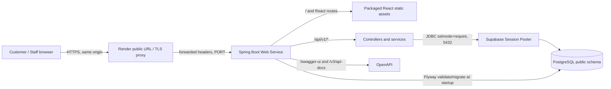

# Deployment — รุ่นส่งปัจจุบัน

Topology URL เดียวด้านล่างยังใช้จริง: Render เสิร์ฟ React และ Spring Boot, API /api/v1, Supabase Session Pooler. หลักฐานล่าสุดอยู่ที่ [public UAT/19 migrations](../../test/evidence/uat-buffet-2026-10-10/report.md) และ [Swagger smoke หลัง PR #52](../testing/readme-final-public-check-2026-10-10.md)

รอบนี้ตรวจ health/OpenAPI แบบ read-only และไม่เข้าถึง Render dashboard; owner-reported deployed SHA กับผล HTTP เป็นหลักฐานคนละชนิด อย่าอ่าน log V15 ด้านล่างเป็นสถานะล่าสุดของฐาน V19 การนำรุ่นเข้า main ไม่รัน migration เพิ่มหรือเปลี่ยน Render deployment source โดยอัตโนมัติ

## ประวัติการตรวจรอบก่อน

# Production deployment — observed and configured topology

Source revision: `2f8bc4b` on `teeramet_673380273-9_02`. An owner-provided Render Deploys screenshot on 9 October 2026 shows this commit as **Live**. This diagram separates what public endpoints showed from what the source config specifies.

The public URL returned HTTP 200 for `/`, `/swagger-ui/index.html`, `/v3/api-docs`, and `/actuator/health/readiness`, and HTTP 404 for an unknown API route. Source revision `2f8bc4b` builds the React assets into the Spring Boot image in [`Dockerfile.production`](../../Dockerfile.production), uses `/api/v1` as the frontend base URL, and enables the database providers in [`application-production.yml`](../../code/backend/src/main/resources/application-production.yml). A prior Render startup log supplied by the deployment owner showed a PostgreSQL connection through the Supabase pooler, Flyway validation of 15 migrations, schema version 15, and JPA initialization. That log is historical evidence; startup of Live `2f8bc4b` still needs a sanitized Flyway/JPA log check.

Before deploying PR #35, `/kitchen/` and `/Customer/QR/` returned 404. On Live `2f8bc4b`, both returned 200 HTML, as did `/ADMIN/users` and `/staff/sessions/1/billing`; unknown API and asset paths returned 404 JSON. The public JavaScript bundle contains `/api/v1` and no `localhost:8080`. Cookie attributes, authentication, QR, Billing/Payment, and persistence after redeploy still require an authenticated public check. The diagram does not certify those flows.
