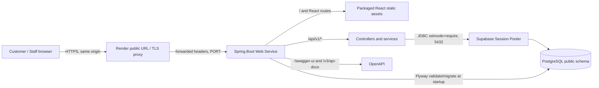

# Production deployment — observed and configured topology

Source revision: `bdd3bd7` on `teeramet_673380273-9_02`. Public observations were made on 8 October 2026; the deployed commit could not be independently read from the public URL. This diagram separates what the public endpoints showed from what the source config specifies.

The public URL returned HTTP 200 for `/`, `/swagger-ui/index.html`, `/v3/api-docs`, and `/actuator/health/readiness`, and HTTP 404 for an unknown API route. Source revision `bdd3bd7` builds the React assets into the Spring Boot image in [`Dockerfile.production`](../../Dockerfile.production), uses `/api/v1` as the frontend base URL, and enables the database providers in [`application-production.yml`](../../code/backend/src/main/resources/application-production.yml). A prior Render startup log supplied by the deployment owner showed a PostgreSQL connection through the Supabase pooler, Flyway validation of 15 migrations, schema version 15, and JPA initialization. That log is historical evidence, not proof that the current public deployment runs `bdd3bd7`.

At the same public check, `/kitchen/` and `/Customer/QR/` still returned 404. The SPA route fix and production customer-cookie fix are in PR #35 but must be deployed and retested before calling those paths or cookies verified in public runtime. The diagram is a topology of the current deployment path, with this release-verification limit.
