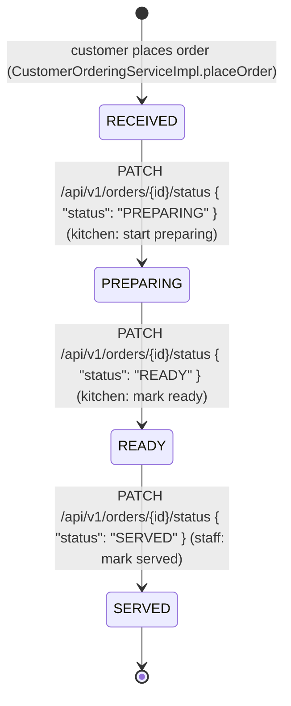

# Order Fulfillment State Diagram

Owner: ศรัณย์. Matches `service/state/*State.java` (`OrderStateFactory`,
`ReceivedState`, `PreparingState`, `ReadyState`, `ServedState`) and
`OrderFulfillmentServiceImpl.advanceStatus`.

## Rules enforced by the State Pattern

- Each state (`ReceivedState`, `PreparingState`, `ReadyState`, `ServedState`) only exposes
  the single legal `next()` state; there is no method that accepts an arbitrary target
  status, so skipping a step (e.g. `RECEIVED -> READY`) or reversing one
  (e.g. `PREPARING -> RECEIVED`) is rejected before persistence.
- `OrderFulfillmentServiceImpl.advanceStatus` compares the caller's requested status
  against `currentState.next().status()`; a mismatch throws `BusinessRuleException`,
  which `GlobalExceptionHandler` maps to `400 Bad Request` with the shared `ErrorResponse`
  shape.
- `SERVED` is terminal: `ServedState.next()` always throws `BusinessRuleException`
  ("Order has already been served; no further status transitions are allowed"), so no
  further change to a served order is possible.
- An unknown `orderId` throws `ResourceNotFoundException`, mapped to `404 Not Found`.

## API surface

| Endpoint | Purpose | Requires |
|---|---|---|
| `GET /api/v1/orders/incoming` | Kitchen board — orders in `RECEIVED` or `PREPARING`, oldest first | `KITCHEN_STAFF`, `SUPERVISOR`, or `MANAGER` |
| `GET /api/v1/orders/ready` | Staff serving board — orders in `READY`, oldest first | `SERVICE_STAFF`, `SUPERVISOR`, or `MANAGER` |
| `PATCH /api/v1/orders/{id}/status` | Advance an order to the single next legal status | `KITCHEN_STAFF`/`SUPERVISOR`/`MANAGER` for `PREPARING`/`READY`; `SERVICE_STAFF`/`SUPERVISOR`/`MANAGER` for `SERVED` |

All three reuse the `OrderResponse` shape (`OrderFulfillmentContext`): `orderId`,
`sessionId`, `tableNumber`, `items`, `status`, `createdAt`.

### Authorization (interim, until Authentication ships)

`OrderFulfillmentAccessProvider` is the authorization seam (mirrors `MenuAdminAccessProvider`
and `SessionContextProvider`). In production (`disabled`, the default) every call fails with
`503 Service Unavailable` until เมธัส's Authentication module provides the real implementation.
In `local`/`test` profiles (`fixture`), the caller's role is read from an `X-User-Role` header:

- Missing or unrecognized header → `401 Unauthorized`
- Recognized role without the required permission → `403 Forbidden`

This header is a temporary stand-in for real login and must be replaced once Authentication
ships a real session/JWT-backed identity.
