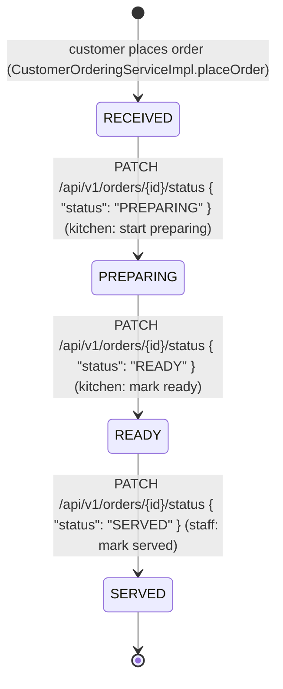

# Order Fulfillment State Diagram

Owner: ศรัณย์. Matches `service/state/*State.java` (`OrderStateResolver` / `RegistryOrderStateResolver`,
`ReceivedState`, `PreparingState`, `ReadyState`, `ServedState`) and
`OrderFulfillmentServiceImpl.advanceStatus`.

## Rules enforced by the State Pattern

- Each state (`ReceivedState`, `PreparingState`, `ReadyState`, `ServedState`) only exposes
  the single legal `next()` state; there is no method that accepts an arbitrary target
  status, so skipping a step (e.g. `RECEIVED -> READY`) or reversing one
  (e.g. `PREPARING -> RECEIVED`) is rejected before persistence.
- `OrderFulfillmentServiceImpl.advanceStatus` compares the caller's requested status
  against `currentState.next().status()`; a mismatch throws `BusinessRuleException`,
  which `GlobalExceptionHandler` maps to `400 Bad Request` with the shared `ErrorResponse`
  shape.
- `SERVED` is terminal: `ServedState.next()` always throws `BusinessRuleException`
  ("Order has already been served; no further status transitions are allowed"), so no
  further change to a served order is possible.
- An unknown `orderId` throws `ResourceNotFoundException`, mapped to `404 Not Found`.

## API surface

| Endpoint | Purpose | Requires |
|---|---|---|
| `GET /api/v1/orders/incoming` | Kitchen board — orders in `RECEIVED` or `PREPARING`, oldest first | `KITCHEN_STAFF` only |
| `GET /api/v1/orders/ready` | Staff serving board — orders in `READY`, oldest first | `SERVICE_STAFF` only |
| `PATCH /api/v1/orders/{id}/status` | Advance an order to the single next legal status | `KITCHEN_STAFF` for `PREPARING`/`READY`; `SERVICE_STAFF` for `SERVED` |

All three reuse the `OrderResponse` shape (`OrderFulfillmentContext`): `orderId`,
`sessionId`, `tableNumber`, `items`, `status`, `createdAt`.

### Current authorization — architecture refactor

`SessionOrderFulfillmentAccessProvider` depends on `UserContextProvider`, implemented by `SessionUserContextProvider` and the staff HTTP login session. Production frontend does not send `X-User-Role`; spoofing it cannot grant access. No login returns 401; a logged-in wrong role returns 403. Fixtures apply only to explicitly configured tests/demo, not production authority. MANAGER and SUPERVISOR cannot use the Kitchen/Serving flows.

[PlantUML state source](state-order.puml) · [SVG preview](previews/state-order.svg) · [class participants](class-order-state.puml)

## State registration

`OrderStateConfig` registers the existing four singleton policies. The immutable registry rejects duplicate/missing statuses at startup and null lookup. Fulfillment injects OrderStateResolver; the static switch factory was removed. Changes to business statuses still require enum/transition/API/UI/permission review. Fixtures now use the same role matrix but do not prove runtime identity.
