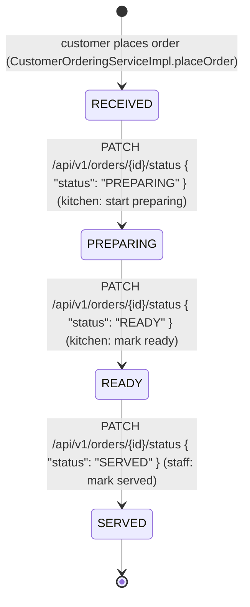

# Order Fulfillment State Diagram

Reviewed against `origin/develop` after architecture refactor PR #25 on 7 October 2026. Owner: ศรัณย์. Matches `service/state/*State.java` (`OrderStateResolver` / `RegistryOrderStateResolver`,
`ReceivedState`, `PreparingState`, `ReadyState`, `ServedState`) and
`OrderFulfillmentServiceImpl.advanceStatus`.

## Rules enforced by the State Pattern

- Each state (`ReceivedState`, `PreparingState`, `ReadyState`, `ServedState`) only exposes
  the single legal `next()` state; there is no method that accepts an arbitrary target
  status, so skipping a step (e.g. `RECEIVED -> READY`) or reversing one
  (e.g. `PREPARING -> RECEIVED`) is rejected before persistence.
- `OrderFulfillmentServiceImpl.advanceStatus` compares the caller's requested status
  against `currentState.next().status()`; a mismatch throws `BusinessRuleException`,
  which `GlobalExceptionHandler` maps to `400 Bad Request` with the shared `ErrorResponse`
  shape.
- `SERVED` is terminal: `ServedState.next()` always throws `BusinessRuleException`
  ("Order has already been served; no further status transitions are allowed"), so no
  further change to a served order is possible.
- An unknown `orderId` throws `ResourceNotFoundException`, mapped to `404 Not Found`.

## API surface

| Endpoint | Purpose | Requires |
|---|---|---|
| `GET /api/v1/orders/incoming` | Kitchen board — orders in `RECEIVED` or `PREPARING`, oldest first | `KITCHEN_STAFF` only |
| `GET /api/v1/orders/ready` | Staff serving board — orders in `READY`, oldest first | `SERVICE_STAFF` only |
| `PATCH /api/v1/orders/{id}/status` | Advance an order to the single next legal status | `KITCHEN_STAFF` for `PREPARING`/`READY`; `SERVICE_STAFF` for `SERVED` |

All three reuse the `OrderResponse` shape (`OrderFulfillmentContext`): `orderId`,
`sessionId`, `tableNumber`, `items`, `status`, `createdAt`.

### Current authorization — architecture refactor

`SessionOrderFulfillmentAccessProvider` depends on `UserContextProvider`, implemented by `SessionUserContextProvider` and the staff HTTP login session. A caller-supplied `X-User-Role` cannot grant access. The session-backed integration test exercises actual login and shows anonymous requests return 401; a logged-in wrong role returns 403 without changing the order. MANAGER and SUPERVISOR cannot use the Kitchen/Serving flows. This proves the session provider when configured, not the public deployment (there is no confirmed public URL).

## State Pattern problem, context and tests

The fulfillment service previously needed to guard arbitrary status changes with scattered conditionals. The State Pattern gives each status its own transition rule so `OrderFulfillmentServiceImpl` asks the current state for its only legal successor rather than duplicating a list of allowed pairs. The service is the context; `CustomerOrder` persists only the `OrderStatus` enum; `OrderStateResolver` resolves the corresponding state through the validated `RegistryOrderStateResolver`; and `ReceivedState`, `PreparingState`, `ReadyState`, and terminal `ServedState` define transition behavior.

| Attempt | Expected result | Evidence |
|---|---|---|
| `RECEIVED → PREPARING → READY → SERVED` with the correct Kitchen/Service roles | All transitions succeed | `OrderStateTest`, `OrderFulfillmentIntegrationTest`, `SessionFulfillmentIntegrationTest` |
| `RECEIVED → READY` or `PREPARING → RECEIVED` | `400 ErrorResponse`; persisted status unchanged | `OrderFulfillmentIntegrationTest` |
| Any transition from `SERVED` | `400 ErrorResponse`; terminal state remains | `OrderStateTest`, `OrderFulfillmentIntegrationTest` |
| Kitchen tries `SERVED`, Service tries `PREPARING`, or Manager/Supervisor tries either role flow | `403 ErrorResponse`; persisted status unchanged | `SessionFulfillmentIntegrationTest` |
| Anonymous request, including a spoofed `X-User-Role` header | `401 ErrorResponse` | `SessionFulfillmentIntegrationTest` |
| Unknown order ID | `404 ErrorResponse` | `OrderFulfillmentIntegrationTest` |

[PlantUML state source](state-order.puml) · [SVG preview](previews/state-order.svg) · [class participants](class-order-state.puml)

## State registration

`OrderStateConfig` registers the existing four singleton policies. The immutable registry rejects duplicate/missing statuses at startup and null lookup. Fulfillment injects OrderStateResolver; the static switch factory was removed. Changes to business statuses still require enum/transition/API/UI/permission review. Fixtures now use the same role matrix but do not prove runtime identity.
