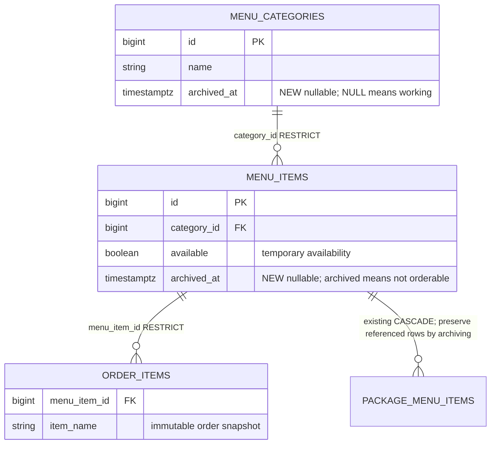

# R01-A — Menu archive delta

Owner: ศิระพัทธ์ · 9 October 2026 · [design/FK/schema decisions](../database/r01-a-menu-archive-proposal.md)

Only `menu_categories.archived_at` and `menu_items.archived_at` are new nullable TIMESTAMP WITH TIME ZONE columns (V18). Existing keys, snapshots, grants and RLS remain unchanged. This delta does not replace the approved full ERD.



```mermaid
sequenceDiagram
    participant M as Manager
    participant C as Menu service
    participant DB as Database
    participant O as Customer ordering
    M->>C: Confirm DELETE menu item
    C->>DB: Lock category then item
    O->>DB: Lock requested item IDs in order
    Note over DB,O: Competing operation waits for the same item lock
    alt Order history or package membership exists
        C->>DB: Set archived_at and available=false; preserve references
    else No reference
        C->>DB: Delete item; FK remains authority
    end
    C-->>M: 204 after commit (409 and rollback on FK conflict)
    O->>DB: Recheck archive/availability before creating order
    O-->>O: Reject stale cart without partial order
```

Restore locks the same category/item, requires a working parent, and sets unavailable only on the first archived → working transition. Retried restore preserves later activation. Category restore never restores children.
