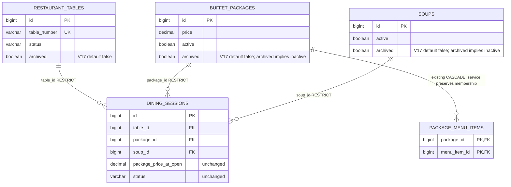
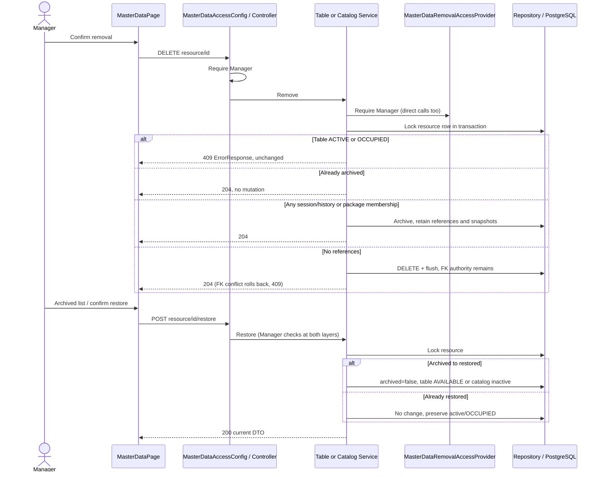

# R01-B — Table / Package / Soup removal delta

Source: [owner design attestation](../architecture/pavarit-r01-b-design-delta.md), baseline `69fb7af` plus R01-B implementation. Mermaid source is embedded so GitHub renders the delta beside its explanation. Existing PlantUML baseline diagrams remain historical; this delta does not certify other owners' V16/V18 or public deployment.

## Entity/FK delta (V17)

No JPA cascade is added. Session relationships remain LAZY; no name snapshot is added. V17 adds only three flags and safe-state checks, retaining applied migrations/FKs/grants. Archived table numbers remain unique/reserved.

## Removal and restore

Opening locks **Table → Package → Soup** and checks archive/availability after each lock. Table removal and open serialize on the same table row; catalog removal serializes on its package/soup row. Archive may succeed after an open commits, preserving that ACTIVE session and its price snapshot. Existing Billing/Payment/close read the session rather than requiring the catalog to remain active.
