# สไลด์ Canva ทีม v02b — ฉบับล่วงหน้า แก้ข้อเท็จจริง PR #24

**ยังไม่รับรอง** รอบนี้แก้เฉพาะข้อเท็จจริงหน้า2/24/68/70 คง76หน้า ลำดับและผู้พูดเดิม รอทบทวนหลังโค้ดทีมเสร็จ

ชุดเต็ม 76 หน้า ประกอบด้วย 20 หน้าเนื้อหา/ภาพอธิบาย และ 56 ภาคผนวก มี diagram จริง 28 ชุดและโค้ดตัวอย่าง ทุกหน้ามีผู้บรรยายหนึ่ง branch ใช้โค้ดจริง baseline `472fba4f25a27fa2e3cd1e1213151ce971646f3a` ไม่ใช่การรับรอง public/release

เกณฑ์ปัจจุบันขั้นต่ำ meaningful commits คนละ 5 ตามที่ปวริศช์แจ้งว่าอาจารย์ปรับวันที่ 7 ตุลาคม 2026 ไม่แก้ใบงานต้นฉบับที่ยังเป็น15

ฟอนต์ Sarabun มีหัวสำหรับข้อความและ JetBrains Mono สำหรับ code สีพื้นครีมกับ navy และ terracotta ทอง ใช้ภาพสถาปัตยกรรม แบบข้อมูล และลำดับงานแทน paragraphs ชุดเต็มเป็นทั้งช่วงอธิบายและอ้างอิง เลือกเส้นพรีเซนต์ตามเวลาจากคู่มือ ไม่ต้องอ่านทุกหน้าบนเวที

## หน้า 01 — ระบบร้านบุฟเฟต์ที่เชื่อมทุกบทบาท

ผู้บรรยาย `pavarit_673380278-9_01` · Software Design

- Buffet Restaurant Management System
- CP353002 Principles of Software Design and Development
- ออกแบบจากปัญหา อธิบายด้วยโค้ด และตรวจด้วยการทดสอบ

ภาพประกอบ Requirements · Architecture · SOLID · Patterns · Verification

### คำพูดประกอบ

หน้าหลัก 20 หน้า ใช้เวลาพูด 10 นาที 50 วินาที เหลือ 1 นาที 10 วินาทีสำหรับเปลี่ยนผู้บรรยายและเผื่อเวลา ภาคผนวกใช้ตอบคำถาม มี diagram ตามข้อ 9.1 ครบและ source ของโค้ดจริง ไม่อ่านทั้งชุดบนเวที

ช่วงนำเสนอ 12 นาที ใช้หน้านี้ประมาณ 15 วินาที

ชุดนำเสนอทั้งทีม สร้างจากโค้ด develop หลัง PR22 ที่ 472fba4 ลำดับนี้เดินจาก requirements สถาปัตยกรรม แบบข้อมูล หลักการออกแบบ Patterns การเชื่อมระบบ แล้วจึงการทดสอบ ไม่ใช่เรียงตามวันที่ทำงาน

## หน้า 02 — ผู้ใช้งานทั้งห้ากลุ่มมีหน้าที่ต่างกัน

ผู้บรรยาย `pavarit_673380278-9_01` · Use Case


### ภาพ diagram

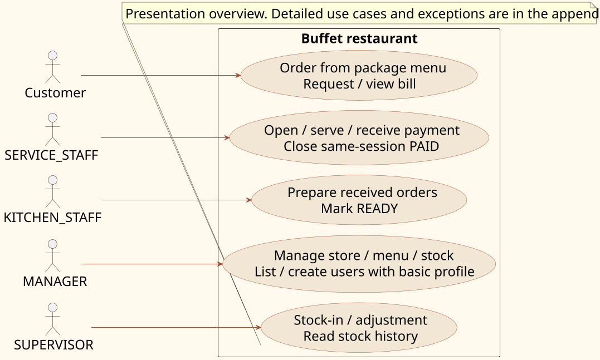

[Source](../diagrams/presentation-use-case.puml) · [อ้างอิง repository](https://github.com/PavaritPramual/buffet-restaurant-management-system/blob/pavarit_673380278-9_01/doc/diagrams/presentation-use-case.puml)

### คำพูดประกอบ

Manager จัดการข้อมูลร้าน เมนูและสต็อก ส่วนผู้ใช้มีเฉพาะ list/create พร้อม basic profile displayName/email ยังไม่มีแก้/ลบผู้ใช้หรือ full profile management

## หน้า 03 — Use Case Description กำหนดเงื่อนไขเปิดรอบ

ผู้บรรยาย `pavarit_673380278-9_01` · โจทย์และขอบเขต

- SERVICE_STAFF ต้อง login และเลือกโต๊ะว่าง
- ระบุจำนวนคน แพ็กเกจ และน้ำซุปก่อนยืนยัน
- สำเร็จแล้ว Session ACTIVE และโต๊ะ OCCUPIED

ภาพประกอบ ก่อนเริ่ม · login และโต๊ะว่าง · งานหลัก · ตรวจและบันทึกพร้อมกัน · หลังสำเร็จ · รอบ active โต๊ะ occupied · ทางเลือก · ปฏิเสธแล้วข้อมูลเดิมคงอยู่

### คำพูดประกอบ

ช่วงนำเสนอ 12 นาที ใช้หน้านี้ประมาณ 30 วินาที

UC-01 เปิดรอบรวมการเลือกแพ็กเกจและน้ำซุปในคำขอเดียว ไม่สร้างรอบเปล่าแล้ว setup ภายหลัง Main flow ตรวจ row lock เก็บราคา snapshot และสร้างรอบพร้อมเปลี่ยนโต๊ะ Alternative โต๊ะไม่ว่าง จำนวนคนผิด หรือ master inactive ต้องปฏิเสธโดยไม่มีข้อมูลครึ่งทาง รายละเอียด UC ทั้งระบบอยู่ doc/system-design/use-cases.md

## หน้า 04 — Controller Service และ Repository แยกหน้าที่

ผู้บรรยาย `pavarit_673380278-9_01` · สถาปัตยกรรม


### ภาพ diagram

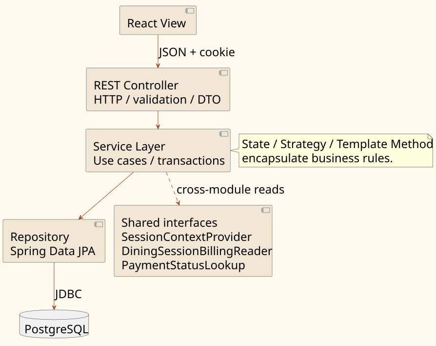

[Source](../diagrams/presentation-component.puml) · [อ้างอิง repository](https://github.com/PavaritPramual/buffet-restaurant-management-system/blob/pavarit_673380278-9_01/doc/diagrams/presentation-component.puml)

### คำพูดประกอบ

ช่วงนำเสนอ 12 นาที ใช้หน้านี้ประมาณ 35 วินาที

Componentย่อแสดงReactHTTPControllerServiceRepositoryPostgresและsharedinterfaces ใช้เพื่อเล่าMVC/Layered/Service/Repository/DTO/DI ภาพละเอียดและโค้ดแต่ละenterprisepatternอยู่ภาคผนวก

## หน้า 05 — Session เป็นแกนของความสัมพันธ์ข้อมูล

ผู้บรรยาย `methus_673380300-2_01` · แบบข้อมูล


### ภาพ diagram

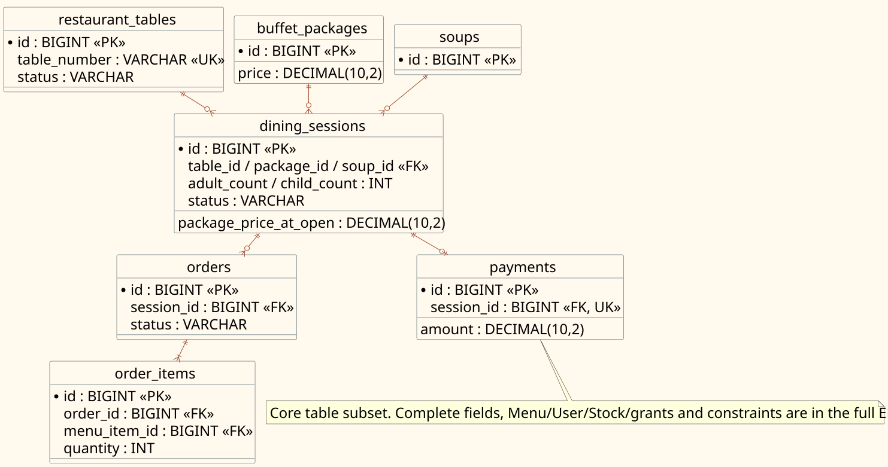

[Source](../diagrams/presentation-erd.puml) · [อ้างอิง repository](https://github.com/PavaritPramual/buffet-restaurant-management-system/blob/pavarit_673380278-9_01/doc/diagrams/presentation-erd.puml)

### คำพูดประกอบ

ช่วงนำเสนอ 12 นาที ใช้หน้านี้ประมาณ 35 วินาที

ERDย่อจากตารางและFKจริง7ตาราง แสดงราคาsnapshotและหนึ่งpaymentต่อsession ภาพเต็มทุกตารางอยู่ภาคผนวก ไม่ใช้ภาพย่อแทนcanonicaldictionary

## หน้า 06 — S แยกงาน HTTP ออกจากกฎเปิดรอบ

ผู้บรรยาย `pavarit_673380278-9_01` · SOLID

- Controller จัดรูปแบบคำขอและ response
- Service ตรวจโต๊ะ จำนวนคน และ transaction
- Mapper แปลงข้อมูลสำหรับผู้ใช้

### ตัวอย่างจากโค้ดจริง

```java
DiningSessionResponse created = diningSessionService.openSession(request);
return ResponseEntity.created(URI.create("/api/v1/dining-sessions/" + created.sessionId())).body(created);
```

[DiningSessionController.java บรรทัด 34](https://github.com/PavaritPramual/buffet-restaurant-management-system/blob/472fba4f25a27fa2e3cd1e1213151ce971646f3a/code/backend/src/main/java/com/buffetrestaurant/controller/DiningSessionController.java#L34)

### คำพูดประกอบ

ช่วงนำเสนอ 12 นาที ใช้หน้านี้ประมาณ 20 วินาที

Single Responsibility ไม่ได้หมายถึงหนึ่งคลาสมีหนึ่งเมธอด Controller นี้รับคำขอที่ผ่าน Bean Validation และมอบ use case ให้ DiningSessionService เหตุผลที่จะเปลี่ยน HTTP contract ต่างจากเหตุผลที่จะเปลี่ยนกฎ capacity ส่วน Mapper เปลี่ยนรูปแบบข้อมูล

## หน้า 07 — O เปลี่ยนนโยบายราคาโดยไม่แก้ Engine

ผู้บรรยาย `teeramet_673380273-9_02` · SOLID

- BillingEngine ขึ้นกับ Strategy
- นโยบายราคาผู้ใหญ่กับเด็กประกอบกัน
- การเลือก implementation อยู่ใน config

### ตัวอย่างจากโค้ดจริง

```java
public BillCalculationStrategy billCalculationStrategy() {
    return new StandardBillCalculation(new ChildRateCalculationStrategy(new BigDecimal("0.5")));
}
```

[BillingConfig.java บรรทัด 17](https://github.com/PavaritPramual/buffet-restaurant-management-system/blob/472fba4f25a27fa2e3cd1e1213151ce971646f3a/code/backend/src/main/java/com/buffetrestaurant/config/BillingConfig.java#L17)

### คำพูดประกอบ

ช่วงนำเสนอ 12 นาที ใช้หน้านี้ประมาณ 20 วินาที

Open Closed ใช้กับจุดที่ต้องเปลี่ยนนโยบายราคา Runtime เลือก child rate 0.5 และ PromotionDiscountStrategy ไม่อ้างว่าเพิ่ม order status ใหม่ได้โดยไม่แก้ factory เพราะ OrderStateFactory มี switch ที่เป็นข้อจำกัดอีกแบบ

## หน้า 08 — L การแทน implementation ต้องรักษาสัญญา

ผู้บรรยาย `sarun_673380515-1_02` · SOLID

- ทุก State บอกสถานะปัจจุบันได้
- next ใช้ได้เฉพาะ State ที่ยังไม่สิ้นสุด
- SERVED ปฏิเสธตามสัญญาที่ประกาศไว้

### ตัวอย่างจากโค้ดจริง

```java
public OrderState next() {
    throw new BusinessRuleException("Order has already been served; no further status transitions are allowed");
}
```

[ServedState.java บรรทัด 20](https://github.com/PavaritPramual/buffet-restaurant-management-system/blob/472fba4f25a27fa2e3cd1e1213151ce971646f3a/code/backend/src/main/java/com/buffetrestaurant/service/state/ServedState.java#L20)

### คำพูดประกอบ

ช่วงนำเสนอ 12 นาที ใช้หน้านี้ประมาณ 20 วินาที

Liskov ต้องอ่าน contract ก่อน OrderState ระบุว่า terminal next จะ throw BusinessRuleException ServedState จึงไม่ละเมิดสัญญาเพียงเพราะปฏิเสธการไปต่อ การไม่มี UnsupportedOperationException ไม่ได้พิสูจน์ LSP ทั้งระบบ ส่วน Strategy ต้องคืนผลที่ไม่ null หรือติดลบ

## หน้า 09 — I ให้ผู้เรียกใช้เฉพาะข้อมูลที่จำเป็น

ผู้บรรยาย `pavarit_673380278-9_01` · SOLID

- Session ต้องรู้เพียงผลการชำระ
- ไม่ต้องสร้าง Payment หรือจัดการส่วนลด
- Billing กับ Ordering ใช้คนละสัญญา

### ตัวอย่างจากโค้ดจริง

```java
public interface PaymentStatusLookup {
    PaymentVerification findPaymentForSession(Long sessionId);

    record PaymentVerification(Long sessionId, PaymentStatus status) {
    }
}
```

[PaymentStatusLookup.java บรรทัด 6](https://github.com/PavaritPramual/buffet-restaurant-management-system/blob/472fba4f25a27fa2e3cd1e1213151ce971646f3a/code/backend/src/main/java/com/buffetrestaurant/integration/payment/PaymentStatusLookup.java#L6)

### คำพูดประกอบ

ช่วงนำเสนอ 12 นาที ใช้หน้านี้ประมาณ 20 วินาที

Interface Segregation ตัวอย่าง PaymentStatusLookup ให้ close อ่าน verification ของรอบเดียวกันโดยไม่เรียก API รับชำระ ไม่มี dependency ต่อ Payment Entity และไม่เอาสิทธิ์ทุกอย่างใส่ interface เดียว

## หน้า 10 — D Service รับ dependency ผ่าน constructor

ผู้บรรยาย `sirapat_673380293-3_01` · SOLID

- กฎ Ordering ขึ้นกับ SessionContextProvider
- สลับ provider ผ่านการประกอบระบบ
- ใน tests ใช้ stub ตามสัญญาได้

### ตัวอย่างจากโค้ดจริง

```java
public CustomerOrderingServiceImpl(SessionContextProvider sessionProvider, MenuItemRepository menuItemRepository,
                                   CustomerOrderRepository orderRepository, OrderingMapper mapper) {
    this.sessionProvider = sessionProvider;
```

[CustomerOrderingServiceImpl.java บรรทัด 32](https://github.com/PavaritPramual/buffet-restaurant-management-system/blob/472fba4f25a27fa2e3cd1e1213151ce971646f3a/code/backend/src/main/java/com/buffetrestaurant/service/impl/CustomerOrderingServiceImpl.java#L32)

ภาพประกอบ Ordering Service · SessionContextProvider · Database implementation

### คำพูดประกอบ

ช่วงนำเสนอ 12 นาที ใช้หน้านี้ประมาณ 25 วินาที

Dependency Inversion เห็นจาก field ที่เป็น abstraction และ constructor injection ใน CustomerOrderingServiceImpl ตัวอย่างนี้ถูกใช้จริง แต่ไม่อ้างว่าทุก service ผ่านเกณฑ์ constructor only แล้ว CustomerBillingService ยังมี field PersistenceContext และ Auth/Stock บางจุดใช้ concrete dependency ตามรายงานข้อขาด

## หน้า 11 — State เก็บกฎลำดับงานไว้กับสถานะ

ผู้บรรยาย `sarun_673380515-1_02` · Behavioral Patterns

- ครัวทำได้ถึง READY
- Service Staff เปลี่ยน READY เป็น SERVED
- ห้ามข้ามขั้น ย้อนกลับ หรือไปต่อหลังเสิร์ฟ

### ตัวอย่างจากโค้ดจริง

```java
public OrderState next() {
    return PreparingState.INSTANCE;
}
```

[ReceivedState.java บรรทัด 19](https://github.com/PavaritPramual/buffet-restaurant-management-system/blob/472fba4f25a27fa2e3cd1e1213151ce971646f3a/code/backend/src/main/java/com/buffetrestaurant/service/state/ReceivedState.java#L19)

ภาพประกอบ RECEIVED · PREPARING · READY · SERVED

### คำพูดประกอบ

ช่วงนำเสนอ 12 นาที ใช้หน้านี้ประมาณ 40 วินาที

ปัญหาคือ client ส่งสถานะปลายทางใดก็ได้และกฎอาจกระจัดกระจายใน service State ทำให้แต่ละสถานะรู้ next ที่ถูกต้องหนึ่งตัว Context คือ OrderFulfillmentServiceImpl; Factory resolve จาก enum; Received/Preparing/Ready/Served เป็น transition classes ส่วน actor authorization อยู่ SessionOrderFulfillmentAccessProvider อีกชั้น Entity เก็บ enum STRING ไม่เก็บ State object Unit/API tests ครอบคลุมทางผ่าน, skip, reverse, terminal และ role ที่ผิด

## หน้า 12 — Strategy แยกนโยบายคำนวณจากงานรับชำระ

ผู้บรรยาย `teeramet_673380273-9_02` · Behavioral Patterns

- Pricing คำนวณยอดก่อนส่วนลด
- Discount คำนวณส่วนลด
- Engine ประสานผลและปัดทศนิยม

### ตัวอย่างจากโค้ดจริง

```java
BigDecimal subtotal = pricing.calculate(context);
BigDecimal reduction = discount.calculateDiscount(context, subtotal);
```

[BillingEngine.java บรรทัด 24](https://github.com/PavaritPramual/buffet-restaurant-management-system/blob/472fba4f25a27fa2e3cd1e1213151ce971646f3a/code/backend/src/main/java/com/buffetrestaurant/service/billing/BillingEngine.java#L24)

ภาพประกอบ BillingContext · Pricing strategy · Discount strategy · BillCalculation

### คำพูดประกอบ

ช่วงนำเสนอ 12 นาที ใช้หน้านี้ประมาณ 40 วินาที

ทั้ง pricing กับ discount เป็น dependency ที่แทนได้ แสดง composition ของ StandardBillCalculation กับ ChildRateCalculationStrategy ไม่มี inheritance ChildRate extends Standard Context คือ BillingContext จาก snapshot จริง ไม่รับราคาจากหน้าเว็บ

## หน้า 13 — Template Method ให้ Stock ใช้ขั้นตอนเดียวกัน

ผู้บรรยาย `methus_673380300-2_01` · Behavioral Patterns

- รับเข้าและปรับยอดใช้ workflow เดียวกัน
- เปลี่ยนเพียง delta กับชนิดธุรกรรม
- ห้ามข้ามกฎยอดไม่ติดลบ

### ตัวอย่างจากโค้ดจริง

```java
public final StockTransaction process(StockItem item, BigDecimal requestedQuantity, String reason,
        UserContext actor) {
    if (actor == null || actor.userId() == null) throw new AuthenticationRequiredException();
    BigDecimal delta = calculateDelta(requestedQuantity);
    BigDecimal nextBalance = item.getQuantity().add(delta);
```

[StockTransactionTemplate.java บรรทัด 27](https://github.com/PavaritPramual/buffet-restaurant-management-system/blob/472fba4f25a27fa2e3cd1e1213151ce971646f3a/code/backend/src/main/java/com/buffetrestaurant/service/StockTransactionTemplate.java#L27)

ภาพประกอบ คำนวณ delta · ตรวจยอดใหม่ · บันทึก StockItem · บันทึก audit

### คำพูดประกอบ

ช่วงนำเสนอ 12 นาที ใช้หน้านี้ประมาณ 40 วินาที

StockTransactionTemplate เป็น abstract class process เป็น final template สอง subclass override calculateDelta และ transactionType ไม่อ้างว่า template เริ่ม DB transaction เอง StockService เป็นเจ้าของ transaction และล็อก StockItem ก่อนเรียก

## หน้า 14 — QR แลกสิทธิ์ก่อนเรียก Ordering

ผู้บรรยาย `sirapat_673380293-3_01` · การเชื่อมระบบ


### ภาพ diagram

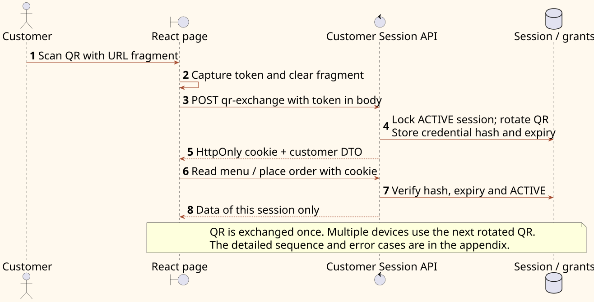

[Source](../diagrams/presentation-sequence-qr.puml) · [อ้างอิง repository](https://github.com/PavaritPramual/buffet-restaurant-management-system/blob/pavarit_673380278-9_01/doc/diagrams/presentation-sequence-qr.puml)

### คำพูดประกอบ

ช่วงนำเสนอ 12 นาที ใช้หน้านี้ประมาณ 45 วินาที

Sequenceย่อเพื่อเล่าภายใน45วินาที ใช้fragmentล้างURL POSTbody lockrotateQR storehash issueHttpOnlycookie ทุกคำขอตรวจexpiryACTIVE รายละเอียดServiceและerrorsอยู่sequenceเต็มในภาคผนวก

## หน้า 15 — คิดบิล ชำระ และปิดรอบเป็นคนละขั้น

ผู้บรรยาย `teeramet_673380273-9_02` · การเชื่อมระบบ


### ภาพ diagram

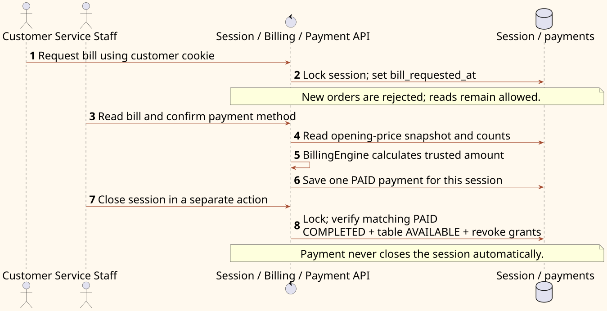

[Source](../diagrams/presentation-sequence-payment.puml) · [อ้างอิง repository](https://github.com/PavaritPramual/buffet-restaurant-management-system/blob/pavarit_673380278-9_01/doc/diagrams/presentation-sequence-payment.puml)

### คำพูดประกอบ

ช่วงนำเสนอ 12 นาที ใช้หน้านี้ประมาณ 50 วินาที

Sequenceย่อ billrequestปิดorderwrites staffpaymentใช้snapshotจากbackend uniquePAID closeแยกverifyPAIDตรงรอบ ภาพละเอียดlockและproviderอยู่ภาคผนวก

## หน้า 16 — Deployment ของ runtime ที่มีอยู่ปัจจุบัน

ผู้บรรยาย `teeramet_673380273-9_02` · ภาคผนวก


### ภาพ diagram

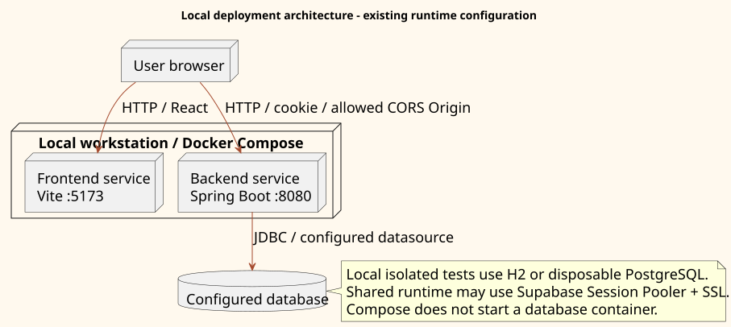

[Source](../diagrams/deployment-local.puml) · [อ้างอิง repository](https://github.com/PavaritPramual/buffet-restaurant-management-system/blob/pavarit_673380278-9_01/doc/diagrams/deployment-local.puml)

### คำพูดประกอบ

ช่วงนำเสนอ 12 นาที ใช้หน้านี้ประมาณ 35 วินาที

Local frontend5173 backend8080 configureddatabase Composeไม่มีDBcontainer แยกisolatedtestH2PGจากSupabase runtime

## หน้า 17 — Test ต้องยืนยันผลที่คาด ไม่ใช่แค่เรียกเมธอด

ผู้บรรยาย `sarun_673380515-1_02` · การตรวจรับ

- RECEIVED ต้องไป PREPARING
- SERVED ต้องปฏิเสธการไปต่อ
- ข้อผิดพลาดต้องเป็นชนิดตาม contract

### ตัวอย่างจากโค้ดจริง

```java
OrderState state = OrderStateFactory.forStatus(OrderStatus.RECEIVED);

assertThat(state.status()).isEqualTo(OrderStatus.RECEIVED);
assertThat(state.next().status()).isEqualTo(OrderStatus.PREPARING);
```

[OrderStateTest.java บรรทัด 14](https://github.com/PavaritPramual/buffet-restaurant-management-system/blob/472fba4f25a27fa2e3cd1e1213151ce971646f3a/code/backend/src/test/java/com/buffetrestaurant/service/state/OrderStateTest.java#L14)

### คำพูดประกอบ

ช่วงนำเสนอ 12 นาที ใช้หน้านี้ประมาณ 35 วินาที

ตัวอย่าง JUnit/AssertJ จาก OrderStateTest แสดง Arrange Act Assert แบบเล็ก ไม่พูดว่าการเขียน test อย่างเดียวแปลว่าผ่าน ผล CI ที่อ้างอยู่หน้าถัดไป Unit นี้เป็นหลักฐานกฎ State ส่วน actor ต้องตรวจด้วย API test แยก

## หน้า 18 — ผล baseline ผ่าน พร้อมขอบเขตหลักฐานที่ชัดเจน

ผู้บรรยาย `sirapat_673380293-3_01` · การตรวจรับ

- CI ของ develop 472fba4
- Browser PR22 เป็น local H2 และ real HTTP
- ไม่ได้แทนผล public release หรือมือถือจริง

### คำพูดประกอบ

ช่วงนำเสนอ 12 นาที ใช้หน้านี้ประมาณ 40 วินาที

CI run37503690105 backend/PostgreSQL303/303 frontend116/116 URL guards6/6 lint0errorsกับ4warningsเดิม buildผ่าน Browser PR22 ก่อนmerge14PASS0FAIL17screenshots สองbrowsercontextsไม่ใช่มือถือจริง ยืนยัน code patch ก่อนmergeตรง head617d742 รายงานนี้ไม่ใช่การรัน tests ใหม่จากการแก้สไลด์ ไม่ติ๊ก timedTTL/publicจากผลเก่า

## หน้า 19 — เดโมแสดงการทำงานร่วมกันครบหนึ่งรอบ

ผู้บรรยาย `pavarit_673380278-9_01` · เดโม

- ใช้บัญชีแยก Customer Kitchen และ Service
- ให้ลูกค้าขอคิดบิล แล้ว Staff รับชำระ
- ปิดรอบและยืนยันว่าโต๊ะกลับว่าง

ภาพประกอบ เปิดโต๊ะและ QR · ลูกค้าสั่งอาหาร · ครัวและเสิร์ฟ · ขอคิดบิลและ PAID · close และโต๊ะว่าง

### คำพูดประกอบ

ช่วงนำเสนอ 12 นาที ใช้หน้านี้ประมาณ 40 วินาที

Demo script เป็นสิ่งที่จะทำในการซ้อม ให้แยก browser contexts ของแต่ละบทบาท เริ่มจากโต๊ะข้อมูลทดสอบที่สร้างใหม่ QRจากsessionจริง สั่งอาหาร ผ่านครัวและเสิร์ฟ ขอคิดบิล รับชำระ close แล้วลอง credentialเดิมถูกปฏิเสธ ไม่แก้ฐานมือระหว่างflow Public URLยังไม่รับรองจากงานสไลด์นี้ ใช้environmentที่ตรวจจริงและบอกให้ชัดก่อนเริ่มเดโม

## หน้า 20 — สรุปการออกแบบจากปัญหาถึงหลักฐาน

ผู้บรรยาย `pavarit_673380278-9_01` · ภาคผนวก

- Session เป็นแกนข้อมูลร่วมของร้าน
- Contracts กับ Patterns แยกเหตุผลการเปลี่ยน
- Transactions กับ tests ตรวจความถูกต้องของ flow

ภาพประกอบ ปัญหา · โครงสร้าง · หลักการ · โค้ด · หลักฐาน

### คำพูดประกอบ

ช่วงนำเสนอ 12 นาที ใช้หน้านี้ประมาณ 30 วินาที

ใช้หน้านี้ตอบคำถามปิดท้ายหรือแทนเดโมหากต้องสรุปเหตุผลการออกแบบ เนื้อหาหลักเรียงrequirementsarchitecturedataSOLIDenterprisebehavioralintegrationverification ไม่สลับไปตามสมาชิก เป็นบทสรุปที่ไม่อ้างpublicFinalผ่านแล้ว

## หน้า 21 — หนึ่งรอบกินคือข้อมูลร่วมของทั้งร้าน

ผู้บรรยาย `pavarit_673380278-9_01` · โจทย์และขอบเขต

- โต๊ะ ออเดอร์ และการชำระต้องอ้างรอบเดียวกัน
- แยกงานครัวกับงานเสิร์ฟตามสิทธิ์
- ใช้ราคาเดิมของรอบ แม้ราคาแพ็กเกจเปลี่ยน

ภาพประกอบ เปิดโต๊ะ · สั่งอาหาร · เตรียมและเสิร์ฟ · รับชำระ · ปิดรอบ

### คำพูดประกอบ

โจทย์คือร้านบุฟเฟต์แบบ Walk-in ปัญหาที่แสดงเป็นเหตุผลในการออกแบบ ไม่ใช่ผลสำรวจร้านที่เราไม่ได้ทำ Scope มีการรับชำระโดยพนักงาน ไม่มี Payment Gateway การจองโต๊ะ WebSocket หรือสูตรตัดวัตถุดิบอัตโนมัติ

## หน้า 22 — ลูกค้า พนักงานบริการ และครัวทำอะไรกับระบบ

ผู้บรรยาย `pavarit_673380278-9_01` · Use Case


### ภาพ diagram

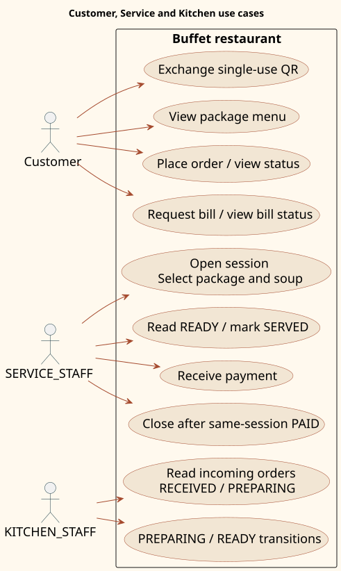

[Source](../diagrams/use-case-service-customer.puml) · [อ้างอิง repository](https://github.com/PavaritPramual/buffet-restaurant-management-system/blob/pavarit_673380278-9_01/doc/diagrams/use-case-service-customer.puml)

### คำพูดประกอบ

แต่ละ actor มี use case ของตน Customer แลก QR ดูเมนู สั่งและขอบิล Staff เปิดรอบเสิร์ฟชำระและclose KitchenทำincomingกับPREPARINGREADY

## หน้า 23 — แต่ละบทบาทมีงานและสิทธิ์ต่างกัน

ผู้บรรยาย `methus_673380300-2_01` · โจทย์และขอบเขต

- Customer ใช้สิทธิ์จากรอบกิน ไม่ต้องสมัครบัญชี
- Staff และ Kitchen ใช้บัญชีพนักงาน
- Manager และ Supervisor ไม่ได้ทำครัวหรือเสิร์ฟโดยอัตโนมัติ

ภาพประกอบ Customer · เมนูและออเดอร์ · Service · โต๊ะ เสิร์ฟ ชำระ · Kitchen · เตรียมอาหาร · Manager · ข้อมูลร้าน · Supervisor · สต็อก

### คำพูดประกอบ

SERVICE_STAFF เปิดรอบ เสิร์ฟ รับชำระและปิดรอบ KITCHEN_STAFF ทำ incoming และเตรียมอาหาร SUPERVISOR จัดการรายการสต็อกตามสิทธิ์ MANAGER จัดการข้อมูลร้าน เมนู ผู้ใช้และสต็อก Backend ตรวจ session จริง ไม่เชื่อ role ที่ส่งจากหน้าเว็บ

## หน้า 24 — Manager และ Supervisor มีสิทธิ์ต่างกัน

ผู้บรรยาย `methus_673380300-2_01` · Use Case


### ภาพ diagram

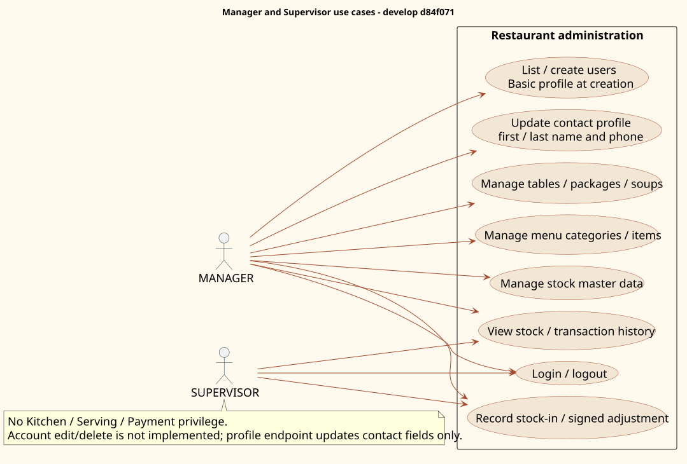

[Source](../diagrams/use-case-management.puml) · [อ้างอิง repository](https://github.com/PavaritPramual/buffet-restaurant-management-system/blob/pavarit_673380278-9_01/doc/diagrams/use-case-management.puml)

### คำพูดประกอบ

User API มี GET list และ POST create พร้อม basic profile displayName/email เท่านั้น ไม่มี update/delete user หรือ full profile management การจัดการข้อมูลร้านแต่ละส่วนต้องอ้าง API ที่มีจริง

## หน้า 25 — แบ่งชั้นเพื่อแยกเหตุผลที่โค้ดต้องเปลี่ยน

ผู้บรรยาย `pavarit_673380278-9_01` · สถาปัตยกรรม

- Controller รับ HTTP และตรวจข้อมูลคำขอ
- Service ประสาน use case และกฎธุรกิจ
- Repository อ่านและเขียนข้อมูล

ภาพประกอบ React UI · REST Controller · Application Service · JPA Repository · PostgreSQL

### คำพูดประกอบ

ภาพนี้เป็น Logical Architecture จากโค้ดจริง React เรียก REST API ส่วน Spring Boot แยก Controller Service Repository ไม่อ้างว่าทุก service ในระบบผ่าน DIP แล้ว รายการข้อขาดอยู่ภาคผนวกท้ายชุด

## หน้า 26 — Component แสดงขอบเขตและจุดเชื่อมของโมดูล

ผู้บรรยาย `pavarit_673380278-9_01` · สถาปัตยกรรม


### ภาพ diagram

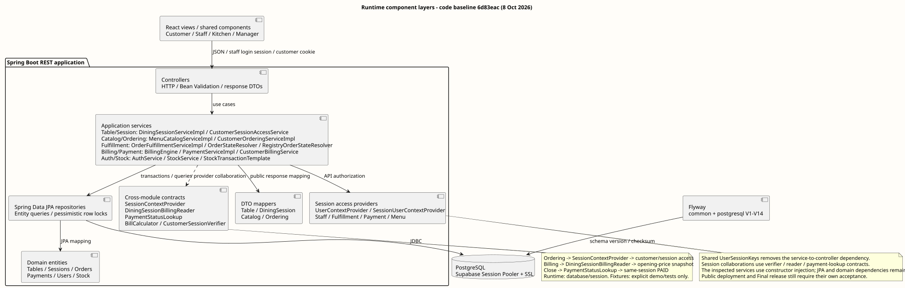

[Source](../diagrams/component.puml) · [อ้างอิง repository](https://github.com/PavaritPramual/buffet-restaurant-management-system/blob/pavarit_673380278-9_01/doc/diagrams/component.puml)

### คำพูดประกอบ

Componentที่ทำงานจริง รวมControllersServicesRepositoriesและproviders SessionContextProvider DiningSessionBillingReader PaymentStatusLookup ไม่แทนผลdeployment

## หน้า 27 — โมดูลอ่านข้อมูลผ่านสัญญาขนาดเล็ก

ผู้บรรยาย `pavarit_673380278-9_01` · สถาปัตยกรรม

- Ordering อ่านบริบทของรอบ
- Billing อ่านราคาและจำนวนคน
- Session อ่านผล PAID ก่อนปิดรอบ

### ตัวอย่างจากโค้ดจริง

```java
record BillingSnapshot(
        Long sessionId,
        BigDecimal packagePriceAtOpen,
        Integer adultCount,
        Integer childCount,
        DiningSessionStatus sessionStatus
) {
}
```

[DiningSessionBillingReader.java บรรทัด 10](https://github.com/PavaritPramual/buffet-restaurant-management-system/blob/472fba4f25a27fa2e3cd1e1213151ce971646f3a/code/backend/src/main/java/com/buffetrestaurant/integration/billing/DiningSessionBillingReader.java#L10)

ภาพประกอบ Session · Ordering · Billing / Payment

### คำพูดประกอบ

ภาพขอบเขตช่วยแสดง coupling ของโมดูล Provider กับ Reader ส่งข้อมูลที่ผู้ใช้ต้องการ โดยไม่ส่ง JPA Entity ข้ามโมดูลเพื่อให้แก้ได้ทุกอย่างพร้อมกัน BillingSnapshot มีข้อมูลราคา จำนวนคน และสถานะ ส่วน discount เป็นความรับผิดชอบของ Billing

## หน้า 28 — DiningSession เชื่อมข้อมูลธุรกรรมของร้าน

ผู้บรรยาย `methus_673380300-2_01` · แบบข้อมูล

- Table Package และ Soup เป็นข้อมูลแม่
- หนึ่ง Session มีหลาย Order
- หนึ่ง Session มี Payment ได้ไม่เกินหนึ่งรายการ

ภาพประกอบ restaurant_tables · buffet_packages · soups · dining_sessions · orders · order_items · payments

### คำพูดประกอบ

ERD ย่อเฉพาะแกนหลักจาก migration และ JPA จริง Order เก็บ sessionId แบบ Long และ FK อยู่ในฐานข้อมูล ไม่วาดเป็น ManyToOne ที่โค้ดไม่มี ตำแหน่งเส้นแสดง cardinality จาก schema ส่วน User และ Stock อยู่แยกในการอธิบายสต็อก

## หน้า 29 — Domain Model แสดงแนวคิดก่อนรายละเอียดคลาส

ผู้บรรยาย `pavarit_673380278-9_01` · แบบข้อมูล


### ภาพ diagram

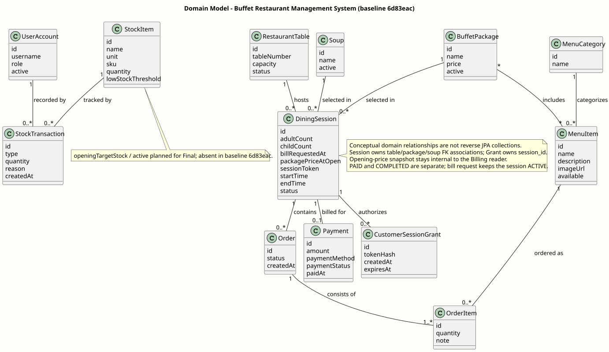

[Source](../diagrams/domain-model.puml) · [อ้างอิง repository](https://github.com/PavaritPramual/buffet-restaurant-management-system/blob/pavarit_673380278-9_01/doc/diagrams/domain-model.puml)

### คำพูดประกอบ

DomainModelเป็นภาพแนวคิด TableSessionPackageSoupOrderPaymentUserStock ไม่ผูกทุกความสัมพันธ์เป็นJPAfield ที่ไม่มีในcode

## หน้า 30 — Cascade ใช้เฉพาะข้อมูลที่เป็นเจ้าของร่วมกัน

ผู้บรรยาย `methus_673380300-2_01` · แบบข้อมูล

- Order เป็นเจ้าของรายการ OrderItem
- อ่าน items แบบ LAZY
- ไม่ cascade ลบจาก Session ไป Package

### ตัวอย่างจากโค้ดจริง

```java
@OneToMany(mappedBy = "order", cascade = CascadeType.ALL, orphanRemoval = true, fetch = FetchType.LAZY)
private List<OrderItem> items = new ArrayList<>();
```

[CustomerOrder.java บรรทัด 39](https://github.com/PavaritPramual/buffet-restaurant-management-system/blob/472fba4f25a27fa2e3cd1e1213151ce971646f3a/code/backend/src/main/java/com/buffetrestaurant/domain/CustomerOrder.java#L39)

ภาพประกอบ Order · OrderItem

### คำพูดประกอบ

ตัวอย่าง OneToMany เป็นโค้ดจริง CustomerOrder เป็นเจ้าของ lifecycle ของ OrderItem จึง cascade persist/update และ orphan delete เฉพาะ child ส่วน OrderItem.order เป็น ManyToOne LAZY ไม่มี cascade กลับไปลบ parent ความสัมพันธ์ Session กับ Table/Package/Soup เป็น ManyToOne LAZY ไม่มี cascade ที่จะลบข้อมูลแม่ตามรอบกิน ประวัติจริงต้องพิจารณาทั้ง JPA และ FK ดู rationale เพิ่มใน architecture/JPA note

## หน้า 31 — FK รักษาประวัติเมื่อข้อมูลต้นทางถูกลบ

ผู้บรรยาย `methus_673380300-2_01` · แบบข้อมูล

- Order ต้องอ้าง Session ที่มีจริง
- RESTRICT ป้องกันการลบ Session ที่มีประวัติ
- ใช้ forward migration เมื่อ schema เปลี่ยน

### ตัวอย่างจากโค้ดจริง

```sql
ALTER TABLE orders
    ADD CONSTRAINT fk_orders_dining_session
    FOREIGN KEY (session_id) REFERENCES dining_sessions(id) ON DELETE RESTRICT;
```

[V7__link_orders_to_dining_sessions.sql บรรทัด 1](https://github.com/PavaritPramual/buffet-restaurant-management-system/blob/472fba4f25a27fa2e3cd1e1213151ce971646f3a/code/backend/src/main/resources/db/migration/common/V7__link_orders_to_dining_sessions.sql#L1)

ภาพประกอบ Session ที่มีจริง · Order อ้างอิง · ลบแล้วประวัติไม่หาย

### คำพูดประกอบ

V7 เพิ่ม FK จาก orders.session_id ไป dining_sessions.id และใช้ ON DELETE RESTRICT ไม่แก้ migration ที่ apply ไปแล้ว V1–V14 มี SELECT readback/checksum สดในรอบแก้ PR24 วันที่7ต.ค. ดูรายงาน pr24-review-fixes-report ไม่มีการ apply/repair migration หรือรัน JPA startup ใหม่

## หน้า 32 — ERD แสดงตารางและความสัมพันธ์ของฐานข้อมูล

ผู้บรรยาย `methus_673380300-2_01` · แบบข้อมูล


### ภาพ diagram

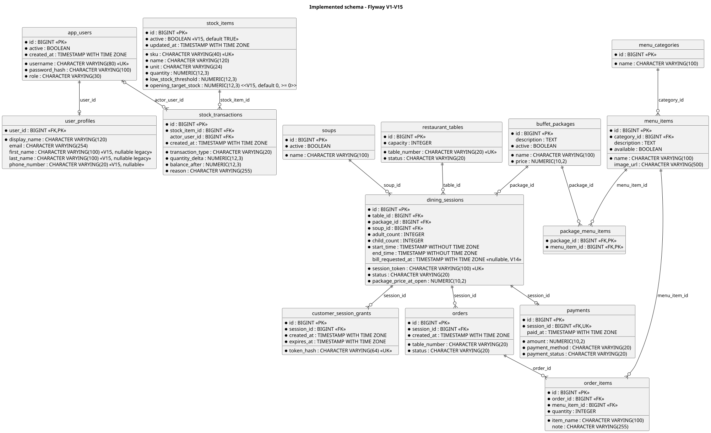

[Source](../diagrams/er-diagram.puml) · [อ้างอิง repository](https://github.com/PavaritPramual/buffet-restaurant-management-system/blob/pavarit_673380278-9_01/doc/diagrams/er-diagram.puml)

### คำพูดประกอบ

ERDครบV1V14 ตารางPKFKชนิดเงินและเวลา ควบคู่DataDictionary ลูกศรcardinalityเป็นnotationของdiagramไม่ใช่proseที่ให้พูด ขยายดูรายละเอียดจากsourceในCanvaหรือSVG

## หน้า 33 — ล็อกราคาแพ็กเกจไว้ตอนเปิดรอบ

ผู้บรรยาย `pavarit_673380278-9_01` · แบบข้อมูล

- ราคาใหม่ใช้กับรอบใหม่
- รอบเดิมคิดจาก packagePriceAtOpen
- เงินใช้ BigDecimal กับทศนิยมสองตำแหน่ง

### ตัวอย่างจากโค้ดจริง

```java
@Column(name = "package_price_at_open", nullable = false, updatable = false,
        precision = 10, scale = 2)
private BigDecimal packagePriceAtOpen;
```

[DiningSession.java บรรทัด 43](https://github.com/PavaritPramual/buffet-restaurant-management-system/blob/472fba4f25a27fa2e3cd1e1213151ce971646f3a/code/backend/src/main/java/com/buffetrestaurant/domain/DiningSession.java#L43)

ภาพประกอบ Package 399 · Session เก็บ 399 · Package เปลี่ยน 499 · Session ยัง 399

### คำพูดประกอบ

DiningSession constructor คัดลอกราคา Package ตอนเปิดรอบลง immutable snapshot ข้อมูลนี้อ่านผ่าน DiningSessionBillingReader ตัวอย่างราคา 399 เปลี่ยนเป็น 499 ระหว่างกิน รอบเดิมยังใช้ 399 Snapshot ป้องกัน master data เปลี่ยนแล้วยอดบิลเก่าเปลี่ยน

## หน้า 34 — Class ของ Session แสดง Entity และ provider

ผู้บรรยาย `pavarit_673380278-9_01` · แบบข้อมูล


### ภาพ diagram

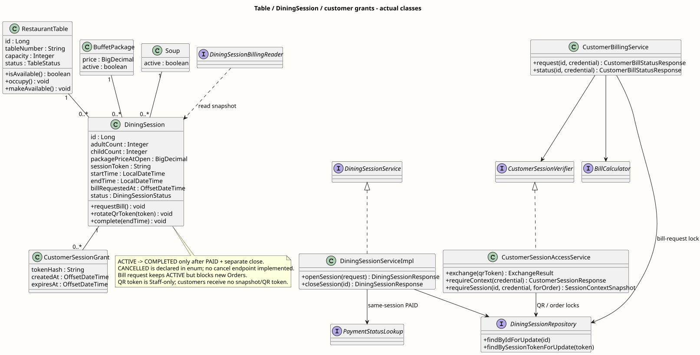

[Source](../diagrams/class-table-session.puml) · [อ้างอิง repository](https://github.com/PavaritPramual/buffet-restaurant-management-system/blob/pavarit_673380278-9_01/doc/diagrams/class-table-session.puml)

### คำพูดประกอบ

ClassDiagramSessionรวมsnapshot grant mapper service repositoryและReader ไม่เผยcustomercredentialจริง

## หน้า 35 — Service Layer ประสานงาน แล้วใช้ Repository เก็บข้อมูล

ผู้บรรยาย `pavarit_673380278-9_01` · Enterprise Patterns

- หนึ่ง use case อยู่ใน service
- Repository ซ่อนวิธีอ่านและเขียนข้อมูล
- ไม่ใส่ workflow เปิดโต๊ะไว้ใน Controller

### ตัวอย่างจากโค้ดจริง

```java
    table.occupy();
    tableRepository.save(table);
    DiningSession saved = diningSessionRepository.saveAndFlush(diningSession);
    return diningSessionMapper.toResponse(saved);
}
```

[DiningSessionServiceImpl.java บรรทัด 122](https://github.com/PavaritPramual/buffet-restaurant-management-system/blob/472fba4f25a27fa2e3cd1e1213151ce971646f3a/code/backend/src/main/java/com/buffetrestaurant/service/impl/DiningSessionServiceImpl.java#L122)

### คำพูดประกอบ

Service Layer เป็น pattern ของ enterprise application ส่วน Repository มาจาก Spring Data JPA แสดงการประกอบใน openSession ตัวอย่างนี้เริ่มหลังตรวจข้อมูลแล้ว ภาพไม่ใช่ generic layer ที่ไม่มีการเรียกจริง

## หน้า 36 — DTO และ Mapper แยก API ออกจาก JPA Entity

ผู้บรรยาย `sirapat_673380293-3_01` · Enterprise Patterns

- DTO เลือก field ที่ต้องส่งออก
- Mapper สร้าง response จาก Entity
- Customer ไม่ได้รับ QR token หรือ grant hash

### ตัวอย่างจากโค้ดจริง

```java
    public OrderResponse toResponse(CustomerOrder order) {
        return new OrderResponse(order.getId(), order.getSessionId(), order.getTableNumber(),
                order.getItems().stream()
                        .map(item -> new OrderResponse.Item(item.getMenuItemId(), item.getItemName(), item.getQuantity()))
                        .toList(),
                order.getStatus(), order.getCreatedAt());
    }
}
```

[OrderingMapper.java บรรทัด 24](https://github.com/PavaritPramual/buffet-restaurant-management-system/blob/472fba4f25a27fa2e3cd1e1213151ce971646f3a/code/backend/src/main/java/com/buffetrestaurant/mapper/OrderingMapper.java#L24)

### คำพูดประกอบ

OrderingMapper เป็น Object Mapper ที่เราเขียน ไม่เรียกว่า JPA Data Mapper ทั้งหมด JPA/Hibernate รับผิดชอบ mapping persistent object กับ relational table ตัวอย่าง API คืน itemName snapshot และ quantity ไม่คืน Entity graph ที่มี field ภายใน

## หน้า 37 — Transaction ทำให้หลายการเปลี่ยนเป็นงานเดียว

ผู้บรรยาย `pavarit_673380278-9_01` · Enterprise Patterns

- สร้างรอบกับเปลี่ยนสถานะโต๊ะต้องสำเร็จด้วยกัน
- ผิดกฎแล้วไม่เหลือข้อมูลครึ่งทาง
- ใช้ row lock จัดลำดับคำขอที่ชนกัน

### ตัวอย่างจากโค้ดจริง

```java
public DiningSessionResponse openSession(OpenDiningSessionRequest request) {
    staffAccessProvider.requireServiceStaffAccess();
    RestaurantTable table = tableRepository.findByIdForUpdate(request.tableId())
            .orElseThrow(() -> new ResourceNotFoundException(
                    "Restaurant table not found with id: " + request.tableId()));
```

[DiningSessionServiceImpl.java บรรทัด 89](https://github.com/PavaritPramual/buffet-restaurant-management-system/blob/472fba4f25a27fa2e3cd1e1213151ce971646f3a/code/backend/src/main/java/com/buffetrestaurant/service/impl/DiningSessionServiceImpl.java#L89)

ภาพประกอบ อ่านพร้อม lock · ตรวจเงื่อนไข · เปลี่ยนข้อมูล · commit ร่วมกัน

### คำพูดประกอบ

Transaction boundary อยู่ use case ที่ต้องเปลี่ยนหลาย record Spring/JPA transaction มี persistence context flush เป็นกลไกที่เกี่ยวกับ Unit of Work ไม่อ้างว่าเขียน custom UnitOfWork class ตัวอย่างเปิดรอบใช้ transaction และล็อก Table ก่อนเปลี่ยนข้อมูล

## หน้า 38 — Class Diagram แสดงตำแหน่ง State Pattern

ผู้บรรยาย `sarun_673380515-1_02` · Behavioral Patterns


### ภาพ diagram

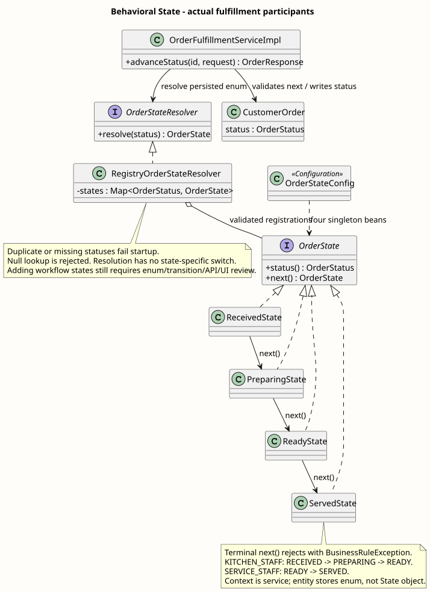

[Source](../diagrams/class-order-state.puml) · [อ้างอิง repository](https://github.com/PavaritPramual/buffet-restaurant-management-system/blob/pavarit_673380278-9_01/doc/diagrams/class-order-state.puml)

### คำพูดประกอบ

FulfillmentServiceเป็นContext OrderStateคือinterface statesสี่singleton implementations และ service พึ่ง OrderFulfillmentAccessProvider; session implementation ตรวจ role จริง Entityเก็บenum ไม่เก็บStateobject

## หน้า 39 — Service ตรวจ next ก่อนบันทึกสถานะ

ผู้บรรยาย `sarun_673380515-1_02` · Behavioral Patterns

- Factory แปลง enum เป็น State
- เทียบ next กับคำขอของผู้ใช้
- ตรวจสิทธิ์ staff session ก่อนแก้ไข
- เปลี่ยน Entity เมื่อ transition ถูกต้อง

### ตัวอย่างจากโค้ดจริง

```java
OrderState current = OrderStateFactory.forStatus(order.getStatus());
OrderState next = current.next();
if (next.status() != requestedStatus) {
    throw new BusinessRuleException("Cannot change order " + orderId + " status from " + order.getStatus()
```

[OrderFulfillmentServiceImpl.java บรรทัด 59](https://github.com/PavaritPramual/buffet-restaurant-management-system/blob/472fba4f25a27fa2e3cd1e1213151ce971646f3a/code/backend/src/main/java/com/buffetrestaurant/service/impl/OrderFulfillmentServiceImpl.java#L59)

### คำพูดประกอบ

ตัวอย่างจาก OrderFulfillmentServiceImpl ซึ่งเป็น Context ที่ใช้ pattern จริง เลือก State จาก status เรียก next และเทียบ requested status ก่อน updateStatus ขณะเดียวกัน access provider ตรวจ KITCHEN_STAFF หรือ SERVICE_STAFF; role ผิดได้ 403 และไม่เขียนสถานะ ไม่สาธิต skip ด้วยการ set enum โดยตรง Factory switch เป็น tradeoff ของ workflow สี่สถานะที่เป็น shared contract

## หน้า 40 — State Diagram แสดงลำดับ Order และสิทธิ์

ผู้บรรยาย `sarun_673380515-1_02` · Behavioral Patterns


### ภาพ diagram

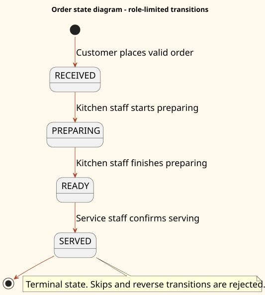

[Source](../diagrams/state-order.puml) · [อ้างอิง repository](https://github.com/PavaritPramual/buffet-restaurant-management-system/blob/pavarit_673380278-9_01/doc/diagrams/state-order.puml)

### คำพูดประกอบ

สถานะRECEIVEDPREPARINGREADYเป็นหน้าที่ครัว READYไปSERVEDเป็นServiceStaff SERVEDterminal skip/reverseถูกปฏิเสธ ทดสอบ roleผิดได้403และสถานะเดิมไม่เปลี่ยน

## หน้า 41 — Class Diagram แสดง composition ของ Strategy

ผู้บรรยาย `teeramet_673380273-9_02` · Behavioral Patterns


### ภาพ diagram

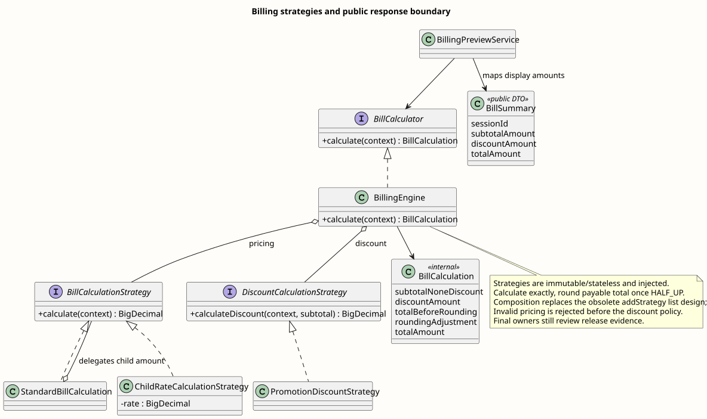

[Source](../diagrams/class-billing-strategy.puml) · [อ้างอิง repository](https://github.com/PavaritPramual/buffet-restaurant-management-system/blob/pavarit_673380278-9_01/doc/diagrams/class-billing-strategy.puml)

### คำพูดประกอบ

BillingEngineประกอบPricingDiscount StandardประกอบChildStrategy ไม่วาดinheritanceผิด ทั้งinterfacesถูกเรียกruntime

## หน้า 42 — BillingEngine ใช้ Strategy แล้วปัดยอดครั้งสุดท้าย

ผู้บรรยาย `teeramet_673380273-9_02` · Behavioral Patterns

- ใช้ BigDecimal รักษาความแม่นยำ
- ตรวจขอบเขตผลจาก Strategy
- ปัด HALF_UP เป็นสองตำแหน่ง

### ตัวอย่างจากโค้ดจริง

```java
BigDecimal preciseTotal = subtotal.subtract(reduction);
BigDecimal total = preciseTotal.setScale(2, RoundingMode.HALF_UP);
return new BillCalculation(context.getSessionId(), subtotal, reduction,
        preciseTotal, total.subtract(preciseTotal), total);
```

[BillingEngine.java บรรทัด 28](https://github.com/PavaritPramual/buffet-restaurant-management-system/blob/472fba4f25a27fa2e3cd1e1213151ce971646f3a/code/backend/src/main/java/com/buffetrestaurant/service/billing/BillingEngine.java#L28)

### คำพูดประกอบ

ตัด snippet จากเมธอด calculate จริง subtotal และ reduction เป็น intermediate internal public BillSummary คืนยอดที่ API ตกลงกัน ส่วน Payment ใช้ total ที่ engine คำนวณแล้ว Runtime ยังไม่ได้ให้ Manager จัดโปรโมชั่นจาก UI ตัวอย่างส่วนลดใน test เป็น controlled context

## หน้า 43 — Class Diagram แสดง Template และ hooks

ผู้บรรยาย `methus_673380300-2_01` · Behavioral Patterns


### ภาพ diagram

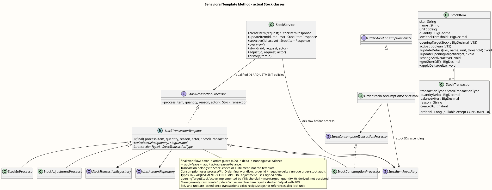

[Source](../diagrams/class-stock-template.puml) · [อ้างอิง repository](https://github.com/PavaritPramual/buffet-restaurant-management-system/blob/pavarit_673380278-9_01/doc/diagrams/class-stock-template.puml)

### คำพูดประกอบ

StockTransactionTemplate finalprocess สองsubclassทำdelta/type StockServicetransactionและrowlock ไม่อ้างhookvalidationที่ไม่มีในsource

## หน้า 44 — process บันทึกทั้งยอดใหม่และผู้ทำรายการ

ผู้บรรยาย `methus_673380300-2_01` · Behavioral Patterns

- ยอดใหม่คำนวณจากยอดเดิมกับ delta
- ผิดกฎแล้วปฏิเสธก่อนบันทึก
- ประวัติมีเหตุผลและยอดหลังทำรายการ

### ตัวอย่างจากโค้ดจริง

```java
item.applyDelta(delta);
items.save(item);
UserAccount account = users.getReferenceById(actor.userId());
StockTransaction transaction = transactions.save(new StockTransaction(item, transactionType(), delta,
        nextBalance, reason.trim(), account));
```

[StockTransactionTemplate.java บรรทัด 35](https://github.com/PavaritPramual/buffet-restaurant-management-system/blob/472fba4f25a27fa2e3cd1e1213151ce971646f3a/code/backend/src/main/java/com/buffetrestaurant/service/StockTransactionTemplate.java#L35)

### คำพูดประกอบ

โค้ดช่วงหลักของ template ค่า reason กับ quantity ถูกตรวจใน DTO/Service ก่อนเรียก Hook ไม่ใช่ที่ทำ Bean Validation แทน Controller signed adjustment คือการเพิ่มลด ไม่ใช่ counted stock แบบ set ยอดโดยตรง

## หน้า 45 — QR แลกได้ครั้งเดียว แล้วใช้ cookie ต่อ

ผู้บรรยาย `pavarit_673380278-9_01` · การเชื่อมระบบ

- Fragment ถูกล้างจาก address bar
- ส่ง token ใน POST body เพื่อแลกสิทธิ์
- หมุน QR และเก็บเพียง hash ของ credential

### ตัวอย่างจากโค้ดจริง

```java
String credential = randomToken();
OffsetDateTime createdAt = OffsetDateTime.now(clock);
grantRepository.save(new CustomerSessionGrant(session, hash(credential),
        createdAt, createdAt.plus(CREDENTIAL_LIFETIME)));
session.rotateQrToken(randomToken());
sessionRepository.flush();
return new ExchangeResult(toResponse(session), credential);
```

[CustomerSessionAccessService.java บรรทัด 62](https://github.com/PavaritPramual/buffet-restaurant-management-system/blob/472fba4f25a27fa2e3cd1e1213151ce971646f3a/code/backend/src/main/java/com/buffetrestaurant/service/impl/CustomerSessionAccessService.java#L62)

ภาพประกอบ QR fragment · POST exchange · Grant hash · HttpOnly cookie

### คำพูดประกอบ

ภาพลำดับใช้ token ตัวอย่างเท่านั้น ไม่มี credential จริง QR อยู่ URL fragment และ frontend ล้างออกก่อน POST exchange Backend row lock จัดลำดับ exchange บันทึก grant hash อายุไม่เกินแปดชั่วโมง หมุน QR หลังสำเร็จ และออก HttpOnly cookie ลูกค้าหลายเครื่องแลก QR รุ่นใหม่ได้คนละ credential

## หน้า 46 — Sequence แสดงการแลก QR และออกสิทธิ์ลูกค้า

ผู้บรรยาย `sirapat_673380293-3_01` · การเชื่อมระบบ


### ภาพ diagram

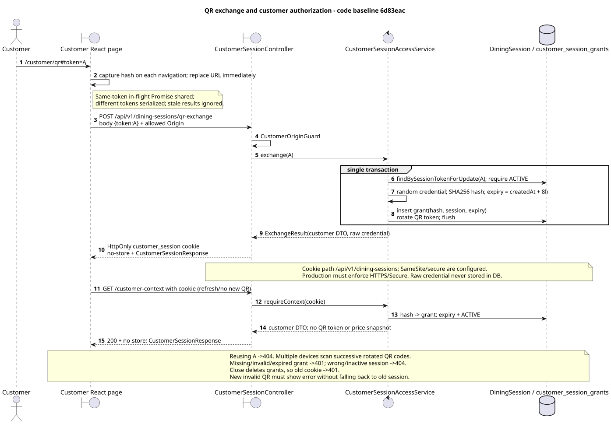

[Source](../diagrams/sequence-qr-exchange.puml) · [อ้างอิง repository](https://github.com/PavaritPramual/buffet-restaurant-management-system/blob/pavarit_673380278-9_01/doc/diagrams/sequence-qr-exchange.puml)

### คำพูดประกอบ

Scenarioหนึ่งsingleuseQR fragmentล้าง POSTbody exchange lock hashgrant rotatecookie ส่วนfrontendStrictModeและstaleresultอธิบายต่อ

## หน้า 47 — React ต้องกันคำขอซ้ำและผลตอบกลับเก่า

ผู้บรรยาย `sirapat_673380293-3_01` · การเชื่อมระบบ

- token เดียวที่ยังรอใช้ Promise ร่วมกัน
- token ใหม่รอ exchange เดิมจบก่อน
- QR ใหม่ผิดแล้วไม่ย้อนแสดงรอบเก่า

### ตัวอย่างจากโค้ดจริง

```typescript
if (latestQrScan?.token === token && !latestQrScan.settled) return latestQrScan.promise

// A new scan must finish after the previous exchange so its cookie wins.
const exchange = previousQrExchange.catch(() => undefined).then(async () =>
  (await customerApiClient.post<SessionContext>('/dining-sessions/qr-exchange', { token })).data)
```

[api.ts บรรทัด 22](https://github.com/PavaritPramual/buffet-restaurant-management-system/blob/472fba4f25a27fa2e3cd1e1213151ce971646f3a/code/frontend/src/features/ordering/api.ts#L22)

### คำพูดประกอบ

redeemQr ใช้ pending request coalescing สำหรับ StrictMode พร้อม serializing different scans ในแท็บเดียวกันเพื่อให้ cookie ของ QR ล่าสุดเป็นผลสุดท้าย การใช้ token ที่แลกเสร็จแล้วอีกครั้งต้องสร้างคำขอใหม่และได้ 404 ไม่ cache success ตลอดไป หน้า Customer reset ข้อมูลเมื่อ hash ใหม่และ guard stale results

## หน้า 48 — เปิดรอบต้องตรวจโต๊ะและ capacity ก่อนสร้างข้อมูล

ผู้บรรยาย `pavarit_673380278-9_01` · การเชื่อมระบบ

- ล็อก Table ก่อนตรวจ AVAILABLE
- จำนวนคนรวมต้องอยู่ในความจุ
- รับ Package และ Soup ที่ active เท่านั้น

### ตัวอย่างจากโค้ดจริง

```java
int guestCount = request.adultCount() + request.childCount();
if (guestCount < 1) {
    throw new IllegalStateException("At least one guest is required");
}
if (guestCount > table.getCapacity()) {
    throw new IllegalStateException("Guest count exceeds restaurant table capacity");
}
```

[DiningSessionServiceImpl.java บรรทัด 98](https://github.com/PavaritPramual/buffet-restaurant-management-system/blob/472fba4f25a27fa2e3cd1e1213151ce971646f3a/code/backend/src/main/java/com/buffetrestaurant/service/impl/DiningSessionServiceImpl.java#L98)

### คำพูดประกอบ

นี่เป็น use case ที่ใช้หลักการและ transaction ก่อนหน้า มีการตรวจ guest อย่างน้อยหนึ่งและไม่เกิน capacity ดึง package soup active สร้าง token แบบ SecureRandom แล้วสร้าง Session กับ OCCUPIED ใน transaction เดียว Backend integration tests ตรวจค่าผิดและคำขอพร้อมกัน

## หน้า 49 — Sequence แสดงการเปิดรอบใน transaction เดียว

ผู้บรรยาย `pavarit_673380278-9_01` · การเชื่อมระบบ


### ภาพ diagram

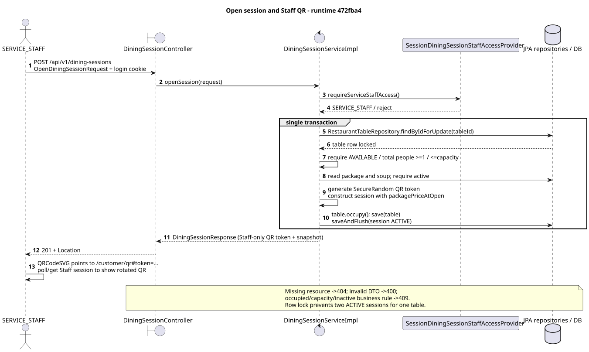

[Source](../diagrams/sequence-open-session.puml) · [อ้างอิง repository](https://github.com/PavaritPramual/buffet-restaurant-management-system/blob/pavarit_673380278-9_01/doc/diagrams/sequence-open-session.puml)

### คำพูดประกอบ

Scenarioสองเปิดรอบ ตรวจStaffAvailablecapacityactivepackage/soup เก็บsnapshot OCCUPIEDกับsessionพร้อมกันในtransaction

## หน้า 50 — Ordering อ่านเฉพาะเมนูของแพ็กเกจในรอบ

ผู้บรรยาย `sirapat_673380293-3_01` · การเชื่อมระบบ

- Cookie ต้องตรง sessionId และยัง ACTIVE
- เมนูต้อง available และอยู่ในแพ็กเกจ
- เก็บชื่ออาหารตอนสั่งเป็น snapshot

### ตัวอย่างจากโค้ดจริง

```java
public List<MenuItemResponse> getMenu(Long sessionId, String sessionToken) {
    SessionContextSnapshot session = requireActive(sessionId, sessionToken);
    return menuItemRepository.findAvailableForPackage(session.packageId()).stream().map(mapper::toResponse).toList();
}
```

[CustomerOrderingServiceImpl.java บรรทัด 40](https://github.com/PavaritPramual/buffet-restaurant-management-system/blob/472fba4f25a27fa2e3cd1e1213151ce971646f3a/code/backend/src/main/java/com/buffetrestaurant/service/impl/CustomerOrderingServiceImpl.java#L40)

### คำพูดประกอบ

CustomerOrder เก็บ sessionId กับ table number snapshot แต่ SessionContextProvider ตรวจสิทธิ์และ lock เมื่อต้องสร้าง order ตัวอย่าง getMenu อ่านเฉพาะ package ของ session ส่วน placeOrder ตรวจ membership อีกครั้ง ไม่เชื่อข้อมูลหน้าเว็บและไม่รับ repeated menu item id

## หน้า 51 — Activity แสดงทางเลือกและเงื่อนไขก่อนสั่ง

ผู้บรรยาย `sirapat_673380293-3_01` · การเชื่อมระบบ


### ภาพ diagram

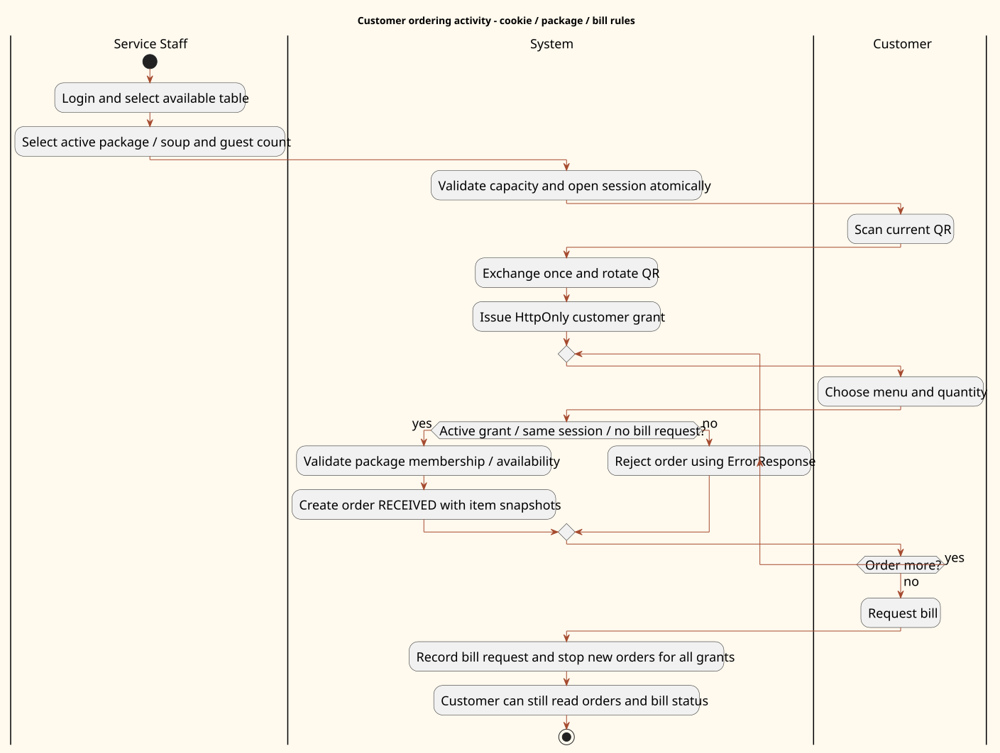

[Source](../diagrams/activity-customer-ordering.puml) · [อ้างอิง repository](https://github.com/PavaritPramual/buffet-restaurant-management-system/blob/pavarit_673380278-9_01/doc/diagrams/activity-customer-ordering.puml)

### คำพูดประกอบ

ActivityswimlaneStaffSystemCustomer การแลกQR ตรวจgrantACTIVE/no billrequested ให้orderเพิ่มจนขอบิล ไม่เขียนstepรอintegrateในภาพimplementation

## หน้า 52 — ขอคิดบิลแล้วทุกเครื่องสั่งเพิ่มไม่ได้

ผู้บรรยาย `teeramet_673380273-9_02` · การเชื่อมระบบ

- ใช้ billRequestedAt โดยไม่เพิ่มสถานะ Session
- คำขอซ้ำคืนสถานะเดิม
- Order และ bill request ใช้ lock ของรอบเดียวกัน

### ตัวอย่างจากโค้ดจริง

```java
if (forOrder && session.getBillRequestedAt() != null) {
    throw new com.buffetrestaurant.exception.DuplicateResourceException("This session has requested its bill and no longer accepts orders");
}
```

[CustomerSessionAccessService.java บรรทัด 89](https://github.com/PavaritPramual/buffet-restaurant-management-system/blob/472fba4f25a27fa2e3cd1e1213151ce971646f3a/code/backend/src/main/java/com/buffetrestaurant/service/impl/CustomerSessionAccessService.java#L89)

### คำพูดประกอบ

CustomerBillingService ตรวจ cookie ก่อนและหลังล็อกเพราะ close อาจ commit ระหว่างรอ requestBill บันทึกเวลาครั้งแรก ส่วน CustomerSessionAccessService ตรวจ billRequestedAt ก่อนสร้าง order และตอบ 409 กรณี Order ได้ lock ก่อนยังบันทึกเสร็จได้ กรณีหลัง bill request ต้องปฏิเสธ

## หน้า 53 — Payment คำนวณยอดฝั่ง backend และกันจ่ายซ้ำ

ผู้บรรยาย `teeramet_673380273-9_02` · การเชื่อมระบบ

- หน้าเว็บส่ง sessionId กับวิธีชำระ
- Engine คำนวณจาก snapshot ของรอบ
- Payment บันทึก PAID และ paidAt

### ตัวอย่างจากโค้ดจริง

```java
BillCalculation summary = billingEngine.calculate(context);
BigDecimal amount = summary.getTotalAmount();
```

[PaymentServiceImpl.java บรรทัด 109](https://github.com/PavaritPramual/buffet-restaurant-management-system/blob/472fba4f25a27fa2e3cd1e1213151ce971646f3a/code/backend/src/main/java/com/buffetrestaurant/service/impl/PaymentServiceImpl.java#L109)

ภาพประกอบ Session snapshot · BillingEngine · Recorded payment

### คำพูดประกอบ

PaymentService ตรวจ role session ACTIVE bill requested context id ตรงกันและไม่มี payment เดิมใต้ session row lock DB ยังมี unique session FK เป็นด่านเพิ่ม CASH QR CARD เป็นวิธีที่พนักงานบันทึก ไม่ใช่ Payment Gateway สไลด์ไม่แสดงยอดจาก browser เป็นข้อมูลรับชำระ

## หน้า 54 — PAID ยังต้องให้พนักงานกดปิดรอบ

ผู้บรรยาย `pavarit_673380278-9_01` · การเชื่อมระบบ

- close ตรวจ PAID ของ session เดียวกันอีกครั้ง
- ลบสิทธิ์ Customer ของทุกเครื่อง
- Session COMPLETED และ Table AVAILABLE ร่วมกัน

### ตัวอย่างจากโค้ดจริง

```java
customerGrantRepository.deleteByDiningSessionId(sessionId);
session.complete(LocalDateTime.now(clock));
table.makeAvailable();
tableRepository.save(table);
return diningSessionMapper.toResponse(session);
```

[DiningSessionServiceImpl.java บรรทัด 172](https://github.com/PavaritPramual/buffet-restaurant-management-system/blob/472fba4f25a27fa2e3cd1e1213151ce971646f3a/code/backend/src/main/java/com/buffetrestaurant/service/impl/DiningSessionServiceImpl.java#L172)

### คำพูดประกอบ

Payment ไม่เปลี่ยน DiningSession เป็น COMPLETED เอง close มีการอ่าน PaymentStatusLookup ตรวจ sessionId และ PAID ก่อน ส่วน snippet นี้คือผลหลังผ่านเงื่อนไข หาก provider ไม่มีให้ 503 ไม่มี fixture ที่แกล้ง PAID ใน production Order กับ close ใช้ session lock เดียวกัน

## หน้า 55 — Sequence แยกคิดบิล ชำระ และปิดรอบ

ผู้บรรยาย `teeramet_673380273-9_02` · การเชื่อมระบบ


### ภาพ diagram

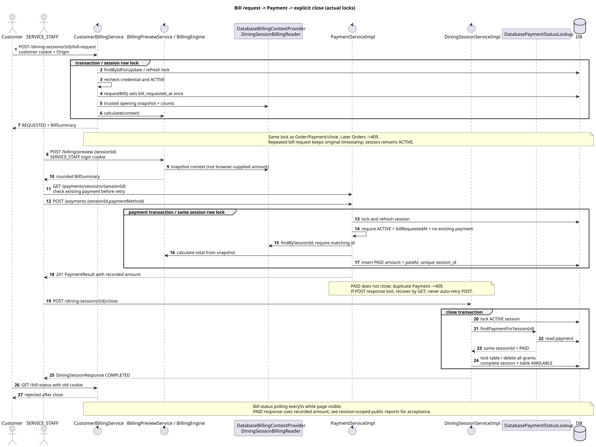

[Source](../diagrams/sequence-billing-payment.puml) · [อ้างอิง repository](https://github.com/PavaritPramual/buffet-restaurant-management-system/blob/pavarit_673380278-9_01/doc/diagrams/sequence-billing-payment.puml)

### คำพูดประกอบ

Scenarioสามขึ้นไปBillRequestPaymentClose อ่านราคาSnapshotBackendคำนวณ PAID ไม่closeอัตโนมัติและcloseตรวจsameSessionอีกครั้ง

## หน้า 56 — สิทธิ์พนักงานมาจาก server session

ผู้บรรยาย `methus_673380300-2_01` · การเชื่อมระบบ

- ไม่ได้ login ได้ 401
- login แล้ว role ไม่ตรงได้ 403
- ปลอม X-User-Role ไม่เพิ่มสิทธิ์

### ตัวอย่างจากโค้ดจริง

```java
public void requireKitchenAccess() {
    users.requireCurrentRequestRole(UserRole.KITCHEN_STAFF);
}
```

[SessionOrderFulfillmentAccessProvider.java บรรทัด 18](https://github.com/PavaritPramual/buffet-restaurant-management-system/blob/472fba4f25a27fa2e3cd1e1213151ce971646f3a/code/backend/src/main/java/com/buffetrestaurant/service/SessionOrderFulfillmentAccessProvider.java#L18)

### คำพูดประกอบ

SessionUserContextProvider อ่าน HTTP session ของบัญชีจริง ส่วน Staff และ Fulfillment access provider ระบุ role เฉพาะงาน Logout และ session หมดอายุไม่เข้าหน้าป้องกันได้ Frontend guard ช่วย UX แต่การป้องกันข้อมูลต้องอยู่ backend Auth ไม่ใช้ Supabase Auth ในรุ่นนี้

## หน้า 57 — สต็อกเปลี่ยนผ่านธุรกรรมที่ตรวจย้อนหลังได้

ผู้บรรยาย `methus_673380300-2_01` · การเชื่อมระบบ

- รายการใหม่เริ่มยอดศูนย์
- เพิ่มยอดผ่าน Stock-in
- SKU และหน่วยคงเดิมหลังมีประวัติ

### ตัวอย่างจากโค้ดจริง

```java
public StockTransactionResponse stockIn(Long itemId, @Valid StockInRequest request, UserContext actor) {
    return StockTransactionResponse.from(stockInProcessor.process(findItem(itemId), request.quantity(),
            request.reason(), actor));
}
```

[StockService.java บรรทัด 62](https://github.com/PavaritPramual/buffet-restaurant-management-system/blob/472fba4f25a27fa2e3cd1e1213151ce971646f3a/code/backend/src/main/java/com/buffetrestaurant/service/StockService.java#L62)

ภาพประกอบ StockItem · Stock-in / Adjustment · Transaction history

### คำพูดประกอบ

Stock overview และ history มีทั้ง Manager และ Supervisor ตามสิทธิ์ ส่วนแก้ master data เป็น Manager การเปลี่ยนยอดทำผ่าน stock-in/adjustment ที่เก็บ actor reason balance_after ไม่แก้ยอดตรงจากฟอร์ม รายการ opening_target_stock active และ Profile ชื่อโทรศัพท์เป็น scope ที่ยังไม่อยู่ baselineนี้ ไม่ใส่เป็นความสามารถที่ทำแล้ว

## หน้า 58 — ทดสอบตามความเสี่ยงของแต่ละชั้น

ผู้บรรยาย `sirapat_673380293-3_01` · การตรวจรับ

- Unit ตรวจสูตรและกฎ transition
- API ตรวจ contract สิทธิ์และฐานข้อมูล
- Browser ตรวจ flow ที่ผู้ใช้ทำจริง

ภาพประกอบ Unit · กฎ · API · Contract และสิทธิ์ · PostgreSQL · Lock และ FK · Frontend · Race และ state · Browser · Core Flow

### คำพูดประกอบ

ความลึกต่างกัน Unit Mockito หรือ plain class ไม่พิสูจน์ DB locks H2 ตรวจ Flyway/JPA/API ได้แต่ PostgreSQL concurrency ใช้ฐานทิ้งได้ Browser ของ Step2/PR22 ใช้ real HTTP/cookies ส่วน UI states ที่ fixture ต้องติดป้าย ไม่รวมเป็น public readiness

## หน้า 59 — ตัวอย่าง test สำหรับ Strategy ที่แทนกันได้

ผู้บรรยาย `teeramet_673380273-9_02` · ภาคผนวก

- เปลี่ยนอัตราเด็กกับส่วนลด
- Engine ตัวเดิมยังคำนวณตาม contract
- ยอดตัวอย่างเป็น controlled test

### ตัวอย่างจากโค้ดจริง

```java
var pricing = new StandardBillCalculation(new ChildRateCalculationStrategy(new BigDecimal("0.25")));
var replacement = new BillingEngine(pricing, (context, subtotal) -> new BigDecimal("10"));
assertThat(replacement.calculate(context("100", 1, 1)).totalAmount()).isEqualByComparingTo("115.00");
```

[BillingEngineTest.java บรรทัด 15](https://github.com/PavaritPramual/buffet-restaurant-management-system/blob/472fba4f25a27fa2e3cd1e1213151ce971646f3a/code/backend/src/test/java/com/buffetrestaurant/service/billing/BillingEngineTest.java#L15)

### คำพูดประกอบ

Test policiesCanBeReplacedWithoutChangingEngine ใช้ price100 ผู้ใหญ่หนึ่ง เด็กหนึ่ง childrate25% discount10 ได้115.00 ไม่ใช่โปรโมชั่นที่ Managerทำผ่านUI runtime เปลี่ยนimplementationผ่านDI และต้องรักษาผลไม่ติดลบ

## หน้า 60 — Test ของ QR ตรวจว่า POST เกิดเพียงครั้งเดียว

ผู้บรรยาย `sirapat_673380293-3_01` · ภาคผนวก

- เรียก redeemQr สองครั้งระหว่างรอ
- ใช้ Promise เดียวกัน
- backend request มีเพียงหนึ่งครั้ง

### ตัวอย่างจากโค้ดจริง

```typescript
const first = redeemQr('A')
const second = redeemQr('A')
expect(second).toBe(first)
response.resolve({ data: sessionA })
expect(await first).toEqual(sessionA)
expect(post).toHaveBeenCalledTimes(1)
```

[api.test.ts บรรทัด 22](https://github.com/PavaritPramual/buffet-restaurant-management-system/blob/472fba4f25a27fa2e3cd1e1213151ce971646f3a/code/frontend/src/features/ordering/api.test.ts#L22)

### คำพูดประกอบ

นี่เป็น Vitest spy ของ frontend เป็น controlled test ไม่ใช่ HTTPเงินจริง Testภายใต้StrictModeในCustomerOrderingPage.test.tsxเพิ่มเติมเพื่อรับรอง effectซ้ำ ส่วนนี้อธิบาย invariantของapi helperโดยตรง

## หน้า 61 — PostgreSQL test จัดลำดับคำขอ Order กับ close

ผู้บรรยาย `pavarit_673380278-9_01` · ภาคผนวก

- ใช้ latch คุมจุดที่ Order ถือ lock
- close ต้องรอ transaction เดิม
- ทดสอบลำดับกลับกันให้ Order ถูกปฏิเสธ

### ตัวอย่างจากโค้ดจริง

```java
CountDownLatch orderLocked = new CountDownLatch(1);
CountDownLatch releaseOrder = new CountDownLatch(1);
CountDownLatch closeStarted = new CountDownLatch(1);
ExecutorService executor = Executors.newFixedThreadPool(2);
```

[PostgresOrderCloseConcurrencyTest.java บรรทัด 112](https://github.com/PavaritPramual/buffet-restaurant-management-system/blob/472fba4f25a27fa2e3cd1e1213151ce971646f3a/code/backend/src/test/java/com/buffetrestaurant/integration/PostgresOrderCloseConcurrencyTest.java#L112)

### คำพูดประกอบ

PostgresOrderCloseConcurrencyTest ใช้DisposablePostgresDatabaseverifyฐานทิ้งได้ก่อนclean Sessionข้อมูลจริงและPaymentStatusLookupfixtureเฉพาะtests เมื่อOrderlockก่อนบันทึกจบแล้วclose เมื่อcloseก่อนorderถูกปฏิเสธ ไม่รันชุดนี้บนSupabaseกลาง

## หน้า 62 — DTO ตรวจค่าที่จำเป็นก่อนเข้า use case

ผู้บรรยาย `sarun_673380515-1_02` · ภาคผนวก

- id ต้องเป็นค่าบวก
- จำนวนคนไม่ติดลบ
- กฎ capacity ตรวจซ้ำใน Service

### ตัวอย่างจากโค้ดจริง

```java
@NotNull @Positive Long tableId,
@NotNull @Positive Long packageId,
@NotNull @Positive Long soupId,
@NotNull @Min(0) Integer adultCount,
@Min(0) Integer childCount
```

[OpenDiningSessionRequest.java บรรทัด 8](https://github.com/PavaritPramual/buffet-restaurant-management-system/blob/472fba4f25a27fa2e3cd1e1213151ce971646f3a/code/backend/src/main/java/com/buffetrestaurant/dto/request/OpenDiningSessionRequest.java#L8)

### คำพูดประกอบ

OpenDiningSessionRequest เป็นrecord Bean Validation และdefaultchild0 GlobalExceptionHandlerจัดErrorResponseให้HTTPvalidation/business errors หลีกเลี่ยงสอนว่าDTOตรวจcapacityแทนDBได้ Responseวันที่/enum/เงินตามsharedcontract

## หน้า 63 — ตัวอย่างบิลจากราคาที่ล็อกไว้ตอนเปิดรอบ

ผู้บรรยาย `teeramet_673380273-9_02` · ภาคผนวก

- ผู้ใหญ่ 2 คน คิดเต็มราคา 399
- เด็ก 1 คน คิดครึ่งราคา 199.50
- รวม 997.50 ก่อนส่วนลด

### ตัวอย่างจากโค้ดจริง

```java
BigDecimal adultTotal = packagePrice.multiply(BigDecimal.valueOf(context.getAdultCount()));
BigDecimal childTotal = childStrategy.calculate(context);

return adultTotal.add(childTotal);
```

[StandardBillCalculation.java บรรทัด 45](https://github.com/PavaritPramual/buffet-restaurant-management-system/blob/472fba4f25a27fa2e3cd1e1213151ce971646f3a/code/backend/src/main/java/com/buffetrestaurant/service/billing/StandardBillCalculation.java#L45)

ภาพประกอบ 798.00 ผู้ใหญ่ · 199.50 เด็ก · 997.50 รวม

### คำพูดประกอบ

สูตรตรงruntimeChildRate0.5 ตัวอย่าง10%discountเป็นcontrolledtestไม่ใช่promotionUIพร้อมใช้งาน 997.50ลด99.75คง897.75 หากราคาปัจจุบันเปลี่ยน499sessionเดิมยังใช้snapshot399 หน้าCustomerpaidแสดงrecordedpaymenttotalและdue0

## หน้า 64 — เวลาและทศนิยมต้องตรง API กับฐานข้อมูล

ผู้บรรยาย `methus_673380300-2_01` · ภาคผนวก

- ราคาเป็น DECIMAL 10,2
- Stock เป็น DECIMAL 12,3
- API timestamps เป็น ISO-8601 UTC (`Z`)

### ตัวอย่างจากโค้ดจริง

```java
@Column(name = "package_price_at_open", nullable = false, updatable = false,
        precision = 10, scale = 2)
private BigDecimal packagePriceAtOpen;
```

[DiningSession.java บรรทัด 43](https://github.com/PavaritPramual/buffet-restaurant-management-system/blob/472fba4f25a27fa2e3cd1e1213151ce971646f3a/code/backend/src/main/java/com/buffetrestaurant/domain/DiningSession.java#L43)

### คำพูดประกอบ

packagePriceAtOpenและPackageprecision10scale2ตรงกัน Stockใช้12,3 Session start/end เก็บLocalDateTimeภายใน แต่serviceใช้UTC Clockและmapperส่งออกเป็นOffsetDateTime UTC; Stockใช้Instant Payment/billRequestedAtใช้OffsetDateTime UTC JSON จึงมี timezone Z ไม่ใช่เวลาไร้เขตเวลา ตรวจ enum เป็นuppercaseและเงิน/stock decimal เป็นJSON numberตาม API contract

## หน้า 65 — ระบบที่ตรวจแล้วรันด้วย frontend กับ backend แยก

ผู้บรรยาย `teeramet_673380273-9_02` · ภาคผนวก

- React ที่พอร์ต 5173
- Spring Boot ที่พอร์ต 8080
- Database เลือกตาม environment ที่ระบุ

ภาพประกอบ Browser · Vite 5173 · Spring Boot 8080 · Database ตาม config

### คำพูดประกอบ

Composeปัจจุบันมีfrontend/backendไม่ใช่databasecontainer envอาจชี้SupabaseSessionPooler การทดสอบbrowserPR22ใช้H2isolatedไม่ใช่ฐานกลาง แผนpublicคือRenderURLเดียวReactstaticกับSpringBootAPIแต่ยังไม่อ้างdeployเสร็จหรือSecurecookieproductionจากงานนี้

## หน้า 66 — ขอบเขตที่ยังไม่รับรองสำหรับชุดส่ง Final

ผู้บรรยาย `pavarit_673380278-9_01` · ภาคผนวก

- Public deployment และผล release ล่าสุด
- Stock target และ lifecycle พร้อม Profile รายละเอียด
- SOLID gaps การยืนยันของเจ้าของ และการซ้อมทีม

ภาพประกอบ Implementation baseline · Owner confirmation · Public acceptance · Release และ PDF

### คำพูดประกอบ

นี่คือสถานะที่รวบรวมไว้ท้ายชุด ไม่ปะปนในแต่ละหน้าimplementation ตอนนี้PR24ยังOPENไม่มีreview ณการตรวจรอบนี้ developยัง472fba4 พบรหัสG01EntityManagerfield injection G02concreteStock/Auth G03Serviceอ้างControllerconstant G04authorizationconcrete ข้อมูลGit meaningfulqualificationบางคนยังไม่ถึงเกณฑ์ตามaudit เป็นข้อเท็จจริงที่ต้องปิดก่อนรับรองFinal สไลด์ใหม่ช่วยนำเสนอ implementationที่มีได้แต่ไม่ทำให้ระบบpublicreadyโดยอัตโนมัติ

## หน้า 67 — อ้างอิงโค้ดและหลักฐานที่ตรวจย้อนกลับได้

ผู้บรรยาย `pavarit_673380278-9_01` · ภาคผนวก

- ทุก snippet มาจาก develop 472fba4
- Speaker notes มี source พร้อมบรรทัด
- ผล CI กับ browser ระบุ environment ต่างกัน

ภาพประกอบ Repository · Course worksheet · Design docs · CI และ Test Report

### คำพูดประกอบ

แหล่งหลักคือREADME docs/systemdesign diagrams SOLID patterns course matrix testplan traceabilityรายงานStep2/PR22 GitHubCI37503690105 รายงานนี้อ้างbaselineไม่ใช่deployedcommit ในPDFรุ่นส่งต้องเติมURLกับผลreleaseหลังตรวจจริง ใช้Canvaต้นฉบับและเก็บPDFexportเป็นเวอร์ชัน เก็บPPTX/PDFที่exportจากCanvaตามเวอร์ชัน ร่างPPTXรายคนเก่าเป็นประวัติ

## หน้า 68 — Use Case ภาพรวมทุก actor ของระบบ

ผู้บรรยาย `pavarit_673380278-9_01` · ภาคผนวก


### ภาพ diagram

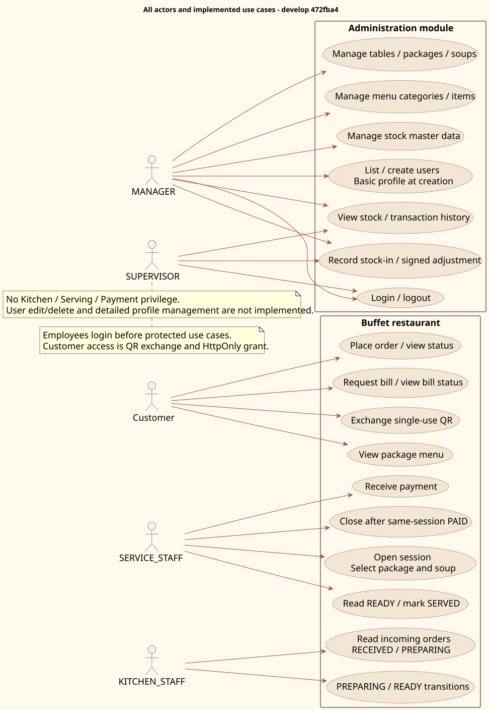

[Source](../diagrams/use-case.puml) · [อ้างอิง repository](https://github.com/PavaritPramual/buffet-restaurant-management-system/blob/pavarit_673380278-9_01/doc/diagrams/use-case.puml)

### คำพูดประกอบ

CustomerMenu กับ AdminMenu เป็นคนละ use case และมี alias แยกกัน Customer ดูเมนูตามแพ็กเกจ ส่วน Manager จัดการ menu categories/items; ผู้ใช้มีเฉพาะ list/create และ basic profile

## หน้า 69 — Class ของ Menu และ Ordering ตรง source

ผู้บรรยาย `sirapat_673380293-3_01` · ภาคผนวก


### ภาพ diagram

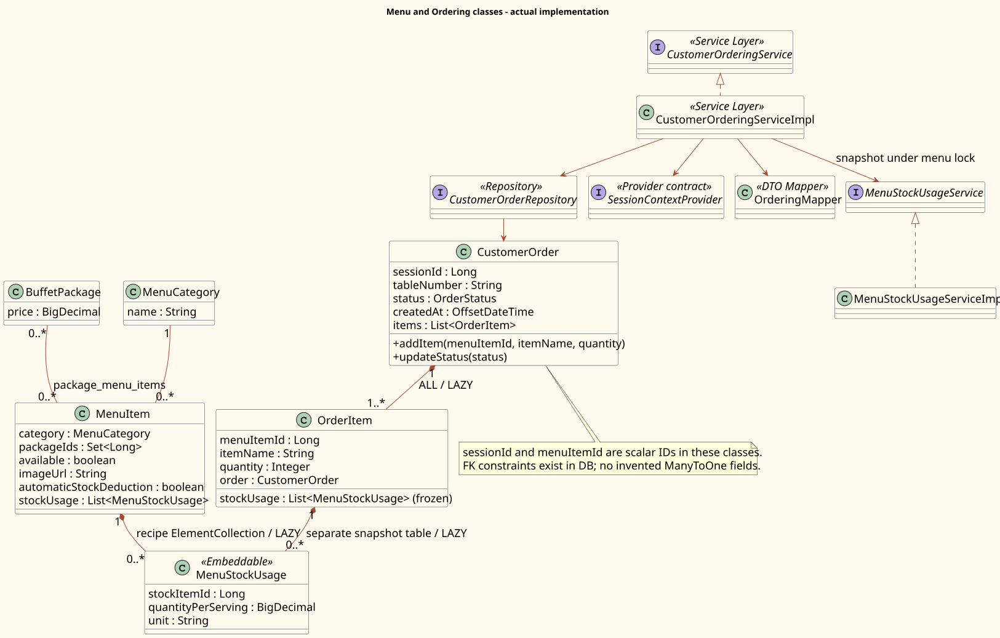

[Source](../diagrams/class-menu-order.puml) · [อ้างอิง repository](https://github.com/PavaritPramual/buffet-restaurant-management-system/blob/pavarit_673380278-9_01/doc/diagrams/class-menu-order.puml)

### คำพูดประกอบ

CustomerOrderOrderItem snapshotid/name EnumOffsetDateTime DTOMapper ServiceLayerRepositoryJPArelationshipsไม่สร้างmethodที่ไม่มี

## หน้า 70 — Class ของ Auth และ UserProfile แบบ shared PK

ผู้บรรยาย `methus_673380300-2_01` · ภาคผนวก


### ภาพ diagram

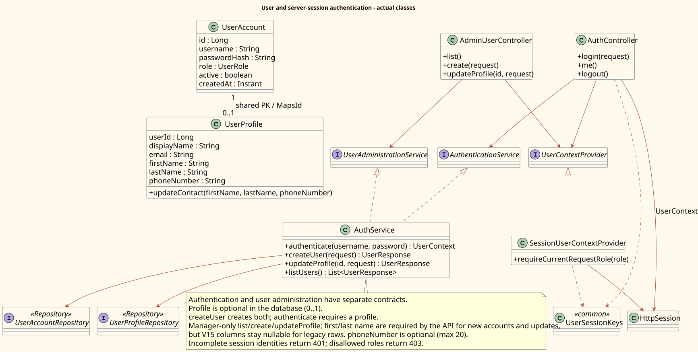

[Source](../diagrams/class-auth.puml) · [อ้างอิง repository](https://github.com/PavaritPramual/buffet-restaurant-management-system/blob/pavarit_673380278-9_01/doc/diagrams/class-auth.puml)

### คำพูดประกอบ

UserAccount มี UserProfile ได้ 0..1 จาก shared PK/FK ใน DB createUser สร้างทั้งคู่ ส่วน authenticate ต้องมี profile และ listUsers รองรับ user ไม่มี profile ด้วยค่าว่าง/null Basic profile มี displayName/email ยังไม่มี full profile management

## หน้า 71 — Sequence ของ Ordering ครัว และงานเสิร์ฟ

ผู้บรรยาย `sarun_673380515-1_02` · ภาคผนวก


### ภาพ diagram

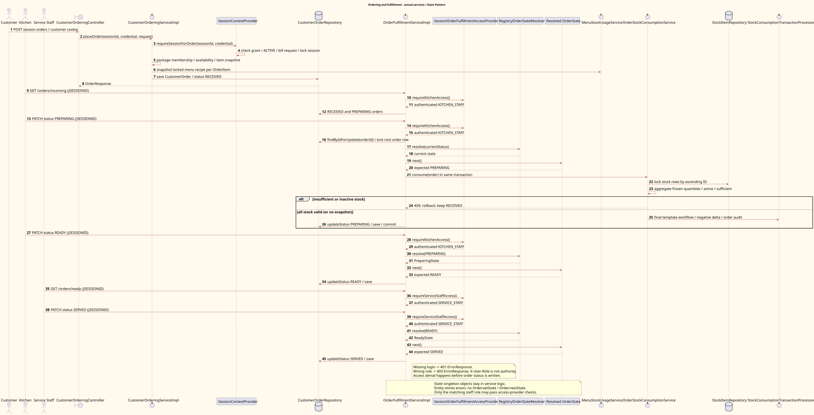

[Source](../diagrams/sequence-ordering-kitchen.puml) · [อ้างอิง repository](https://github.com/PavaritPramual/buffet-restaurant-management-system/blob/pavarit_673380278-9_01/doc/diagrams/sequence-ordering-kitchen.puml)

### คำพูดประกอบ

Scenarioสี่รวมCustomerOrderingServiceกับOrderFulfillmentService StateFactorycurrent.next thenEntityupdate ไม่ใช้APIprepare/ready/serveเก่าที่ไม่มี

## หน้า 72 — Activity ของครัวและการยืนยันเสิร์ฟ

ผู้บรรยาย `sarun_673380515-1_02` · ภาคผนวก


### ภาพ diagram

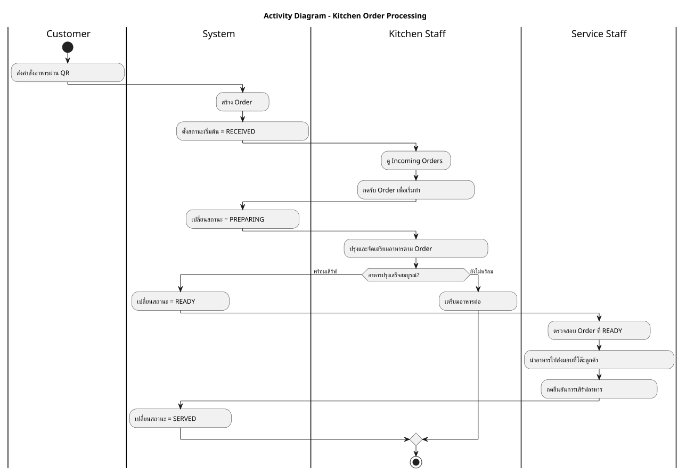

[Source](../diagrams/activity-kitchen.puml) · [อ้างอิง repository](https://github.com/PavaritPramual/buffet-restaurant-management-system/blob/pavarit_673380278-9_01/doc/diagrams/activity-kitchen.puml)

### คำพูดประกอบ

ActorKitchenServiceSystemแยกครัวทำถึงREADYกับStaffSERVED เป็นworkflow overviewไม่แทนchecksbackend

## หน้า 73 — Activity ของ Payment และ close แยกกัน

ผู้บรรยาย `teeramet_673380273-9_02` · ภาคผนวก


### ภาพ diagram

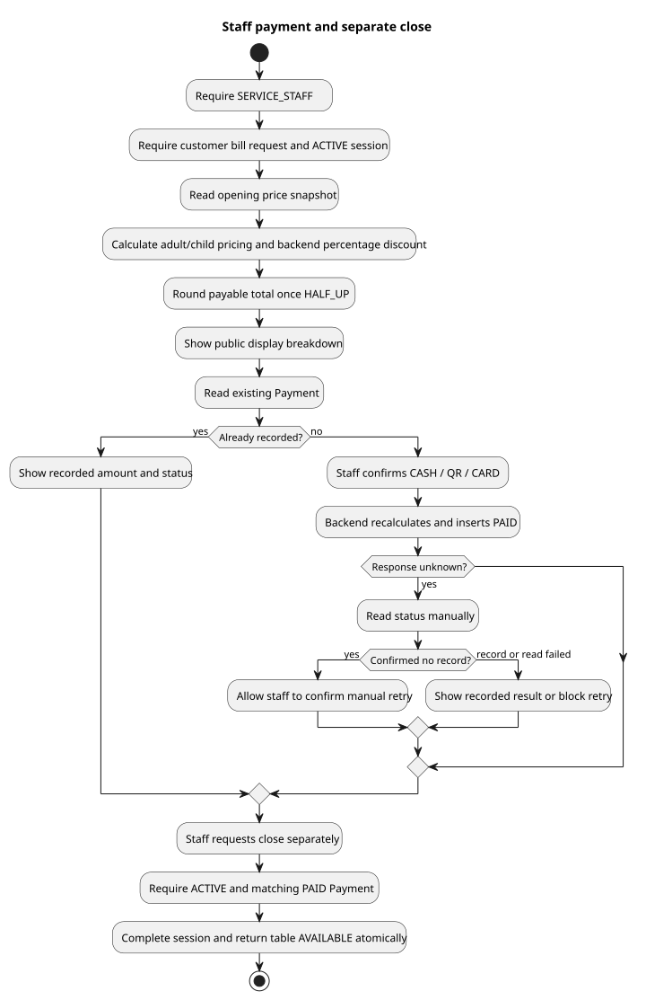

[Source](../diagrams/activity-payment-close.puml) · [อ้างอิง repository](https://github.com/PavaritPramual/buffet-restaurant-management-system/blob/pavarit_673380278-9_01/doc/diagrams/activity-payment-close.puml)

### คำพูดประกอบ

รองรับresponseunknown อ่านPaymentstatusก่อนretry Requirebillrequestก่อนรับชำระและmatchingPAIDก่อนclose

## หน้า 74 — Activity ของการรับเข้าและปรับสต็อก

ผู้บรรยาย `methus_673380300-2_01` · ภาคผนวก


### ภาพ diagram

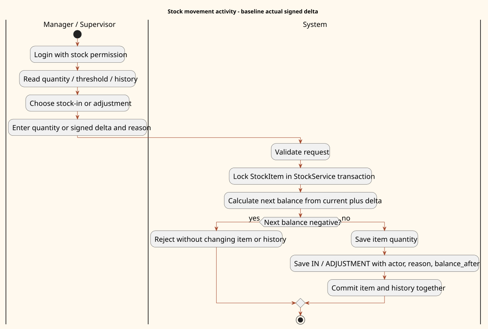

[Source](../diagrams/activity-stock.puml) · [อ้างอิง repository](https://github.com/PavaritPramual/buffet-restaurant-management-system/blob/pavarit_673380278-9_01/doc/diagrams/activity-stock.puml)

### คำพูดประกอบ

ManagerSupervisorส่งquantitysigneddeltareason lockStockItemตรวจไม่negative บันทึกIN/ADJUSTMENTพร้อมaudit ไม่แสดงopeningTargetที่ยังไม่implemented

## หน้า 75 — Deployment design สำหรับระบบสาธารณะ

ผู้บรรยาย `teeramet_673380273-9_02` · ภาคผนวก


### ภาพ diagram

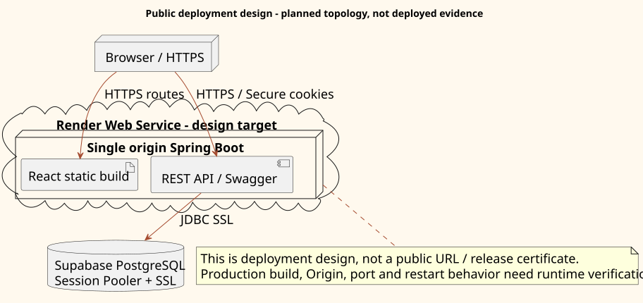

[Source](../diagrams/deployment-production-design.puml) · [อ้างอิง repository](https://github.com/PavaritPramual/buffet-restaurant-management-system/blob/pavarit_673380278-9_01/doc/diagrams/deployment-production-design.puml)

### คำพูดประกอบ

แบบออกแบบRenderURLเดียวReactstaticSpringBootAPI HTTPS SecurecookieSupabaseSessionPoolerSSL ภาพนี้คือdesign ไม่อ้างว่ารับรองpublic/deployedcommitแล้ว

## หน้า 76 — MVC แยกหน้าจอ HTTP และข้อมูลของระบบ

ผู้บรรยาย `pavarit_673380278-9_01` · Enterprise Patterns

- React เป็น View ที่เรียก REST API
- Spring Controller จัดคำขอและ response
- Service และ Domain Model จัดกฎและข้อมูล

### ตัวอย่างจากโค้ดจริง

```java
DiningSessionResponse created = diningSessionService.openSession(request);
return ResponseEntity.created(URI.create("/api/v1/dining-sessions/" + created.sessionId())).body(created);
```

[DiningSessionController.java บรรทัด 34](https://github.com/PavaritPramual/buffet-restaurant-management-system/blob/472fba4f25a27fa2e3cd1e1213151ce971646f3a/code/backend/src/main/java/com/buffetrestaurant/controller/DiningSessionController.java#L34)

ภาพประกอบ React View · REST Controller · Service และ Domain Model

### คำพูดประกอบ

ใช้ Spring MVC แบบ REST ไม่ใช่ server rendered template View อยู่ React Controller ไม่ query Repository โดยตรง DTO เป็นรูปแบบข้อมูลสำหรับ API ไม่อ้างว่า Entity เพียงอย่างเดียวคือ Model ทั้งหมด ดู Component diagram และ DiningSessionController
