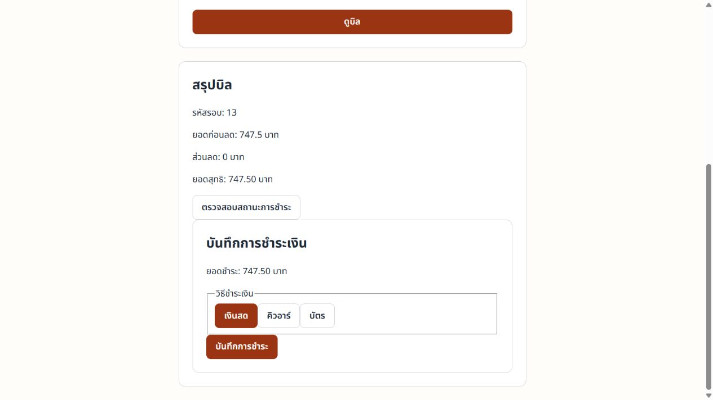

# Public UAT — 10 ตุลาคม 2026

**สถานะ:** ผ่าน Core Flow จนถึงบันทึกการชำระและปิดรอบ โดยทดสอบต่อผ่าน Swagger UI; การชำระเป็นเพียงรายการ CASH ในข้อมูล UAT ไม่มีการเรียก Payment Gateway หรือรับเงินจริง ทดสอบ Swagger ครบ 78/78 operations โดยแยกผล happy path ออกจากคำขอตรวจ validation/สิทธิ์ที่ไม่เปลี่ยนข้อมูล

- เว็บที่ตรวจ: [buffet-restaurant-management.onrender.com](https://buffet-restaurant-management.onrender.com)
- baseline ใน repo: `develop` `c778150c79657b80930ceca6a4f10c136c1fc285` (รวม PR #47/V18 ณ จุดเริ่ม UAT)
- ผู้ใช้แจ้งว่าธีรเมธ deploy รุ่นล่าสุดแล้ว; ไฟล์ JavaScript/CSS ที่ให้บริการมี byte ตรงกับ frontend build ของ baseline นี้ แต่ยังไม่มีหลักฐาน SHA ของ backend จาก Render จึงยังยืนยัน revision ของ backend ที่ deploy ไม่ได้
- Browser ใช้งานเว็บจริงและ API ผ่าน HTTPS; ไม่ใช้ mock/H2 ในผล UAT นี้
- ไม่ล้างฐานข้อมูล ไม่รัน migration และไม่แก้ข้อมูลเดิมของทีม
- ตรวจ `flyway_schema_history` ก่อนหน้านี้พบ V1–V18 สำเร็จ; V9 มี installed rank 11 หลัง V10/V11 ตามลำดับประวัติ ห้ามใช้ผลนี้แทนการตรวจ checksum หรือ JPA validation

## บัญชีสำหรับ UAT

ผู้ใช้อนุญาตให้สร้างบัญชีผ่าน Manager จึงสร้างและใช้บัญชีต่อไปนี้บนเว็บจริง รหัสผ่านไม่ได้บันทึกในเอกสารหรือหลักฐานภาพ

| บัญชี | Role | ใช้ตรวจ |
|---|---|---|
| `nattapong` | `SERVICE_STAFF` | เปิดโต๊ะ งานเสิร์ฟ และดูบิล |
| `kanokwan` | `KITCHEN_STAFF` | รับออเดอร์ เริ่มทำ และทำอาหารเสร็จ |
| `anucha` | `SUPERVISOR` | สร้างบัญชีทดสอบแล้ว แต่ยังตรวจสิทธิ์ Supervisor ไม่ครบ |

## ผล UAT

| กรณี | ผล |
|---|---|
| หน้าแรกและ login | เปิดเว็บแล้วเห็นหน้า login; Manager login สำเร็จและ logout กลับหน้าที่ต้อง login |
| Manager จัดข้อมูล | สร้างแพ็กเกจ “บุฟเฟต์ซีฟู้ดพรีเมียม”, น้ำซุป “น้ำซุปกระดูกหมู”, โต๊ะ C01, หมวดเมนู และเมนูได้จาก UI |
| รูปอาหาร | ใส่ URL ภาพให้เมนูขายได้ทั้ง 9 รายการผ่าน Manager; ตรวจว่าโหลดสำเร็จจาก `img.complete` และ `naturalWidth > 0`; Customer ของแพ็กเกจมาตรฐานโหลดภาพ 6 รายการได้ |
| เปิดรอบและตรวจ capacity | เปิดโต๊ะ C01 ความจุ 4 สำหรับผู้ใหญ่ 2 และเด็ก 1 สำเร็จ; ลองผู้ใหญ่ 5 คนแล้ว UI ปฏิเสธว่าเกินความจุ |
| ราคาและข้อมูลรอบ | เปิดรอบด้วยแพ็กเกจมาตรฐานราคา 299 บาทและน้ำซุปกระดูกหมู; Staff เห็นชื่อ package/soup; snapshot ที่ใช้คำนวณบิลไม่เปลี่ยน |
| QR | ลูกค้าแลก QR สดสำเร็จ; token ถูกล้างจาก URL หลังแลก; เปิด QR เดิมซ้ำในอีกแท็บถูกปฏิเสธด้วยข้อความให้ขอ QR ใหม่ |
| Ordering | Customer สั่งออเดอร์ #6: หมูสันคอสไลซ์ 1 และชุดผักรวม 1; หน้า Customer แสดงสถานะของออเดอร์ |
| Kitchen | `kanokwan` เปลี่ยนเฉพาะออเดอร์ #6 จาก `RECEIVED` → `PREPARING` → `READY`; Customer เห็นพร้อมเสิร์ฟ |
| Serving | `nattapong` เปลี่ยนออเดอร์ #6 จาก `READY` → `SERVED`; Customer เห็นสถานะเสิร์ฟแล้ว |
| Bill request | Customer ขอคิดเงินสำเร็จ; เห็น “รอพนักงานรับชำระ” และยอดค้าง 747.50 บาท; ปุ่มสั่งอาหาร/เพิ่มจำนวนถูกปิด; Staff เห็น badge ขอคิดบิล |
| ปิดก่อนจ่าย | ทดลองปิดรอบก่อนชำระ ระบบปฏิเสธด้วยข้อความ “กรุณาบันทึกการชำระเงินก่อนปิดรอบกิน”; รอบยังไม่ปิดและโต๊ะยังถูกใช้งาน |
| ตรวจยอดบิล | Staff เห็นยอดก่อนลด 747.50 บาท ส่วนลด 0 บาท ยอดสุทธิ 747.50 บาท ตรงกับยอดค้างของ Customer |
| Billing Preview ผ่าน Swagger | `POST /api/v1/billing/preview` ตอบ 200 และยอด `747.50` บาท ตรงกับหน้า Staff/Customer; `GET /payments/sessions/13` ก่อนบันทึกตอบ 404 จึงยืนยันได้ว่าก่อนหน้านั้นยังไม่มี payment record |
| บันทึกการชำระผ่าน Swagger | ส่ง `POST /api/v1/payments` ด้วย session 13 และวิธี `CASH`; ตอบ 201, อ่านกลับได้ 200 และผลเป็น `PAID` ยอด 747.50 บาท ไม่มีการเรียก gateway หรือทำธุรกรรมเงินจริง |
| ปิดหลังชำระ | `POST /api/v1/dining-sessions/13/close` ตอบ 200; อ่านกลับพบ session `COMPLETED`, โต๊ะ C01 `AVAILABLE`; Customer context และ orders ของ credential เดิมตอบ 401 หลังปิด |
| API หลังขอคิดเงิน/ปิดรอบ | ขอคิดบิลซ้ำตอบ 200 โดยไม่สร้างคำขอใหม่; สั่งหลังขอคิดบิลตอบ 409; หลังปิดแล้ว Customer API ตอบ 401; แลก QR ปลอมตอบ 404 |

รอบ UAT ที่ใช้คือ session 13 บน C01; ออเดอร์ #6 เสิร์ฟแล้วและปิดรอบหลังบันทึกรายการ CASH ผ่าน Swagger แล้ว ปัจจุบันโต๊ะ C01 ว่าง ข้อมูลการชำระเป็นข้อมูลจำลองสำหรับ UAT เท่านั้น

## ผลตรวจ API ผ่าน Swagger UI

เปิด Swagger UI บนเว็บ Render จริงและเรียกครบ **78/78 operations** จากรายการ OpenAPI: GET 33 รายการ และ operation ที่เปลี่ยนสถานะ/ข้อมูล 45 รายการ ครอบคลุม Table, Dining Session, Order Fulfillment, Stock, Soup, Menu Item, Menu Category, Buffet Package, Staff Profile, Payment, Customer Ordering/Bill, Billing, Authentication และ Health

| ขอบเขต | ผลที่เห็น |
|---|---|
| Read APIs | รายการ/รายละเอียดที่มีข้อมูลตอบ 200; API ที่ต้องใช้ role อื่นตอบ 403; ข้อมูลชำระก่อนบันทึกหรือ ID ที่ไม่มีอยู่ตอบ 404 |
| Role/Auth | login Manager และ SERVICE_STAFF ตอบ 200; `/auth/me` ตอบ 200 เมื่อ login และ 401 หลัง logout; logout ตอบ 204; protected customer APIs ตอบ 401 หลังปิดรอบ |
| Validation ของ CRUD | เรียก create/update ด้วย payload ว่างและเรียก delete/restore ด้วย ID ที่ไม่มีอยู่ ผลตอบ 400/404 ตาม validation/resource; ไม่มีการสร้างหรือแก้รายการจากชุดตรวจนี้ |
| State และ business rules | ปิดก่อนจ่ายตอบ 400; สั่งหลัง bill request ตอบ 409; QR token ปลอมตอบ 404; จ่าย CASH ตอบ 201; ปิดหลัง PAID ตอบ 200 |
| Billing | preview ตอบ 200 และยอด 747.50; Payment อ่านกลับได้ 200 พร้อม `PAID`; หลัง close โต๊ะว่างและ credential ลูกค้าเดิมใช้ไม่ได้ |

การเรียก CRUD ด้วย payload ว่างหรือ ID ที่ไม่มีอยู่ตรวจ route, validation และการปฏิเสธคำขอเท่านั้น ไม่ถือเป็นหลักฐานว่า happy path ของ create/update/delete/restore ทุกชนิดผ่าน ส่วนการสร้างข้อมูลและ flow จริงที่ผ่าน UI ระบุแยกไว้ในตาราง UAT ด้านบน

## ผลตรวจเดิมที่ยังเกี่ยวข้อง

- Stock-in 8 → ปรับยอด -1 พร้อมเหตุผล → คงเหลือ 7; history แสดงผู้ทำและรายการทั้งสอง
- เก็บรายการ Stock ที่มี history ออกแล้วคืนเป็น inactive ได้; ยอดและประวัติยังอยู่ และเปิดใช้งานกลับได้
- เปลี่ยน SKU หลังมี transaction ถูก backend ปฏิเสธและข้อมูลเดิมยังอยู่
- ลบหมวดที่ยังมีเมนูอ้างอิงถูกปฏิเสธด้วย HTTP 409; หมวดและเมนูคงอยู่
- Manager เข้าหน้า Staff Tables ไม่ได้; protected API เมื่อไม่มี login/ข้อมูลไม่ถูกต้องตอบ 401 และ role ที่ไม่อนุญาตตอบ 403 ในจุดที่ตรวจ
- readiness, OpenAPI ตอบ 200 และ API ที่ไม่มีอยู่ตอบ 404
- หลักฐาน screenshot, HTTP results และตารางผล **78/78 Swagger operations** อยู่ใน [`test/evidence/pavarit-public-uat-2026-10-10/`](../../test/evidence/pavarit-public-uat-2026-10-10/) โดยรายละเอียด API อยู่ใน [swagger-ui-api-coverage.md](../../test/evidence/pavarit-public-uat-2026-10-10/swagger-ui-api-coverage.md)

## สิ่งที่พบและประเด็นต้องตัดสิน

### UX-01 — ข้อความผิดพลาด SKU เป็นภาษาอังกฤษ

เมื่อแก้ `BEEF-002` เป็น `BEEF-003` หลังมีประวัติ ระบบปฏิเสธถูกต้อง แต่แสดง `SKU and unit cannot change after stock transactions exist` ควรแสดงข้อความไทยที่บอกว่ามีประวัติการเคลื่อนไหวแล้ว ไม่จำเป็นต้องเปลี่ยน ErrorResponse หรือ schema เพื่อแก้ข้อความ

หลักฐาน: [stock-sku-guard-english-1280.png](../../test/evidence/pavarit-public-uat-2026-10-10/stock-sku-guard-english-1280.png)

### DATA-01 — Order ไม่ได้ตัด Stock อัตโนมัติ

ตรวจ Entity ปัจจุบันพบว่า `MenuItem` ไม่มีความสัมพันธ์กับ `StockItem`; `OrderItem` เก็บ menu item id/name snapshot และจำนวน แต่ไม่มีสูตรวัตถุดิบ จึงไม่มีข้อมูลพอให้ระบบลด stock ตามออเดอร์โดยอัตโนมัติ นี่เป็นขอบเขตที่ต้องตกลงว่าจะเพิ่ม recipe/BOM หรือคงการจัดการ Stock แบบ manual ไม่ใช่ปัญหาที่แก้ด้วยการเชื่อม ID แบบเดาเอง

หลักฐานโค้ด: [`MenuItem.java`](../../code/backend/src/main/java/com/buffetrestaurant/domain/MenuItem.java), [`StockItem.java`](../../code/backend/src/main/java/com/buffetrestaurant/domain/StockItem.java), [`OrderItem.java`](../../code/backend/src/main/java/com/buffetrestaurant/domain/OrderItem.java)

### DATA-02 — การลบเมนูที่เคยถูกสั่ง

ยังไม่ได้ทดสอบ archive/restore ของเมนูที่มี order history โดยเฉพาะ; ห้าม hard-delete ประวัติการสั่ง การทดสอบนี้ต้องยืนยันว่า UI แสดงวิธีเก็บออก/คืนรายการ และข้อมูลเก่าของออเดอร์ยังอ่านได้

### IMG-01 — ภาพเป็นภาพประกอบจากเว็บภายนอก

URL ภาพที่ใส่เป็น stock photos จาก Unsplash และ Pexels ไม่ใช่ภาพถ่ายของร้าน; บางรายการไม่ใช่วัตถุดิบดิบหรือพื้นหลังขาวแบบเดียวกันทั้งหมด หน้าเว็บโหลดภาพได้ แต่ควรเลือกภาพชุดสุดท้ายให้รูปแบบสอดคล้องกัน และพิจารณาย้ายไป storage ที่ทีมควบคุมแทนการพึ่ง hotlink

ตัวอย่างหน้าแหล่งภาพที่ใช้: [Unsplash](https://unsplash.com/photos/thinly-sliced-marbled-beef-and-pork-belly-pork-belly-Ksx7y1xeucc), [Pexels — shrimp](https://www.pexels.com/photo/8879625/), [Pexels — squid](https://www.pexels.com/photo/squid-dish-in-white-ceramic-plate-13065211/), [Pexels — vermicelli](https://www.pexels.com/photo/thai-street-food-stir-fried-vermicelli-with-egg-and-vegetables-on-a-white-background-15797948/), [Pexels — fried chicken](https://www.pexels.com/photo/overhead-shot-of-fried-chicken-on-a-white-plate-7172748/)

## ยังไม่ผ่านการตรวจรับ

- [x] บันทึกรายการ CASH ใน UAT ผ่าน Swagger แล้วตรวจว่าเป็น `PAID` ยอด 747.50 บาท
- [x] หลัง `PAID` ปิด session; C01 กลับ `AVAILABLE` และ credential ลูกค้าเดิมใช้ต่อไม่ได้
- [ ] ทดสอบจ่ายซ้ำและ refresh หน้าบิล โดยยืนยันว่าไม่มีรายการชำระซ้ำ
- [ ] ทดสอบ Customer สองอุปกรณ์พร้อมกัน, QR ใหม่ในแท็บเดิม, และสั่งหลังขอคิดเงินด้วย browser/session แยกจริง
- [ ] ตรวจสิทธิ์ Supervisor บนครบ API และตรวจ session ถูกเพิกถอนหลังเก็บบัญชี
- [ ] ทดสอบ archive/restore เมนูที่อยู่ใน order history และยืนยัน Order เดิมยังแสดง snapshot
- [ ] ตรวจ package/soup ที่ถูกปิดใช้งานระหว่าง active session
- [ ] ตรวจ Customer 360px, Staff/Kitchen 768px และ Manager 1280px ให้ครบ; screenshot ที่บันทึกส่วนใหญ่เป็น desktop จึงยังไม่รับรอง responsive ทุก breakpoint
- [ ] ตรวจ cold start, persistence หลัง Render restart/redeploy และ backend deploy SHA

## ภาพหลักฐาน

