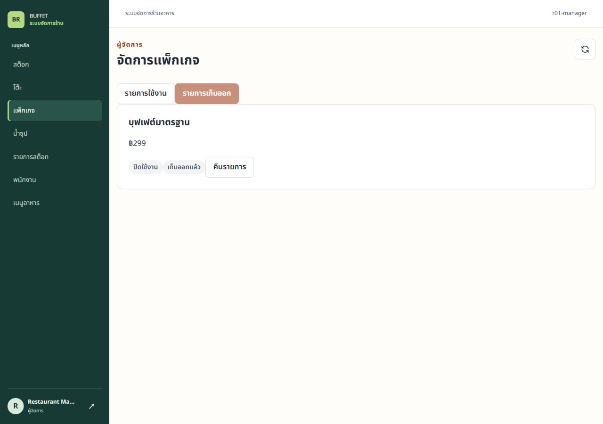
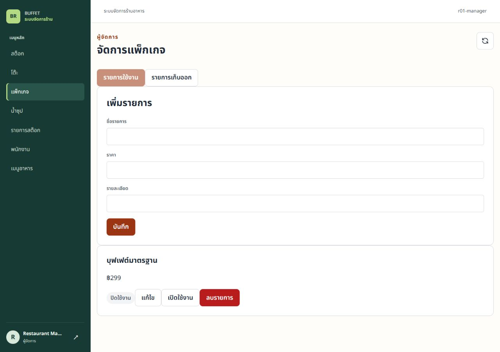
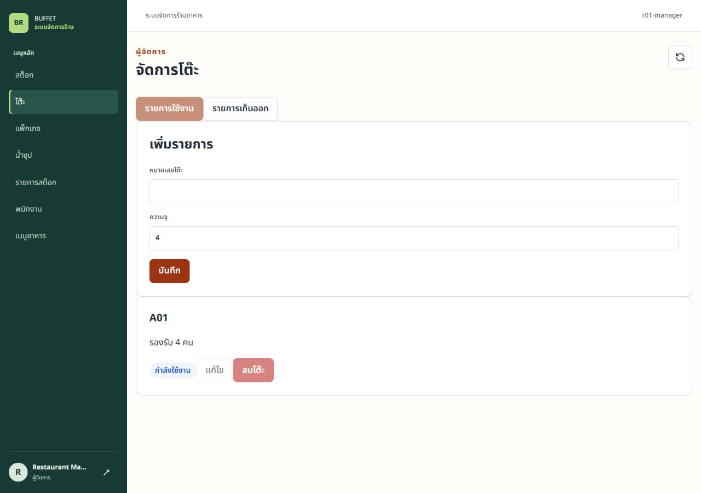
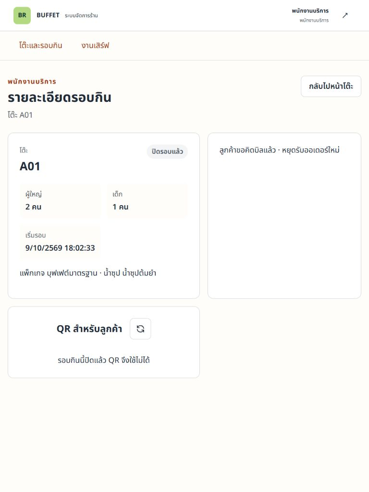

# R01-B — รายงานทดสอบ Table / Package / Soup

เจ้าของ ปวริศช์ · ตรวจ 9 ตุลาคม 2026 (ICT)

ฐาน develop `69fb7afae06cf4230c814c0e58c4e8e13700ac3e` รวม PR #41; implementation/tests [46b4ef9](https://github.com/PavaritPramual/buffet-restaurant-management-system/tree/46b4ef9fe952eabeca4f71d83136b194cadc29fd). Backend commit `9f5c9a5`; Frontend commit `46b4ef9`. เอกสารรายงานนี้เพิ่มภายหลัง โดยไม่เปลี่ยน implementation ที่ทดสอบ

## ขอบเขตและ design

- [Owner design / lock / FK](../architecture/pavarit-r01-b-design-delta.md)
- [V17 schema delta](../database/pavarit-r01-b-schema-delta.md)
- [Contract และ HTTP status migration](../contracts/deletion-contract.md)
- [ERD และ sequence delta แบบ Mermaid source/preview](../diagrams/r01-b-removal.md)

ยึดการจอง **เมธัส V16 / ปวริศช์ V17 / ศิระพัทธ์ V18**. V17 เพิ่ม archived แค่สามตาราง ไม่เพิ่ม Entity หรือลบ FK/grants ไม่แก้ V1–V15 ไม่สร้าง placeholder V16/V18 และไม่ได้ apply/repair Supabase กลาง

ข้อมูลไม่มี reference ลบจริง; มีประวัติหรือ package membership เก็บออก. รายการหลักไม่แสดง archived; Manager มีรายการเก็บออกและคืนรายการ. คืนครั้งแรกเป็น table AVAILABLE หรือ package/soup inactive; retry ไม่เปลี่ยนสถานะปัจจุบัน. ปิด active ชั่วคราวยังแยกจาก archive

## Environment

Windows, Java 21.0.11, Maven 3.9.16. Automated tests ปิด `spring.config.import` ไม่อ่าน `.env` ใช้ H2 แยก และ PostgreSQL 18 container ผูกเฉพาะ loopback พร้อมฐาน marker ตาม `disposable-postgres-ci.sql`. Runtime ใช้ fresh H2 ใน local-regression, session/database providers จริงและไม่ seed fixture. บัญชี/credentials เป็นของฐานทิ้งได้และไม่เก็บในหลักฐาน

## Automated results

| ตรวจ | ผลจริง |
|---|---|
| Backend `mvn --batch-mode --no-transfer-progress -Dspring.config.import= clean verify` | **367 passed, 0 failures/errors/skipped** รวม PostgreSQL และ Testcontainers suites |
| `MasterDataArchiveMigrationTest` ที่เพิ่มหลัง full suite: `mvn --batch-mode --no-transfer-progress -Dspring.config.import= -Dtest=MasterDataArchiveMigrationTest test` | **1 passed, 0 failures/errors/skipped**; upgrade H2 V15 → V17 รักษา legacy rows/default false และปฏิเสธ unsafe archive state |
| `MasterDataRemovalIntegrationTest` ใน full suite | **5 passed** ใช้ session auth/database Billing/Payment จริง; hard-delete, history, package membership, auth และ retry restore |
| `PostgresMasterDataRemovalConcurrencyTest` ใน full suite | **7 passed** ใช้ PostgreSQL row locks จริงและ controlled auth mock; open/delete/archive แข่งกัน และ FK failure rollback |
| Frontend `npm test` หลังแก้ครบ | **157 passed / 17 files** |
| Frontend `npm run lint` | exit 0; **4 warnings เดิม** set-state-in-effect ใน StockPage, UsersPage, KitchenBoardPage, StaffServingPage; ไม่มี warning ใหม่ใน MasterDataPage |
| Frontend `npm run build` | exit 0 |
| `mvn -Dspring.config.import= validate` | ผ่านก่อนจัดทำ diagram delta |

จำนวน Backend ไม่ใช่ full suite 368 ในครั้งเดียว: เป็น full 367 และ focused upgrade 1 ตามเวลาที่รันจริง. Logs ใน `test/reports/r01-*.log` เป็น ignored local diagnostics; ไม่ส่ง raw runtime logs ที่อาจมีข้อมูลสิทธิ์. CI ของ PR ต้องรันอีกครั้งบน head ที่ push

PostgreSQL ใช้ env `ALLOW_DESTRUCTIVE_DB_TESTS=true`, MENU/DINING/PAYMENT_TEST_PG_URL ที่ loopback และฐาน `buffet_test_*_ci`. Payment ใช้ role `buffet_backend_test`; fixture authorization ใน concurrency suite ไม่ใช่หลักฐาน production login. HTTP/H2 integration tests แยกพิสูจน์ Manager-only, 401/403 และ spoofed header ไม่เพิ่มสิทธิ์

Frontend tests เพิ่ม confirmation/กันกดซ้ำ, archived list/restore, error/occupied guard รวมการรักษา `/stock/items` และ reset state เมื่อเปลี่ยนชนิดข้อมูล เพื่อไม่ให้ archive UI กระทบหน้าสต็อก

## Local browser / HTTP runtime

ตรวจผ่าน browser จริงบน Vite + API fresh H2 ก่อน commit; รูปไม่มี QR token/cookie/password

1. Manager 1280px เก็บแพ็กเกจของ ACTIVE session: หายจากรายการหลักและยังอยู่รายการเก็บออก
2. คืนแพ็กเกจ: กลับรายการหลักแบบ inactive ไม่เปิดใช้งานอัตโนมัติ
3. โต๊ะ OCCUPIED ปิดปุ่มแก้และลบ; backend guard ตรวจซ้ำ ไม่ใช้ UI เป็น authority
4. HTTP cookie jars แยก Manager/Staff/Customer: เก็บ package/soup เดิมออก → แลก QR → ขอคิดบิล **747.50** → Payment CASH **747.50** → close **COMPLETED**. ไม่ใช่ payment gateway จริง
5. Staff 768px เปิดรายละเอียดรอบ COMPLETED: ชื่อ **บุฟเฟต์มาตรฐาน / น้ำซุปต้มยำ** ยังอ่านได้; QR ใช้ไม่ได้หลังปิด

API/runtime flow ใช้โค้ด backend เดียวกับ commit `9f5c9a5`. ภาพ Manager/Staff เก็บก่อน frontend guard เพิ่มเติมใน `46b4ef9`; guard `/stock/items` และ reset เมื่อเปลี่ยนหน้าได้รับ regression tests ในชุด 157 แล้ว ไม่อ้างว่าเป็น public acceptance หรือทวนมือถือจริง

### ภาพ

## Gates ที่ยังรอ

- Review API/status delta, UI, Billing/history และ migration/FK; PR merge
- V16/V18 รวมแล้วทวน full V1–V18 ใหม่; history/checksum ฐานกลางและอนุมัติ V17 แยก
- Deploy approved SHA และ public regression/Final. ผลฐานทิ้งได้/fixture/CI ไม่แทน gate นี้
- Menu/Category/Stock/User removal เป็นของเจ้าของพื้นที่ ไม่รับรองแทนจาก PR นี้

Diagram delta เป็น Mermaid ที่มี source ฝังใน Markdown ไม่อ้างว่า render PlantUML/SVG baseline ใหม่. baseline diagrams เก็บเป็นประวัติ; การรับรองทั้งระบบยังรอทุก owner

## แก้รีวิวธีรเมธ — Customer package หลัง archive

รีวิวบน head `ba54602c7421c44eabc7098394e93a397125294d` พบว่า CustomerSessionPackageController เรียก CatalogService.getPackage ซึ่งปฏิเสธ archived409 ทำให้ Promise.all ของหน้า Customer โหลดไม่สำเร็จ แม้ bill/payment tests เดิมผ่าน. ชุดแรกไม่ได้ทดสอบการโหลดแพ็กเกจและเมนูหลัง archive จึงตรวจ defect นี้ไม่พบ

แก้ด้วย CustomerSessionPackageService ใช้ CustomerSessionVerifier ตรวจ cookie/session ก่อนอ่านแพ็กเกจที่ผูกกับ ACTIVE session ใน read-only transaction. Catalog ทั่วไปยังปฏิเสธ archived; การเปิดรอบใหม่ยังปฏิเสธแพ็กเกจนี้. ไม่เปลี่ยน migration V17, FK, DTO, routes, cookie flow, ราคา snapshot หรือ transaction/locks ของ Order/Payment/close

รัน 9 ตุลาคม 2026 บน Java21/H2 แยก ปิด `.env` import:

| คำสั่งหลังแก้ | ผล |
|---|---|
| `mvn --batch-mode --no-transfer-progress -Dspring.config.import= -Dtest=MasterDataRemovalIntegrationTest,DiningSessionIntegrationTest test` | **18 passed, 0 failures/errors/skipped** (Removal6 + DiningSession12) |
| `mvn --batch-mode --no-transfer-progress -Dspring.config.import= -Dtest=CustomerBillingContractTest,SessionContextProviderContractTest,Step2CompletionIntegrationTest test` | **13 passed, 0 failures/errors/skipped** |

รวม **31 tests หลังแก้**. Regression ใหม่เปิดรอบผ่าน POSTจริง → Manager archive → Catalog mainซ่อน/operational detail409 → QR exchangeผ่านHTTP → cookieของรอบนี้อ่านpackage200/no-store/menuและbill747.50 → order201 → billrequest747.50 → payment747.50 → closeCOMPLETED. ตรวจ cookieขาด/ปลอม401, cookieผิดsession404, หลังclose401 และราคาsnapshot299ยังอยู่; โต๊ะอีกตัวว่างแต่เปิดรอบด้วยpackagearchivedได้400ตามกฎเดิม

ผล full PostgreSQL367, upgrade1, frontend157 และภาพข้างต้นเป็นหลักฐานรอบก่อนแก้ ไม่อ้างว่ารันซ้ำรอบนี้. ไม่มี frontend/schema/locking changes ใน fix; รอ CI full suite ของ head ใหม่และธีรเมธตรวจซ้ำ รวม public acceptance แยก

## แก้รีวิวศิระพัทธ์ — เส้นทางโหลดรายการสต็อก

รีวิวบน `d4a93dee4992777ea7b07f02af758c08730b04c6` พบว่า MasterDataPage เรียก GET `/stock/items` แต่ StockController รองรับ GET `/stock`. ข้อความ baseline ที่อ้างว่า guard `/stock/items` ป้องกัน regression หมายถึง tests แบบ mock ในรอบนั้น ซึ่งคาดหวังเส้นทางผิดและไม่ได้พิสูจน์การโหลดสต็อกจาก Controller จริง ภาพ browser baseline ด้านบนไม่ได้ตรวจหน้ารายการสต็อก

แก้เฉพาะ listEndpoint เป็น `/stock` ทั้งตอนเข้าหน้า สลับหน้า รีเฟรช และโหลดใหม่หลังบันทึก/เปิดปิดรายการ ส่วน POST `/stock/items`, PUT `/stock/items/{id}` และ PUT `/stock/items/{id}/active` คงเดิม ไม่มีการเปลี่ยน backend production, API contract, migration, สิทธิ์ หรือ software design

รัน 9 ตุลาคม 2026 บน Java21/H2 แยก ปิด `.env` import:

| การตรวจหลังแก้ | ผลจริง |
|---|---|
| `mvn --batch-mode --no-transfer-progress -Dspring.config.import= -Dtest=MasterDataRemovalIntegrationTest,Step2CompletionIntegrationTest package` | **14 passed, 0 failures/errors/skipped** (Removal7 + Step2Completion7); package ผ่าน |
| `npm test` | **157 passed / 17 files** |
| `npm run lint` | exit 0, 4 warnings เดิม ไม่มี warning ใหม่ |
| `npm run build` | exit 0 |

Regression backend ใช้ MockMvc กับ Spring context, Controller/Service/Repository และ session login จริง: Manager สร้างสต็อกยอดศูนย์ผ่าน POST `/stock/items` → GET `/stock` เห็นรายการ → PUT metadata → PUT active=false → GET `/stock` ยังอ่านรายการเดิมได้ ตรวจ OpenAPI ที่สร้างจาก runtime ว่ามี GET `/stock`, POST `/stock/items` และไม่มี GET `/stock/items`. Frontend tests ตรวจ URL list และ reload หลัง create/active พร้อมรักษา mutation URLs

การตรวจนี้ไม่ใช่ browser/public acceptance หรือการทวน full PostgreSQL suite รอบใหม่ ผลรอบเดิมยังเป็นประวัติ รอ CI บน head ที่ push และศิระพัทธ์ตรวจซ้ำ ไม่ apply V17 บน Supabase และไม่ merge เอง

## แก้ข้อยืนยันก่อน merge จากเมธัส

รีวิวบน `93309ba3662b28c245a28383d50e9a7f3eb45f8e` approve ส่วน SQL แบบมีเงื่อนไข ขอหลักฐาน CHECK PostgreSQL, การ map CHECK/FK เป็น409 และให้ tests ไม่ล้มเมื่อ V16/V18 รวม

- เปลี่ยน H2/PostgreSQL MenuOrderingMigrationTest จาก containsExactly เป็น containsSubsequence ของ required baseline พร้อม validate/pending ว่าง รักษาลำดับและยอมรับ migration ที่เพิ่ม ไม่ลบ assertion เวอร์ชันเดิม
- H2 archive upgrade test ตรวจ applied มีV17/pendingว่างแทนบังคับ current=17 เพื่อรองรับV18
- เพิ่ม PostgresMasterDataArchiveMigrationTest ใช้ PostgreSQL16 container ใหม่ upgradeจากV15พร้อมlegacy rows ตรวจ defaults=false, CHECK ทั้งสาม, safe archive และ FK RESTRICT ข้อมูลคงอยู่เมื่อปฏิเสธ
- Test-only HTTP probe เรียก JdbcTemplate กับฐาน PostgreSQLจริงแล้วส่ง exception ผ่าน GlobalExceptionHandler production เดิม CHECK SQLSTATE23514 และ FK23503 คืน ErrorResponse409 ไม่มี endpoint ใหม่ในแอปจริง และไม่ได้ใช้ probe เป็นหลักฐาน authentication
- เอกสารยืนยัน V16 ต้องเข้าก่อนV17และห้ามapplyV17ฐานกลางก่อนV16 ไม่ใช้repair/outOfOrderข้าม gate ไม่เปลี่ยนไฟล์migrationหรือproduction source

ผล 9 ตุลาคม 2026 Java21/Docker Desktop ปิด `.env` import ไม่เชื่อม Supabase:

| Suite/คำสั่ง focused | ผล |
|---|---|
| `MenuOrderingMigrationTest,MasterDataArchiveMigrationTest,PostgresMasterDataArchiveMigrationTest,MasterDataRemovalIntegrationTest,EnumErrorResponseTest` | **16 passed, 0 failures/errors/skipped**; H2 tests และ PostgreSQL16 Testcontainers จริง |
| `PostgresMenuOrderingMigrationTest,PostgresMasterDataRemovalConcurrencyTest` | **8 passed, 0 failures/errors/skipped**; PostgreSQL18.6 ใหม่บน loopback port15439, marked databases ตาม helper/CI SQL |
| `MasterDataArchiveMigrationTest,PostgresMasterDataArchiveMigrationTest` หลังปรับ assertion current-version และเพิ่ม SQLSTATE | **2 passed, 0 failures/errors/skipped**; เป็น rerun ไม่บวกเป็น tests ใหม่ |

รวม24กรณีไม่ซ้ำ รัน26ครั้งเพราะ rerun2. PostgreSQL18 มี warning เดิมว่า Flywayรุ่นนี้รับรองถึง17 จึงบันทึกแยกจาก PostgreSQL16 ที่ใช้ตรวจ CHECK; testsผ่านจริง. ไม่รันfrontendซ้ำเพราะแก้เฉพาะtests/docs ไม่มีruntime/API/DTO/UI/schema changes. ผลfrontend157และCIของ93309baเป็น baseline; รอCIheadใหม่และเมธัสตรวจหลักฐาน ไม่รับรองfullV1–V18/publicจากชุดนี้
