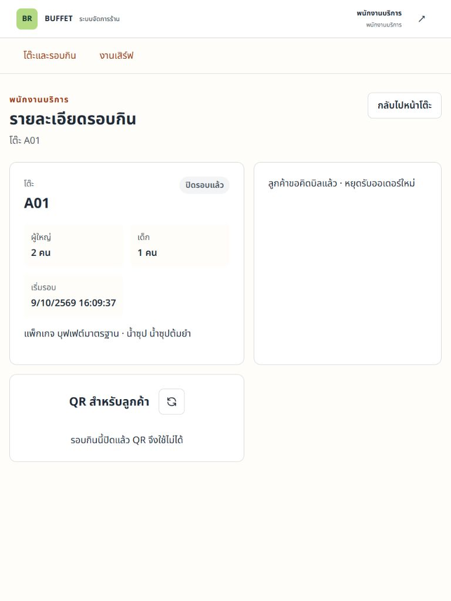

# U02 — ชื่อแพ็กเกจและน้ำซุปในรายละเอียดรอบกิน

เจ้าของ ปวริศช์ · ตรวจ 9 ตุลาคม 2026 · branch `pavarit_673380278-9_01`

## Revision และ design delta

- develop baseline `96da8ea7560225f9037ac9be2debfd496802ab57`; ไม่รวม PR #39 ที่ปิดโดยไม่ merge
- Backend/contract commit `95c178f`; UI/tests commit `73ca6f07c5f99d052d076e4699b1345a14001eaf`. Tests และ browser ตรวจ working tree ของสอง commit นี้ก่อนบันทึก commit; commit เอกสารถัดมาไม่เปลี่ยน runtime
- Staff `DiningSessionResponse` เพิ่ม `packageName`/`soupName` ต่อท้าย โดย field เดิมยังอยู่ครบ [DTO](https://github.com/PavaritPramual/buffet-restaurant-management-system/blob/73ca6f07c5f99d052d076e4699b1345a14001eaf/code/backend/src/main/java/com/buffetrestaurant/dto/response/DiningSessionResponse.java) และ [mapper](https://github.com/PavaritPramual/buffet-restaurant-management-system/blob/73ca6f07c5f99d052d076e4699b1345a14001eaf/code/backend/src/main/java/com/buffetrestaurant/mapper/DiningSessionMapper.java)
- ชื่อปัจจุบันอ่านจาก JPA relationship ภายใน service transaction เดิม ไม่สร้าง name snapshot หรือเรียก Catalog API เพิ่มจากหน้ารายละเอียด Staff
- ACTIVE/COMPLETED และข้อมูลหลัก inactive ยังอ่านชื่อได้ การเปลี่ยนชื่อจะเปลี่ยนข้อความของรอบเก่าด้วย ส่วนราคา Billing ยังเป็น `packagePriceAtOpen`
- Customer DTO, Ordering context, QR/cookie, สิทธิ์, locks, Payment/close และสถานะธุรกิจไม่เปลี่ยน ไม่มี Entity/migration ใหม่
- [Shared contract](../contracts/shared-contracts.md#staff-diningsessionresponse--u02) และ Swagger schema ระบุ fields ใหม่; [diagram review](../diagrams/README.md#u02--staff-display-names-9-october-2026) ยืนยันว่าไม่ต้องแก้ ERD/source/SVG เพราะภาพไม่ได้แจกแจง DTO fields

## ผล automated tests

Environment Windows, Maven 3.9.16, Java 26.0.1 สำหรับ tests; H2 ใหม่ตาม test profile, Flyway/JPA validate. ปิด `.env` import ด้วย `-Dspring.config.import=` ไม่เชื่อม Supabase กลาง

| คำสั่งและขอบเขต | ผล |
|---|---|
| backend: `mvn --batch-mode --no-transfer-progress -Dspring.config.import= test` | 351 tests, failures 0, errors 0, skipped 25; เท่ากับผ่าน 326 |
| DiningSessionIntegrationTest ใน suite ข้างต้น | 12 tests ผ่าน รวมชื่อในการเปิด/อ่าน/ปิด รอบ inactive และราคาที่เปิด 299 แม้ราคาหลักเปลี่ยนเป็น 399 |
| frontend: `npm test` | 14 files, 126 tests ผ่าน รวมแสดงชื่อ ACTIVE/COMPLETED และ loading/error โดยไม่โหลด Catalog เพิ่ม |
| frontend: `npm run lint` | exit 0; warnings เดิม 4 จุดเรื่อง set-state-in-effect ใน StockPage, UsersPage, KitchenBoardPage, StaffServingPage |
| frontend: `npm run build` | TypeScript/Vite build ผ่าน |
| `git diff --check` | ผ่าน; diff ของ Entity/migration ว่าง |

25 tests ที่ข้ามเป็น PostgreSQL suites ซึ่งต้องมี disposable DB และ opt-in; ไม่ใช้ H2 เป็นหลักฐาน locking/concurrency ของ PostgreSQL. DiningSession integration ใช้ fixture access provider และ mocked PaymentStatusLookup ตาม test setup เดิม แยกจาก runtime HTTP ด้านล่าง. Initial sandbox ทำให้ Maven ไม่เริ่มและ Vitest อ่าน temporary files ไม่ได้ จึงรันใหม่ด้วยสิทธิ์ execution ที่ใช้ได้จนได้ผลข้างต้น; ไม่แก้โค้ดเพื่อหลบ failures เหล่านั้น

## Browser / HTTP จริงที่ 768px

- สร้าง jar ด้วย `mvn -DskipTests package` และเปิด Spring Boot ด้วย Java 21.0.11, profile `local-regression`, `--spring.config.import=` และ fresh `jdbc:h2:mem:u02` ใช้ Flyway common/H2 และ `ddl-auto: validate` เดิม
- Local URLs `http://127.0.0.1:5177` / API `http://127.0.0.1:8087/api/v1`; ไม่ใช่ public deployment. Master data/DiningSession/Fulfillment ใช้ session providers; Ordering/Billing/Payment ใช้ database providers; seed fixtures ปิด
- สร้างบัญชี Manager/Service Staff บนฐานทิ้งได้และสร้างโต๊ะ A01, บุฟเฟต์มาตรฐานราคา 299, น้ำซุปต้มยำ ผ่าน API จากนั้น Staff เปิดรอบผู้ใหญ่ 2 เด็ก 1; Customer แลก QR และขอคิดบิล; Staff บันทึก CASH/PAID และกด close แยก
- HTTP close response คืน `COMPLETED`, `packageName=บุฟเฟต์มาตรฐาน`, `soupName=น้ำซุปต้มยำ`. Browser login เป็น SERVICE_STAFF แล้วอ่านรอบเดิมผ่าน API จริงที่ viewport 768 × 1024 แสดงชื่อทั้งสองอ่านได้ ไม่แสดง #ID และไม่มี QR credential ของรอบที่ปิดแล้ว
- ภาพไม่มี password/cookie/token; ไม่เก็บ raw session response ลง repo

## Gate ที่ยังไม่ผ่าน

รอศรัณย์ตรวจ DTO/API และศิระพัทธ์ตรวจ UI/regression. ยังไม่ merge, deploy หรือรับรอง public FIX. R01-B การลบ/เก็บออกแยก PR หลังล็อก contract และรับรอง design/schema ตามแผน. รักษา `doc/learning/` ไม่แก้หรือ stage
