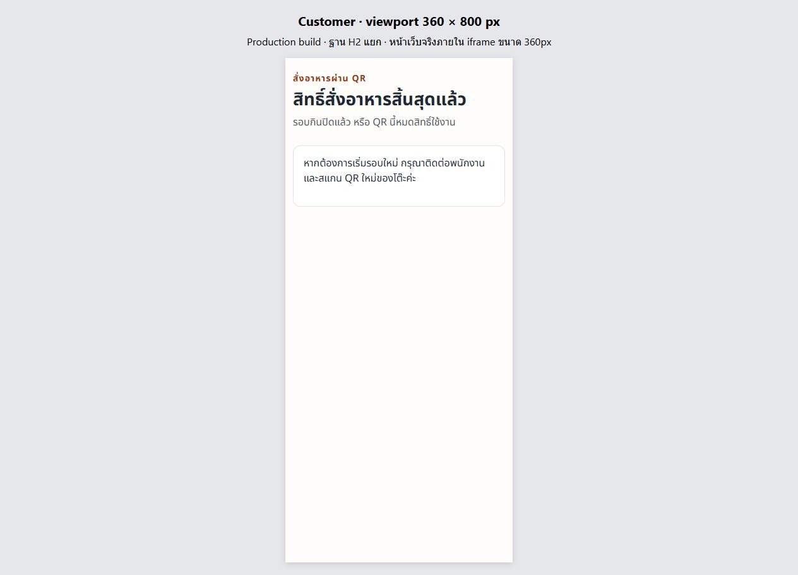

# Step FIX — ศิระพัทธ์: U01 / U04

วันที่ 9 ตุลาคม 2026 · Branch `sirapat_673380293-3_01` · เริ่มจาก `develop` 96da8ea
อ้างอิง [แผน Step FIX](https://app.notion.com/p/Step-FIX-UAT-Defects-Manager-Data-Management-3f4cb2e9d47a81d1ae9fd42e77d189c9)

## ขอบเขตที่ส่ง

- U01: `/` และ URL ที่ไม่รู้จักเข้าสู่ `/admin` จริงทั้ง dev/production; login แล้วไปหน้าตาม role; Design System อยู่เฉพาะ `/dev/ui` ใน dev
- ป้องกันคำตอบ restore/logout เก่าใน StaffShell หลัง session สิ้นสุด และล็อก logout ระหว่างส่งคำขอ
- U04: 401/404 ที่ยืนยันสิทธิ์รอบกินสิ้นสุดแสดงหน้าหมดสิทธิ์ ล้าง menu/cart/orders/notice/bill/dialogs หยุด interval และ invalidate คำตอบเก่า
- Order POST 404 ต้องตรวจ customer-context แยก เพราะอาหารที่ถูกนำออกก็คืน 404 ได้; ไม่ทำให้สิทธิ์โต๊ะที่ยังใช้ได้กลายเป็นหมดสิทธิ์
- Network/5xx รักษาตะกร้าและบิลล่าสุด พักการสั่งระหว่างไม่ทราบสถานะบิล ให้ลองใหม่เองหรือรอ poll ถัดไป; QR ใหม่ในแท็บเดิมเริ่มใหม่ได้

ผู้ใช้แจ้งให้เพื่อนรับงาน PR #39 ต่อ จึงไม่นำงานบังคับปิดโต๊ะ/ลบเมนูหรือ migration จาก PR #39 มารวมในชุดนี้
ตรวจ GitHub แล้ว PR #39 เป็น **CLOSED / merged=false**. ไม่มีการ revert develop เพราะโค้ดนั้นไม่เคยถูกรวม
R01 อาหาร/หมวดหมู่ไม่ถือว่าเสร็จจาก PR นี้ และไม่มีการแก้ schema/API/backend

## ผลอัตโนมัติในเครื่อง

| ชุดตรวจ | ผลจริง |
|---|---|
| Frontend ทั้งหมด | 148/148 ผ่าน, 16 files |
| U01 root/role/logout/expiry tests ใหม่ | 11/11 ผ่าน |
| U04 terminal/transient/new-QR/late-response tests ใหม่ | 12/12 ผ่าน |
| URL/origin runtime guards | 6/6 ผ่าน |
| Lint | 0 errors, 4 warnings เดิมใน KitchenBoard/StaffServing/Users/Stock |
| TypeScript + production build | ผ่าน |
| Backend `clean verify` | 350 discovered, 322 passed, 28 skipped, 0 failures/errors |

Backend ใช้ test resources ของ H2 และปิดการใช้ .env ฐานกลาง; PostgreSQL/Docker-dependent cases ถูก skip ในเครื่อง จึงไม่ถือว่าเป็นผล PostgreSQL ผ่าน
การตรวจครั้งแรกก่อน clean พบ V16/test classes ค้างใน target จากสาขา PR #39; หลัง clean แล้วรันใหม่ผ่านตามตาราง ไม่มีการเปลี่ยน applied migration เพื่อแก้ผลทดสอบ
CI ต้องตรวจ revision ที่ส่ง PR ใหม่; ไม่ยกผล CI ของ PR #39 มาเป็นผลของงานนี้

## Browser จริงบนฐาน H2 แยก

ใช้ production build ที่เชื่อม `127.0.0.1:8087`, frontend `127.0.0.1:5177`; fresh H2 V1–V15, database/session providers จริง, ไม่ mock HTTP
ตั้ง `spring.config.import=` เพื่อไม่โหลด .env. Native API ใช้เตรียม 4 บทบาท, 30 foods, package 499 บาท, soup/table และรอบแรก; customer orders/actions ด้านล่างทำผ่าน CUA UI
credentials/QR อยู่เฉพาะ ignored local setup file ไม่รวมในหลักฐาน

1. เปิด `/` ได้หน้า login จริง; login Manager → stock, Supervisor → stock, Kitchen → kitchen, Service → tables; logout แล้วเปิด protected URL ได้ login
2. Manager catalog แสดง 30 รายการ/3 หน้า ที่ browser viewport 1280px
3. QR รอบ 1 แลกสิทธิ์จริง แสดงอาหาร 30 รายการ; Customer สั่ง 3 เมนูได้ Order #1 และเห็นชื่อ/จำนวนตรงรายการ
4. Customer ขอคิดบิลจาก UI; Service Staff ดูบิล/รับชำระจำลอง 499 บาทและปิดรอบ 1 จาก UI
5. Customer ที่ยังเปิดอยู่เปลี่ยนเป็น “สิทธิ์สั่งอาหารสิ้นสุดแล้ว” จาก poll โดยไม่ reload; menu/cart/order-success/bill/actions หาย
6. Service เปิดรอบ 2 จาก UI แล้วเปิด QR ใหม่ในแท็บ Customer เดิม; กลับมาเลือกเมนูได้ ไม่เห็นคำสั่งซื้อเก่า
7. เปิดหน้า Customer จริงใน iframe ขนาด **360 × 800px**; 30 menus, 1 column, content client/scroll width เท่ากัน 345px (อีก 15px เป็น scrollbar), ไม่มี horizontal overflow. สั่ง Order #2 และขอคิดบิลจาก UI ใน iframe ได้
8. Native API assertions ตรวจ Kitchen เห็น Order #1/#2 และ Payment #1 ยังคง PAID/499; จากนั้นรับชำระ/ปิดรอบ 2 บน H2 เพื่อ teardown — ระบุแยกจาก UI proof
9. iframe Customer 360px เปลี่ยนเป็นหน้าสิทธิ์สิ้นสุด; table AVAILABLE
10. logout Service จากอีกแท็บ แล้วให้แท็บเดิมเรียก protected API; แสดง login และล้างหน้าเดิมจาก 401

ตัว override viewport ของ in-app browser ไม่มีผลต่อความกว้างจริง จึงใช้ iframe viewport 360px เป็น responsive proof
นี่เป็น browser layout/interaction test ที่ 360px ไม่ใช่ physical-phone/touch/browser-device acceptance. Outer screenshot ยังคงแสดง harness เพื่อให้ตรวจวิธีทดสอบได้
Network/5xx recovery และ late-response races มี component-test evidence; ไม่ได้อ้างว่าใช้ fault injection ใน browser จริง

หลักฐาน: [directory](../../test/evidence/sirapat-step-fix-2026-10-09/), `responsive-metrics.json`, `native-api-results.json`, `source-manifest.json`

## เกณฑ์ส่งต่อ

ขอปวริศช์ตรวจ flow และศรัณย์ตรวจการแยก status/error กับ API contract. รอ review/merge ตามทีม
หลัง deploy commit ที่รับรองแล้ว จึงทวน public Render และอ้าง deployed SHA; ผล H2/CI ไม่ใช่ผลรับรอง public deployment
ไม่มีการ apply/repair migration บนฐานกลาง และไม่มีการ merge/deploy PR เอง
